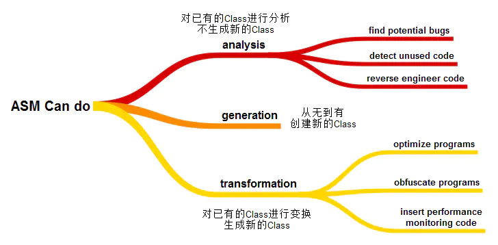
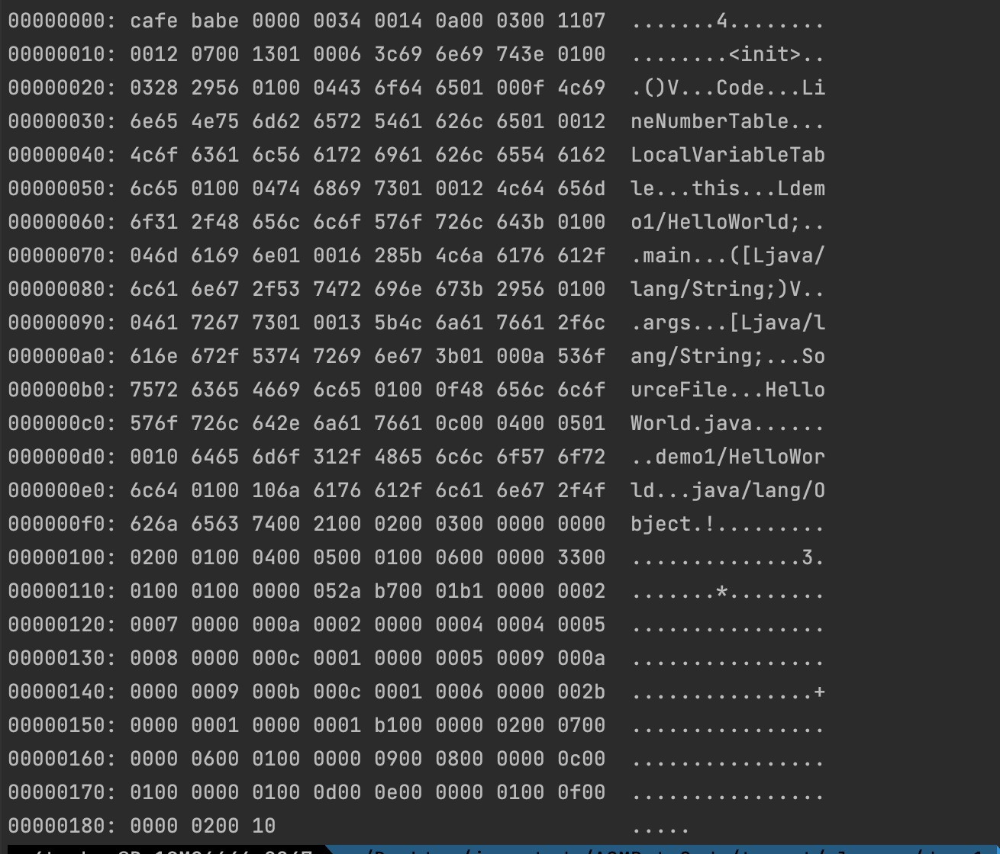
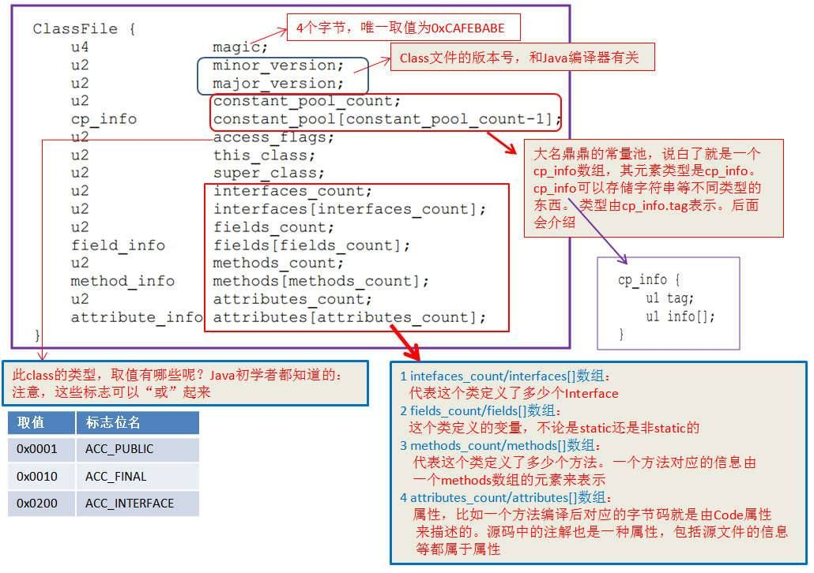
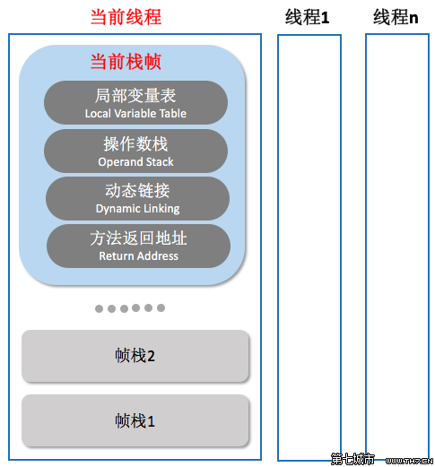
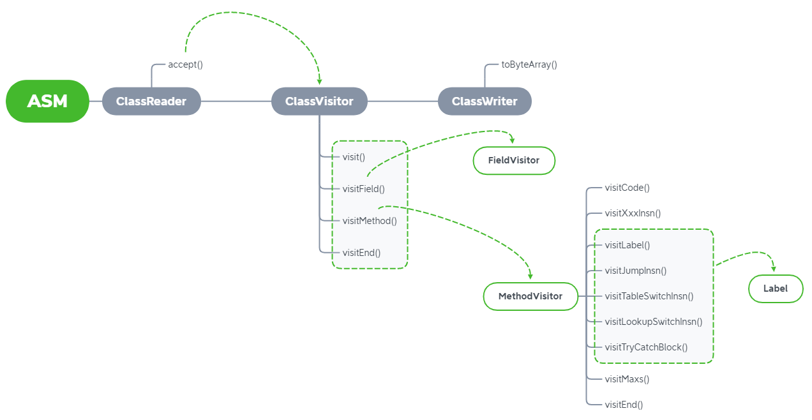
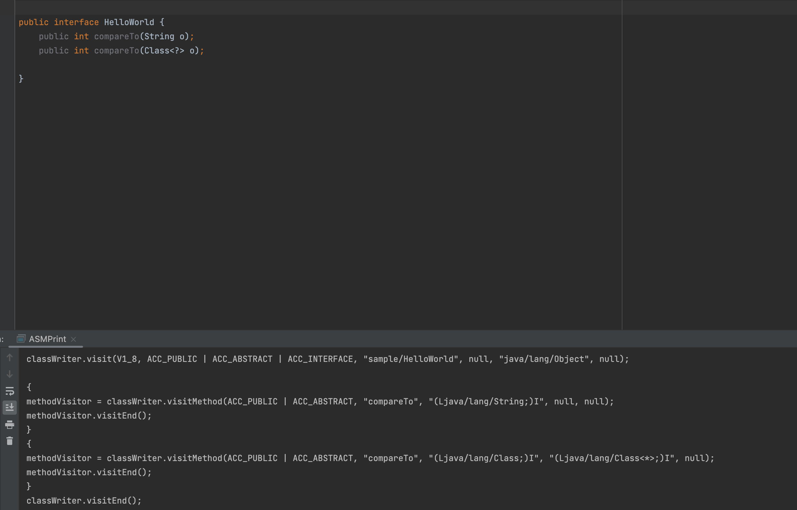

# ASM学习

## 什么是ASM

​	ASM是一种通用Java字节码操作和分析框架。它可以用于修改现有的class文件或动态生成class文件，当然其实javassist也可以实现一些基础操作，不过asm更灵活，性能也更好。一张图帮我们简单认识它。




其中ASM所操作的对象是字节码的数据，换个容易理解但又不那么恰当，来说它会首先将xx`.class`文件按class文件结构拆分成多部分，之后我们就可以对其中某一个部分的内容做修改，最后重新组合形成一个新的`xx.class`

因此不免要对class文件结构做一些了解。

## Class文件结构

稍微了解下就行了，不需要专门一个一个字节瞪着看，毕竟很多时候我们不需要通过二进制数据翻译为Java源码

这方面官方文档就有说明：[Chapter 4. The class File Format](https://docs.oracle.com/javase/specs/jvms/se15/html/jvms-4.html)

class文件结构如下，其中ux代表x个字节无符号数，其余info类型是复合结构

```c
ClassFile {
    u4             magic;
    u2             minor_version;
    u2             major_version;
    u2             constant_pool_count;
    cp_info        constant_pool[constant_pool_count-1];
    u2             access_flags;
    u2             this_class;
    u2             super_class;
    u2             interfaces_count;
    u2             interfaces[interfaces_count];
    u2             fields_count;
    field_info     fields[fields_count];
    u2             methods_count;
    method_info    methods[methods_count];
    u2             attributes_count;
    attribute_info attributes[attributes_count];
}

```

简单写个最简单的java类来做描述

```java
public class HelloWorld {
    public HelloWorld() {
    }

    public static void main(String[] args) {

    }

}
```

通过xxd查看



其中对照上面文件结构来看

### magic

class文件固定的文件头，为固定值`0xcafebabe`

### minor_version(次版本号)与major_version(主版本号)

这里为`0x00000034`可知主版本号(0x34=52)为1.8，次版本号为0

| JDK版本 | **十进制** | **十六进制** | 发布时间 |
| ------- | ---------- | ------------ | -------- |
| JDK1.1  | 45         | 2D           | 1996-05  |
| JDK1.2  | 46         | 2E           | 1998-12  |
| JDK1.3  | 47         | 2F           | 2000-05  |
| JDK1.4  | 48         | 30           | 2002-02  |
| JDK1.5  | 49         | 31           | 2004-09  |
| JDK1.6  | 50         | 32           | 2006-12  |
| JDK1.7  | 51         | 33           | 2011-07  |
| JDK1.8  | 52         | 34           | 2014-03  |
| Java9   | 53         | 35           | 2017-09  |
| Java10  | 54         | 36           | 2018-03  |
| Java11  | 55         | 37           | 2018-09  |
| Java12  | 56         | 38           | 2019-03  |
| Java13  | 57         | 39           | 2019-09  |
| Java14  | 58         | 3A           | 2020-03  |
| Java15  | 59         | 3B           | 2020-09  |

### constant_pool_count

这里是`0x00001e4`

常量池计数器的值等于常量池总数+1,注意的是`long`和`double`类型的常量池对象占用两个常量位

### constant_pool

常量池是一个结构表，代表各种字符串常量、类和接口名称、字段名称，以及其他在结构及其子结构中被引用的常量。

其中cp_info数据结构，其中tag对应了常量池中的存储类型

```
cp_info {
   u1 tag;
   u1 info[];
}
```

关于tag的说明

| Constant Kind                 | Tag  | `class` file format | Java SE |
| ----------------------------- | ---- | ------------------- | ------- |
| `CONSTANT_Utf8`               | 1    | 45.3                | 1.0.2   |
| `CONSTANT_Integer`            | 3    | 45.3                | 1.0.2   |
| `CONSTANT_Float`              | 4    | 45.3                | 1.0.2   |
| `CONSTANT_Long`               | 5    | 45.3                | 1.0.2   |
| `CONSTANT_Double`             | 6    | 45.3                | 1.0.2   |
| `CONSTANT_Class`              | 7    | 45.3                | 1.0.2   |
| `CONSTANT_String`             | 8    | 45.3                | 1.0.2   |
| `CONSTANT_Fieldref`           | 9    | 45.3                | 1.0.2   |
| `CONSTANT_Methodref`          | 10   | 45.3                | 1.0.2   |
| `CONSTANT_InterfaceMethodref` | 11   | 45.3                | 1.0.2   |
| `CONSTANT_NameAndType`        | 12   | 45.3                | 1.0.2   |
| `CONSTANT_MethodHandle`       | 15   | 51.0                | 7       |
| `CONSTANT_MethodType`         | 16   | 51.0                | 7       |
| `CONSTANT_Dynamic`            | 17   | 55.0                | 11      |
| `CONSTANT_InvokeDynamic`      | 18   | 51.0                | 7       |
| `CONSTANT_Module`             | 19   | 53.0                | 9       |
| `CONSTANT_Package`            | 20   | 53.0                | 9       |

### access_flags（访问标志）

表示某个类或者接口的访问权限及属性

| 标志名         | 十六进制值 | 描述                                                   |
| -------------- | ---------- | ------------------------------------------------------ |
| ACC_PUBLIC     | 0x0001     | 声明为public                                           |
| ACC_FINAL      | 0x0010     | 声明为final                                            |
| ACC_SUPER      | 0x0020     | 废弃/仅JDK1.0.2前使用                                  |
| ACC_INTERFACE  | 0x0200     | 声明为接口                                             |
| ACC_ABSTRACT   | 0x0400     | 声明为abstract                                         |
| ACC_SYNTHETIC  | 0x1000     | 声明为synthetic，表示该class文件并非由Java源代码所生成 |
| ACC_ANNOTATION | 0x2000     | 标识注解类型                                           |
| ACC_ENUM       | 0x4000     | 标识枚举类型                                           |

同时这些标记可以通过或运算组合

### this_class（当前类名称）与super_class（父类名索引值）

this_class表示的是当前class文件的类名所在常量池中的索引位置

super_class表示的是当前class文件的父类类名所在常量池中的索引位置。`java/lang/Object`类的`super_class`的为0，其他任何类的`super_class`都必须是一个常量池中存在的索引位置


### interfaces_count（当前类继承或实现的接口数）与interfaces[] （接口名称数组）

`u2 interfaces_count;`表示的是当前类继承或实现的接口数。

`u2 interfaces[interfaces_count];`表示的是所有接口数组。


### fields_count（当前类的成员变量数）与fields[fields_count]（成员变量数组）

`u2 fields_count;`表示的是当前class中的成员变量个数。

`field_info fields[fields_count];`表示的是当前类的所有成员变量，`field_info`表示的是成员变量对象。

**field_info数据结构：**

```
field_info {
   u2 access_flags;//表示的是成员变量的修饰符；
   u2 name_index;//表示的是成员变量的名称
   u2 descriptor_index;//表示的是成员变量的描述符；
   u2 attributes_count;//表示的是成员变量的属性数量
   attribute_info attributes[attributes_count];//表示的是成员变量的属性信息；
}
```


| Flag Name       | Value  | Interpretation                                               |
| --------------- | ------ | ------------------------------------------------------------ |
| `ACC_PUBLIC`    | 0x0001 | Declared `public`; may be accessed from outside its package. |
| `ACC_PRIVATE`   | 0x0002 | Declared `private`; accessible only within the defining class and other classes belonging to the same nest ([§5.4.4](https://docs.oracle.com/javase/specs/jvms/se15/html/jvms-5.html#jvms-5.4.4)). |
| `ACC_PROTECTED` | 0x0004 | Declared `protected`; may be accessed within subclasses.     |
| `ACC_STATIC`    | 0x0008 | Declared `static`.                                           |
| `ACC_FINAL`     | 0x0010 | Declared `final`; never directly assigned to after object construction (JLS §17.5). |
| `ACC_VOLATILE`  | 0x0040 | Declared `volatile`; cannot be cached.                       |
| `ACC_TRANSIENT` | 0x0080 | Declared `transient`; not written or read by a persistent object manager. |
| `ACC_SYNTHETIC` | 0x1000 | Declared synthetic; not present in the source code.          |
| `ACC_ENUM`      | 0x4000 | Declared as an element of an `enum`.                         |


### methods_count（方法计数）与methods[methods_count]（方法数组）

`u2 methods_count;`表示的是当前class中的成员方法个数。

`method_info methods[methods_count];`表示的是当前class中的所有成员方法，`method_info`表示的是成员方法对象。

**method_info数据结构：**

```
method_info {
   u2 access_flags; //表示的是成员方法的修饰符；
   u2 name_index; //表示的是成员方法的名称；
   u2 descriptor_index; //表示的是成员方法的描述符；
   u2 attributes_count; //表示的是成员方法的属性数量；
   attribute_info attributes[attributes_count]; //表示的是成员方法的属性信息；
}
```

| Flag Name          | Value  | Interpretation                                               |
| ------------------ | ------ | ------------------------------------------------------------ |
| `ACC_PUBLIC`       | 0x0001 | Declared `public`; may be accessed from outside its package. |
| `ACC_PRIVATE`      | 0x0002 | Declared `private`; accessible only within the defining class and other classes belonging to the same nest ([§5.4.4](https://docs.oracle.com/javase/specs/jvms/se15/html/jvms-5.html#jvms-5.4.4)). |
| `ACC_PROTECTED`    | 0x0004 | Declared `protected`; may be accessed within subclasses.     |
| `ACC_STATIC`       | 0x0008 | Declared `static`.                                           |
| `ACC_FINAL`        | 0x0010 | Declared `final`; must not be overridden ([§5.4.5](https://docs.oracle.com/javase/specs/jvms/se15/html/jvms-5.html#jvms-5.4.5)). |
| `ACC_SYNCHRONIZED` | 0x0020 | Declared `synchronized`; invocation is wrapped by a monitor use. |
| `ACC_BRIDGE`       | 0x0040 | A bridge method, generated by the compiler.                  |
| `ACC_VARARGS`      | 0x0080 | Declared with variable number of arguments.                  |
| `ACC_NATIVE`       | 0x0100 | Declared `native`; implemented in a language other than the Java programming language. |
| `ACC_ABSTRACT`     | 0x0400 | Declared `abstract`; no implementation is provided.          |
| `ACC_STRICT`       | 0x0800 | Declared `strictfp`; floating-point mode is FP-strict.       |
| `ACC_SYNTHETIC`    | 0x1000 | Declared synthetic; not present in the source code.          |


### attributes_count（属性计数）与attributes[attributes_count]（属性数组）

`u2 attributes_count;`表示当前class文件属性表的成员个数。

`attribute_info attributes[attributes_count];`表示的是当前class文件的所有属性，`attribute_info`是一个非常复杂的数据结构，存储着各种属性信息。

**`attribute_info`数据结构：**

```
attribute_info {
   u2 attribute_name_index; //表示的是属性名称索引，读attribute_name_index在常量池中查找可以得到属性名称
   u4 attribute_length;
   u1 info[attribute_length];
}
```

### 一个更方便的图片总结(比较直观)



### 其他

通过javap -verbose xxx.class可以帮助我们更好的理解


## jvm

也是了解一些基础的就行，首先JVM的指令集是基于栈而不是寄存器，基于栈可以具备很好的跨平台性。在线程中执行一个方法时，我们会创建一个栈帧入栈并执行，如果该方法又调用另一个方法时会再次创建新的栈帧然后入栈，方法返回之际，原栈帧会返回方法的执行结果给之前的栈帧，随后虚拟机将会丢弃此栈帧。



​							图片来源：http://www.th7.cn/Program/java/201601/749326.shtml

关于「栈帧」，我们在看看《Java虚拟机规范》中的描述：

> 栈帧是用来存储数据和部分过程结果的数据结构，同时也用来处理动态连接、方法返回值和异常分派。
> 栈帧随着方法调用而创建，随着方法结束而销毁——无论方法正常完成还是异常完成都算作方法结束。
> 栈帧的存储空间由创建它的线程分配在Java虚拟机栈之中，每一个栈帧都有自己的本地变量表(局部变量表)、操作数栈和指向当前方法所属的类的运行时常量池的引用。

因此这里我们也需要简单了解下关于栈帧中的局部变量表、操作数栈、动态连接、方法返回地址等各个部分的数据结构和作用

### 局部变量表

**局部变量表(Local Variable Table)**是一组变量值存储空间，用于存放方法参数和方法内定义的局部变量。局部变量表的容量以变量槽(Variable Slot)为最小单位，Java虚拟机规范并没有定义一个槽所应该占用内存空间的大小，但是规定了一个槽应该可以存放一个32位以内的数据类型。

一个局部变量可以保存一个类型为boolean、byte、char、short、int、float、reference和returnAddress类型的数据。reference类型表示对一个对象实例的引用。returnAddress类型是为jsr、jsr_w和ret指令服务的，目前已经很少使用了。

虚拟机通过索引定位的方法查找相应的局部变量，索引的范围是从0~局部变量表最大容量。如果Slot是32位的，则遇到一个64位数据类型的变量(如long或double型)，则会连续使用两个连续的Slot来存储。


比如之前的set方法

```
public void setTest(String test) {
        this.test = test;
    }
```

通过javap查看，可以看到局部变量表有两个元素，其中一个为this，如果该方法为静态方法则为1个

```
  public void setTest(java.lang.String);
    descriptor: (Ljava/lang/String;)V
    flags: (0x0001) ACC_PUBLIC
    Code:
      stack=2, locals=2, args_size=2
         0: aload_0
         1: aload_1
         2: putfield      #3                  // Field test:Ljava/lang/String;
         5: return
      LineNumberTable:
        line 16: 0
        line 17: 5
      LocalVariableTable:
        Start  Length  Slot  Name   Signature
            0       6     0  this   Ldemo1/HelloWorld;
            0       6     1  test   Ljava/lang/String;

```

### 操作数栈

**操作数栈(Operand Stack)**也常称为操作栈，它是一个后入先出栈(LIFO)。同局部变量表一样，操作数栈的最大深度也在编译的时候写入到方法的Code属性的max_stacks数据项中。

操作数栈的每一个元素可以是任意Java数据类型，32位的数据类型占一个栈容量，64位的数据类型占2个栈容量,且在方法执行的任意时刻，操作数栈的深度都不会超过max_stacks中设置的最大值。

当一个方法刚刚开始执行时，其操作数栈是空的，随着方法执行和字节码指令的执行，会从局部变量表或对象实例的字段中复制常量或变量写入到操作数栈，再随着计算的进行将栈中元素出栈到局部变量表或者返回给方法调用者，也就是出栈/入栈操作。一个完整的方法执行期间往往包含多个这样出栈/入栈的过程。


### 动态连接

在一个class文件中，一个方法要调用其他方法，需要将这些方法的符号引用转化为其在内存地址中的直接引用，而符号引用存在于方法区中的运行时常量池。

Java虚拟机栈中，每个栈帧都包含一个指向运行时常量池中该栈所属方法的符号引用，持有这个引用的目的是为了支持方法调用过程中的**动态连接(Dynamic Linking)**。

这些符号引用一部分会在类加载阶段或者第一次使用时就直接转化为直接引用，这类转化称为**静态解析**。另一部分将在每次运行期间转化为直接引用，这类转化称为动态连接。


### 方法返回

**当一个方法开始执行时，可能有两种方式退出该方法：**

- **正常完成出口**
- **异常完成出口**

**正常完成出口**是指方法正常完成并退出，没有抛出任何异常(包括Java虚拟机异常以及执行时通过throw语句显示抛出的异常)。如果当前方法正常完成，则根据当前方法返回的字节码指令，这时有可能会有返回值传递给方法调用者(调用它的方法)，或者无返回值。具体是否有返回值以及返回值的数据类型将根据该方法返回的字节码指令确定。

**异常完成出口**是指方法执行过程中遇到异常，并且这个异常在方法体内部没有得到处理，导致方法退出。


### jvm指令集

记一些简单的吧，具体的虚拟机指令可以看看官方文档：https://docs.oracle.com/javase/specs/jvms/se15/html/jvms-6.html#jvms-6.5

| 描述符   | Java类型       | 示例                 |
| -------- | -------------- | -------------------- |
| `B`      | `byte`         | `B`                  |
| `C`      | `char`         | `C`                  |
| `D`      | `double`       | `D`                  |
| `F`      | `float`        | `F`                  |
| `I`      | `int`          | `I`                  |
| `J`      | `long`         | `J`                  |
| `S`      | `short`        | `S`                  |
| `Z`      | `boolean`      | `Z`                  |
| `[`      | `数组`         | `[IJ`                |
| `L类名;` | `引用类型对象` | `Ljava/lang/Object;` |

不过在这当中我比较懵逼dup指令不过后来懂了，具体可以看看[java虚拟机指令dup的理解](https://www.cnblogs.com/CLAYJJ/p/7698035.html)

引用文章当中的话

> 一个dup指令，这是因为实例的初始化方法肯定需要用到一次，然后第二个留给程序员使用，例如给变量赋值，抛出异常等，如果我们不用，那编译器也会生成dup指令，在初始化方法调用完成后再从栈顶pop出来。例如我们仅仅创建一个对象而不做任何操作

## ASM使用学习

说了半天终于到正文了，前面的很多都可以作为参考阅读，不用太过于深入，了解了这么多我们就可以开始来学习ASM框架了，这篇文章主要也是想学点常用的具体框架所有东西肯定是不会多讲的，只记录我需要的。总的来说都是站在巨人肩膀上学习。

### 引入依赖

这里我就用最新版了

```xml
<properties>
  <maven.compiler.source>8</maven.compiler.source>
  <maven.compiler.target>8</maven.compiler.target>
  <asm.version>9.3</asm.version>
</properties>
<dependencies>
  <dependency>
    <groupId>org.ow2.asm</groupId>
    <artifactId>asm</artifactId>
    <version>${asm.version}</version>
  </dependency>
  <dependency>
    <groupId>org.ow2.asm</groupId>
    <artifactId>asm-commons</artifactId>
    <version>${asm.version}</version>
  </dependency>
  <dependency>
    <groupId>org.ow2.asm</groupId>
    <artifactId>asm-util</artifactId>
    <version>${asm.version}</version>
  </dependency>
  <dependency>
    <groupId>org.ow2.asm</groupId>
    <artifactId>asm-tree</artifactId>
    <version>${asm.version}</version>
  </dependency>
  <dependency>
    <groupId>org.ow2.asm</groupId>
    <artifactId>asm-analysis</artifactId>
    <version>${asm.version}</version>
  </dependency>

</dependencies>
```

### ASM使用

在asm当中有三个最重要的类，关系如下图



- `ClassReader`类，负责读取`.class`文件里的内容，然后拆分成各个不同的部分。
- `ClassVisitor`类，负责对`.class`文件中某一部分里的信息进行修改。
- `ClassWriter`类，负责将各个不同的部分重新组合成一个完整的`.class`文件。

### 如何快速将.class文件转换为ASM代码

跟着大佬的参考简单做了修改，不需要理解先体验，利用这个发现去快速分析样本代码就很方便

```java
import org.objectweb.asm.ClassReader;
import org.objectweb.asm.util.ASMifier;
import org.objectweb.asm.util.Printer;
import org.objectweb.asm.util.Textifier;
import org.objectweb.asm.util.TraceClassVisitor;

import java.io.FileInputStream;
import java.io.IOException;
import java.io.InputStream;
import java.io.PrintWriter;


public class ASMPrint {
    public static void main(String[] args) throws IOException {
        // (1) 设置参数
        String className = "Nonerratically.class";
        int parsingOptions = ClassReader.SKIP_FRAMES | ClassReader.SKIP_DEBUG;
        boolean asmCode = true;

        // (2) 打印结果
        Printer printer = asmCode ? new ASMifier() : new Textifier();
        PrintWriter printWriter = new PrintWriter(System.out, true);
        TraceClassVisitor traceClassVisitor = new TraceClassVisitor(null, printer, printWriter);
        if (className.endsWith(".class")){
            InputStream inputStream = new FileInputStream(className);
            new ClassReader(inputStream).accept(traceClassVisitor, parsingOptions);
        }else {
            new ClassReader(className).accept(traceClassVisitor, parsingOptions);

        }
    }
}
```


其中

- `className`值设置为类的全限定名，可以是我们自己写的类，例如`sample.HelloWorld`，也可以是JDK自带的类，例如`java.lang.Comparable`，还可以是class文件
- `asmCode`值设置为`true`或`false`。如果是`true`，可以打印出对应的ASM代码；如果是`false`，可以打印出方法对应的Instruction。
- `parsingOptions`值设置为`ClassReader.SKIP_CODE`、`ClassReader.SKIP_DEBUG`、`ClassReader.SKIP_FRAMES`、`ClassReader.EXPAND_FRAMES`的组合值，也可以设置为`0`，可以打印出详细程度不同的信息。


### 常用API


visitFieldInsn ： 访问某个成员变量的指令，支持GETSTATIC, PUTSTATIC, GETFIELD or PUTFIELD.
visitFrame ：访问当前局部变量表和操作数栈中元素的状态，参数就是局部变量表和操作数栈的内容
visitIincInsn ： 访问自增指令
visitVarInsn ：访问局部变量指令，就是取局部变量变的值放入操作数栈
visitMethodInsn ：访问方法指令，就是调用某个方法，支持INVOKEVIRTUAL, INVOKESPECIAL, INVOKESTATIC or INVOKEINTERFACE.
visitInsn ： 访问无操作数的指令，例如nop，duo等等

visitTypeInsn：访问type指令，即将一个类的全限定名作为参数然后new一个对象压入操作数栈中

### ClassVisitor类

ClassVisitor类是一个抽象类，比较常见的ClassVisitor子类有ClassWriter类（Core API）和ClassNode类（Tree API）

它有两个字段

```java
protected final int api;//指出了当前使用的ASM API版本，其取值有Opcodes.ASM4、Opcodes.ASM5、Opcodes.ASM6、Opcodes.ASM7、Opcodes.ASM8和Opcodes.ASM9
protected ClassVisitor cv;//它是一个ClassVisitor类型的数据，它的作用是将多个ClassVisitor串连起来
```

在ClassVisitor类当中，有许多visitXxx()方法，但是，我们只需要关注这4个方法：visit()、visitField()、visitMethod()和visitEnd()，我的理解是大部分场景下我们用这些足够了

```java
public abstract class ClassVisitor {
    public void visit(
        final int version,
        final int access,
        final String name,
        final String signature,
        final String superName,
        final String[] interfaces);
    public FieldVisitor visitField( // 访问字段
        final int access,
        final String name,
        final String descriptor,
        final String signature,
        final Object value);
    public MethodVisitor visitMethod( // 访问方法
        final int access,
        final String name,
        final String descriptor,
        final String signature,
        final String[] exceptions);
    public void visitEnd();
    // ......
}
```

在ClassVisitor的visit()方法、visitField()方法和visitMethod()方法中都带有signature参数。这个signature参数“泛型”密切相关；换句话说，如果处理的是一个带有泛型信息的类、字段或方法，那么就需要给signature参数提供一定的值；如果处理的类、字段或方法不带有“泛型”信息，那么将signature参数设置为null就可以了。

看下图可以明显感受到区别，带有泛型的部分返回参数当中sinature部分有值



同时在ClassVisitor类当中定义的多个visitXxx()方法。它们也有一定的调用顺序。

```
visit
[visitSource][visitModule][visitNestHost][visitPermittedSubclass][visitOuterClass]
(
 visitAnnotation |
 visitTypeAnnotation |
 visitAttribute
)*
(
 visitNestMember |
 visitInnerClass |
 visitRecordComponent |
 visitField |
 visitMethod
)* 
visitEnd
```

其实很明显总体来说我们只需要关注`ClassVisitor`类当中的`visit()`方法、`visitField()`方法、`visitMethod()`方法和`visitEnd()`方法这4个方法就完全足够了

顺便了解下它们的参数

随便找了一个dump出来的类这里参考classWriter的即可


#### 常用的Visitor回调事件


| 方法名              | 说明                                                         |
| :------------------ | :----------------------------------------------------------- |
| visit               | 访问class的头部信息时，version为class版本（编译版本），access为访问修饰符，name为类名称，signature为class的签名，可能是null，superName为超类名称，interfaces为接口的名称 |
| visitAnnotation     | 访问class的注解信息时，descriptor为签名描述信息，visible为是否运行时可见 |
| visitAttribute      | 访问该类的属性                                               |
| visitInnerClass     | 访问class中内部类的信息，而且这个内部类不一定是被访问类的成员（有可能是一段方法中的匿名内部类或者声明在一个方法中的类等等）。name为内部类的名称，outerName为内部类所在类的名称，innerName为内部类的名称 |
| visitOuterClass     | 访问该类的外部类，仅当类具有封闭类时，才必须调用此方法。owner为拥有该类的class名称，name为包含该类的方法的名称，如果该类未包含在其封闭类的方法中，则返回null，descriptor为签名描述信息 |
| visitEnd            | 结束访问class时调用                                          |
| visitField          | 访问class中字段的信息，返回一个FieldVisitor用于操作字段相关的信息，access为访问修饰符，name为类名称，signature为class的签名，可能是null，descriptor为描述信息 |
| visitMethod         | 访问class中方法的信息，返回一个MethodVisitor用于操作字段相关的信息，access为访问修饰符，name为方法名称，signature为方法的签名，可能是null，descriptor为描述信息，exceptions为异常 |
| visitModule         | 访问对应的模块                                               |
| visitTypeAnnotation | 访问类的签名的注解                                           |


#### ClassWriter类

既然是子类就把它放在classVisitor下吧，大部分内容一致，我们更需要关注一些不一样的地方

ClassWriter定义的构造方法有两个，我们这里只关注其中一个，也就是只接收一个int类型参数的构造方法。在使用new关键字创建ClassWriter对象时，推荐使用COMPUTE_FRAMES参数

```java
public class ClassWriter extends ClassVisitor {
    /* A flag to automatically compute the maximum stack size and the maximum number of local variables of methods. */
    public static final int COMPUTE_MAXS = 1;
    /* A flag to automatically compute the stack map frames of methods from scratch. */
    public static final int COMPUTE_FRAMES = 2;

    // flags option can be used to modify the default behavior of this class.
    // Must be zero or more of COMPUTE_MAXS and COMPUTE_FRAMES.
    public ClassWriter(final int flags) {
        this(null, flags);
    }
}
```


关于这两个参数的区别

```java
COMPUTE_MAXS: 计算max stack和max local信息
COMPUTE_FRAMES: 既计算stack map frame信息，又计算max stack和max local信息
```

`flags`参数，它可以选择的值有三个：

- 第一个，可以选取的值是`0`。ASM不会自动计算max stacks和max locals，也不会自动计算stack map frames。
- 第二个，可以选取的值是`ClassWriter.COMPUTE_MAXS`。ASM会自动计算max stacks和max locals，但不会自动计算stack map frames。
- 第三个，可以选取的值是`ClassWriter.COMPUTE_FRAMES`（推荐使用）。ASM会自动计算max stacks和max locals，也会自动计算stack map frames。

关于一些使用示例，我们使用`ClassWriter`生成一个Class文件，可以大致分成三个步骤：

- 第一步，创建`ClassWriter`对象。
- 第二步，调用`ClassWriter`对象的`visitXxx()`方法。
- 第三步，调用`ClassWriter`对象的`toByteArray()`方法。

具体的代码可以配合之前那个ASMPrint类去看看


### FieldVisitor类

通过调用`ClassVisitor`类的`visitField()`方法，会返回一个`FieldVisitor`类型的对象。

```java
public FieldVisitor visitField(int access, String name, String descriptor, String signature, Object value);
//示例
{
fieldVisitor = classWriter.visitField(ACC_PUBLIC | ACC_STATIC, "a", "I", null, null);
fieldVisitor.visitEnd();
}
```

在`FieldVisitor`类内定义的多个`visitXxx()`方法，也需要遵循一定的调用顺序

```java
(
 visitAnnotation |
 visitTypeAnnotation |
 visitAttribute
)*
visitEnd
```

但是暂时只关注visitEnd即可，不过多提一下比如这个visitAnnotation其实就是生成注解

比如生成这样的代码

```java
public class HelloWorld {
    @MyAnnocation(a = "a", b = 1)
    String annocation = "";
}
```

ASM部分

```java
{
  fieldVisitor = classWriter.visitField(0, "annocation", "Ljava/lang/String;", null, null);
  {
    annotationVisitor0 = fieldVisitor.visitAnnotation("LMyAnnocation;", false);
    annotationVisitor0.visit("a", "a");
    annotationVisitor0.visit("b", new Integer(1));
    annotationVisitor0.visitEnd();
  }
  fieldVisitor.visitEnd();
}
```

### MethodVisitor类

在MethodVisitor类当中，定义了许多的visitXxx()方法，这些方法的调用，也要遵循一定的顺序。

但我们更关注下面几个

```java
[
    visitCode
    (
        visitFrame |
        visitXxxInsn |
        visitLabel |
        visitTryCatchBlock
    )*
    visitMaxs
]
visitEnd
```

具体如何用ASMPrint看看就会了

### Label类

在ASM当中，Label类可以用于实现选择（if、switch）、循环（for、while）和try-catch语句。

#### 生成if语句

```java
if (value == 0) {
  System.out.println("0");
}
else {
  System.out.println("not 0");
}
```

asm

```java
       {
            methodVisitor = classWriter.visitMethod(ACC_PUBLIC, "test", "(I)V", null, null);
            methodVisitor.visitCode();
            methodVisitor.visitVarInsn(ILOAD, 1);
            Label label0 = new Label();
            methodVisitor.visitJumpInsn(IFNE, label0);
            methodVisitor.visitFieldInsn(GETSTATIC, "java/lang/System", "out", "Ljava/io/PrintStream;");
            methodVisitor.visitLdcInsn("0");
            methodVisitor.visitMethodInsn(INVOKEVIRTUAL, "java/io/PrintStream", "println", "(Ljava/lang/String;)V", false);
            Label label1 = new Label();
            methodVisitor.visitJumpInsn(GOTO, label1);
         
            methodVisitor.visitLabel(label0);
            methodVisitor.visitFieldInsn(GETSTATIC, "java/lang/System", "out", "Ljava/io/PrintStream;");
            methodVisitor.visitLdcInsn("not 0");
            methodVisitor.visitMethodInsn(INVOKEVIRTUAL, "java/io/PrintStream", "println", "(Ljava/lang/String;)V", false);
            methodVisitor.visitLabel(label1);
            methodVisitor.visitInsn(RETURN);
            methodVisitor.visitMaxs(2, 2);
            methodVisitor.visitEnd();
        }
```

#### 生成switch语句

```java
switch (val) {
  case 1:
    System.out.println("1");
    break;
  case 2:
    System.out.println("2");
    break;
  case 3:
    System.out.println("3");
    break;
  case 9:
    System.out.println("9");
    break;
  default:
    System.out.println("unknown");
}
```

asm，对于visitTableSwitchInsn第一个参数为最小值，第二个参数为最大值

```java
{
            methodVisitor = classWriter.visitMethod(ACC_PUBLIC, "test", "(I)V", null, null);
            methodVisitor.visitCode();
            methodVisitor.visitVarInsn(ILOAD, 1);
            Label label0 = new Label();
            Label label1 = new Label();
            Label label2 = new Label();
            Label label3 = new Label();
            Label label4 = new Label();
            methodVisitor.visitTableSwitchInsn(1, 9, label3, new Label[] { label0, label1, label2, label3, label3, label3, label3, label3, label4 });
            methodVisitor.visitLabel(label0);
            methodVisitor.visitFieldInsn(GETSTATIC, "java/lang/System", "out", "Ljava/io/PrintStream;");
            methodVisitor.visitLdcInsn("1");
            methodVisitor.visitMethodInsn(INVOKEVIRTUAL, "java/io/PrintStream", "println", "(Ljava/lang/String;)V", false);
            Label label5 = new Label();
            methodVisitor.visitJumpInsn(GOTO, label5);
            methodVisitor.visitLabel(label1);
            methodVisitor.visitFieldInsn(GETSTATIC, "java/lang/System", "out", "Ljava/io/PrintStream;");
            methodVisitor.visitLdcInsn("2");
            methodVisitor.visitMethodInsn(INVOKEVIRTUAL, "java/io/PrintStream", "println", "(Ljava/lang/String;)V", false);
            methodVisitor.visitJumpInsn(GOTO, label5);
            methodVisitor.visitLabel(label2);
            methodVisitor.visitFieldInsn(GETSTATIC, "java/lang/System", "out", "Ljava/io/PrintStream;");
            methodVisitor.visitLdcInsn("3");
            methodVisitor.visitMethodInsn(INVOKEVIRTUAL, "java/io/PrintStream", "println", "(Ljava/lang/String;)V", false);
            methodVisitor.visitJumpInsn(GOTO, label5);
            methodVisitor.visitLabel(label4);
            methodVisitor.visitFieldInsn(GETSTATIC, "java/lang/System", "out", "Ljava/io/PrintStream;");
            methodVisitor.visitLdcInsn("9");
            methodVisitor.visitMethodInsn(INVOKEVIRTUAL, "java/io/PrintStream", "println", "(Ljava/lang/String;)V", false);
            methodVisitor.visitJumpInsn(GOTO, label5);
            methodVisitor.visitLabel(label3);
            methodVisitor.visitFieldInsn(GETSTATIC, "java/lang/System", "out", "Ljava/io/PrintStream;");
            methodVisitor.visitLdcInsn("unknown");
            methodVisitor.visitMethodInsn(INVOKEVIRTUAL, "java/io/PrintStream", "println", "(Ljava/lang/String;)V", false);
            methodVisitor.visitLabel(label5);
            methodVisitor.visitInsn(RETURN);
            methodVisitor.visitMaxs(2, 2);
            methodVisitor.visitEnd();
}
```

#### 生成for语句

```java
for (int i = 0; i < 10; i++) {
    System.out.println(i);
}
```

Asm--IF_ICMPGE类似这种指令注意后两个就行greater equal

```java
{
  methodVisitor = classWriter.visitMethod(ACC_PUBLIC, "test", "()V", null, null);
  methodVisitor.visitCode();
  methodVisitor.visitInsn(ICONST_0);
  methodVisitor.visitVarInsn(ISTORE, 1);
  
  Label label0 = new Label();
  methodVisitor.visitLabel(label0);
  methodVisitor.visitVarInsn(ILOAD, 1);
  methodVisitor.visitIntInsn(BIPUSH, 10);
  
  Label label1 = new Label();
  methodVisitor.visitJumpInsn(IF_ICMPGE, label1);
  methodVisitor.visitFieldInsn(GETSTATIC, "java/lang/System", "out", "Ljava/io/PrintStream;");
  methodVisitor.visitVarInsn(ILOAD, 1);
  methodVisitor.visitMethodInsn(INVOKEVIRTUAL, "java/io/PrintStream", "println", "(I)V", false);
  methodVisitor.visitIincInsn(1, 1);
  methodVisitor.visitJumpInsn(GOTO, label0);
  methodVisitor.visitLabel(label1);
  methodVisitor.visitInsn(RETURN);
  methodVisitor.visitMaxs(2, 2);
  methodVisitor.visitEnd();
}
```

#### 生成try catch语句

java

```java
try {
  System.out.println("try");
} catch (Exception e) {
  System.out.println("catch");
}
```


asm

```java
       {
            methodVisitor = classWriter.visitMethod(ACC_PUBLIC, "test", "(I)V", null, null);
            methodVisitor.visitCode();
            Label label0 = new Label();
            Label label1 = new Label();
            Label label2 = new Label();
            methodVisitor.visitTryCatchBlock(label0, label1, label2, "java/lang/Exception");
            methodVisitor.visitLabel(label0);
            methodVisitor.visitFieldInsn(GETSTATIC, "java/lang/System", "out", "Ljava/io/PrintStream;");
            methodVisitor.visitLdcInsn("try");
            methodVisitor.visitMethodInsn(INVOKEVIRTUAL, "java/io/PrintStream", "println", "(Ljava/lang/String;)V", false);
            methodVisitor.visitLabel(label1);
            Label label3 = new Label();
            methodVisitor.visitJumpInsn(GOTO, label3);
            methodVisitor.visitLabel(label2);
            methodVisitor.visitVarInsn(ASTORE, 2);
            methodVisitor.visitFieldInsn(GETSTATIC, "java/lang/System", "out", "Ljava/io/PrintStream;");
            methodVisitor.visitLdcInsn("catch");
            methodVisitor.visitMethodInsn(INVOKEVIRTUAL, "java/io/PrintStream", "println", "(Ljava/lang/String;)V", false);
            methodVisitor.visitLabel(label3);
            methodVisitor.visitInsn(RETURN);
            methodVisitor.visitMaxs(2, 3);
            methodVisitor.visitEnd();
        }
```


#### 生成while语句

```java
while (true){
  System.out.println("23333");
}
```

Asm

```java
{
methodVisitor = classWriter.visitMethod(ACC_PUBLIC, "test", "(I)V", null, null);
methodVisitor.visitCode();
Label label0 = new Label();
methodVisitor.visitLabel(label0);
methodVisitor.visitFieldInsn(GETSTATIC, "java/lang/System", "out", "Ljava/io/PrintStream;");
methodVisitor.visitLdcInsn("23333");
methodVisitor.visitMethodInsn(INVOKEVIRTUAL, "java/io/PrintStream", "println", "(Ljava/lang/String;)V", false);
methodVisitor.visitJumpInsn(GOTO, label0);
methodVisitor.visitMaxs(2, 2);
methodVisitor.visitEnd();
}
```


## 参考文章

https://docs.oracle.com/javase/specs/jvms/se15/html/index.html

https://docs.oracle.com/javase/specs/jvms/se15/html/jvms-4.html

https://docs.oracle.com/javase/specs/jvms/se15/html/jvms-6.html#jvms-6.5

https://javasec.org/javase/JavaByteCode

http://www.th7.cn/Program/java/201601/749326.shtml

https://www.cnblogs.com/clayjj/p/7698035.html

https://gitee.com/lsieun/learn-java-asm

https://www.yuque.com/mikaelzero/asm
