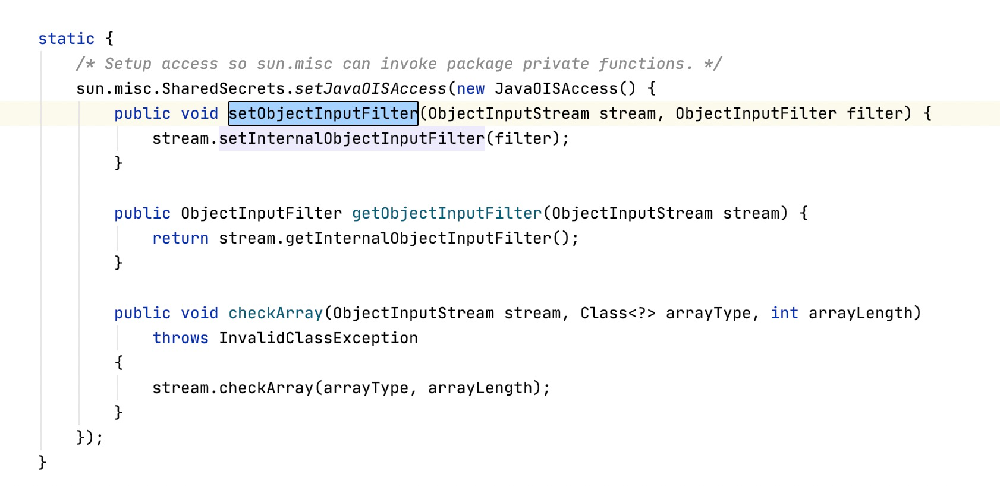
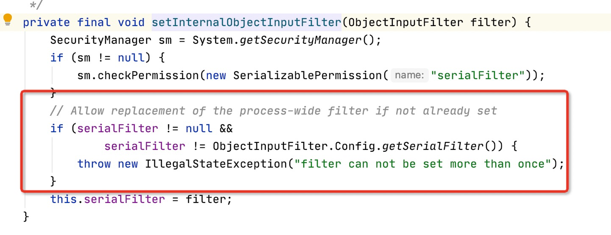

# JEP290的基本概念

本文转载自我的偶像panda：https://www.cnpanda.net/sec/968.html，建议直接点开看，我只是做个学习仓库的备份，免得哪天站突然不在了

## 什么是JEP？

`JDK Enhancement Proposal` 简称`JEP`，是 JDK 增强提议的一个[项目](https://openjdk.java.net/jeps/0)，目前索引编号已经达到了[JEP415](https://openjdk.java.net/jeps/415)，本文重点来谈谈什么是`JEP290`，`JEP290`做了哪些事，`JEP290`绕过的方法总结等。

## 什么是JEP290？

`JEP290`的描述是`Filter Incoming Serialization Data`，即过滤传入的序列化数据

| F Clo 9 | core/io:serialization | 290  | [Filter Incoming Serialization Data](https://openjdk.java.net/jeps/290) |
| :------ | :-------------------- | :--- | -----------------------------------------------------------: |

`JEP290 `是 Java 为了防御反序列化攻击而设置的一种过滤器，其在 JEP 项目中编号为290，因而通常被简称为`JEP290`

## JEP290的适用范围

Java™ SE Development Kit 8, Update 121 (JDK 8u121)

Java™ SE Development Kit 7, Update 131 (JDK 7u131)

Java™ SE Development Kit 6, Update 141 (JDK 6u141)

## JEP290的作用

- Provide a flexible mechanism to narrow the classes that can be deserialized from any class available to an application down to a context-appropriate set of classes. [提供一个限制反序列化类的机制，白名单或者黑名单]
- Provide metrics to the filter for graph size and complexity during deserialization to validate normal graph behaviors. [限制反序列化的深度和复杂度]
- Provide a mechanism for RMI-exported objects to validate the classes expected in invocations. [ 为RMI远程调用对象提供了一个验证类的机制]
- The filter mechanism must not require subclassing or modification to existing subclasses of ObjectInputStream. [定义一个可配置的过滤机制，比如可以通过配置 properties文件的形式来定义过滤器]

## JEP290 具体内容

### 1、限制的情况：

- 反序列化类数组时的数组元素数 ( [arrayLength](https://docs.oracle.com/javase/9/docs/api/java/io/ObjectInputFilter.FilterInfo.html#arrayLength--) )
- 每个嵌套对象的[深度](https://docs.oracle.com/javase/9/docs/api/java/io/ObjectInputFilter.FilterInfo.html#depth--)( [depth](https://docs.oracle.com/javase/9/docs/api/java/io/ObjectInputFilter.FilterInfo.html#depth--) )
- 当前数量对象引用 ( [references](https://docs.oracle.com/javase/9/docs/api/java/io/ObjectInputFilter.FilterInfo.html#references--) ) 的数量
- 当前消耗的字节数 ( [streamBytes](https://docs.oracle.com/javase/9/docs/api/java/io/ObjectInputFilter.FilterInfo.html#streamBytes--) )

### 2、支持 3 种配置过滤器的方式

- 自定义过滤器
- 进程范围过滤器（也称为全局过滤器）
- 用于 RMI 注册表和分布式垃圾收集 (DGC)使用的内置过滤器

### 3、自定义过滤器

当反序列化要求与整个应用程序中的任何其他反序列化过程不同时，就会出现自定义过滤器的配置场景；可以通过实现`ObjectInputFilter`接口并覆盖`checkInput(FilterInfo filterInfo)`方法来创建自定义过滤器：

如以下示例：

```java
static class VehicleFilter implements ObjectInputFilter {
        final Class<?> clazz = Vehicle.class;
        final long arrayLength = -1L;
        final long totalObjectRefs = 1L;
        final long depth = 1l;
        final long streamBytes = 95L;

        public Status checkInput(FilterInfo filterInfo) {
            if (filterInfo.arrayLength() < this.arrayLength || filterInfo.arrayLength() > this.arrayLength
                    || filterInfo.references() < this.totalObjectRefs || filterInfo.references() > this.totalObjectRefs
                    || filterInfo.depth() < this.depth || filterInfo.depth() > this.depth || filterInfo.streamBytes() < this.streamBytes
                    || filterInfo.streamBytes() > this.streamBytes) {
                return Status.REJECTED;
            }

            if (filterInfo.serialClass() == null) {
                return Status.UNDECIDED;
            }

            if (filterInfo.serialClass() != null && filterInfo.serialClass() == this.clazz) {
                return Status.ALLOWED;
            } else {
                return Status.REJECTED;
            }
        }
    }
```

在`JDK 9 `中，oracle 向 `ObjectInputStream` 类里添加了两个方法（`getObjectInputFilter`、`setObjectInputFilter`），允许为当前的` ObjectInputStream `设置或者获取自定义的过滤器：

```java
public class ObjectInputStream
    extends InputStream implements ObjectInput, ObjectStreamConstants {

    private ObjectInputFilter serialFilter;
    ...
    public final ObjectInputFilter getObjectInputFilter() {
        return serialFilter;
    }

    public final void setObjectInputFilter(ObjectInputFilter filter) {
        ...
        this.serialFilter = filter;
    }
    ...
} 
```

与 JDK 9 不同，最新的 JDK 8 似乎只允许在`ObjectInputFilter.Config.setObjectInputFilter(ois, new VehicleFilter());`上设置过滤器，如下所示：



### 4、进程范围（全局）过滤器

可以通过将`jdk.serialFilter`设置为系统属性或安全属性来配置进程范围的过滤器（其实就是在启动Java应用时添加命令行参数，如：`-Djdk.serialFilter=<白名单类1>;<白名单类2>;!<黑名单类>`）。如果定义了系统属性，则用于配置过滤器；否则过滤器会检查安全属性（JDK 8、7、6： `$JAVA_HOME/lib/security/java.security` ；JDK 9 及更高版本： `$JAVA_HOME/conf/security/java.security`）以配置过滤器

此外，也可以在启动Java应用时设置`-Djava.security.properties=<黑白名单配置文件名>`

具体来说，通过检查类名或传入字节流属性的限制，`jdk.serialFilter`的值被过滤器被配置为一系列模式，每个模式要么与流中类的名称匹配，要么与限制匹配。模式由分号分隔，空格也被认为是模式的一部分。无论模式序列的配置顺序如何，都会在类之前检查限制。以下是可在配置期间使用的限制属性：

- `maxdepth=value` — 图的最大深度
- `maxrefs=value` — 内部参考的最大数量
- `maxbytes=value` — 输入流中的最大字节数
- `maxarray=value` — 允许的最大数组大小

其他模式与`Class.getName()`返回的类或包名称匹配*。`Class/Package`模式也接受星号 (`*`)、双星号 (`**`)、句点 (`.`) 和正斜杠 (`/`) 符号。以下是可能发生的几种模式场景：

```java
//匹配特定的类并拒绝非列表中的类
"jdk.serialFilter=org.example.Vehicle;!*" 

 //匹配包和所有子包中的类并拒绝非列表中的类
- "jdk.serialFilter=org.example.**;!*" 

// 匹配包中的所有类并拒绝非列表中的类
- "jdk.serialFilter=org.example.*;!*" 

 // 匹配任何以设置样式为前缀的类
- "jdk.serialFilter=*;
```

### 5、内置过滤器

内置过滤器用于` RMI Registry `、RMI 分布式垃圾收集器(DCG)和 Java 管理扩展(JMX)

`RMI Registry `有一个内置的白名单过滤器，允许将对象绑定到注册表中。它包括的情况如下：

- `java.rmi.Remote`
- ``java.lang.Number`
- `java.lang.reflect.Proxy`
- `java.rmi.server.UnicastRef`
- ``java.rmi.activation.ActivationId`
- `java.rmi.server.UID`
- ``java.rmi.server.RMIClientSocketFactory`
- `java.rmi.server.RMIServerSocketFactory`

内置过滤器包括大小限制：

```
maxarray=1000000,maxdepth=20
```

RMI 分布式垃圾收集器有一个内置的白名单过滤器，它接受一组有限的类。它包括的情况如下：

- `java.rmi.server.ObjID`
- ``java.rmi.server.UID`
- `java.rmi.dgc.VMID`
- `java.rmi.dgc.Lease`

内置过滤器包括大小限制：

```
maxarray=1000000,maxdepth=20
```

除了这些类之外，用户还可以使用`sun.rmi.registry.registryFilter`（针对`RMI Registry`）和`sun.rmi.transport.dgcFilter`（针对DGC）系统或安全属性添加自己的自定义过滤器

对于`JMX 过滤器`，可以在进行`RMIServer.newClient`远程调用以及通过 RMI 向服务器发送反序列化参数时，指定要使用的反序列化过滤器模式字符串；还可以使用该`management.properties`文件向默认代理提供过滤器模式字符串

## JEP290 值得注意的点

- JEP290需要手动设置，只有设置了之后才会有过滤，没有设置的话就还是可以正常的反序列化漏洞利用
- JEP290默认只为 RMI 注册表（RMI Register层）、 RMI分布式垃圾收集器（DGC层）以及 JMX 提供了相应的内置过滤器

## JEP290的绕过

对于JEP290的绕过其实要基于有没有配置全局过滤器，如果没有，那么有可能在**应用程序**级别中利用反序列化漏洞，但如果配置了全局过滤器，那么只能通过发现新的gadget链去利用。

- 配置了全局过滤器
  - JDK7u21
  - JDK8u20
  - [RMI Registry Bypass](https://mogwailabs.de/en/blog/2020/02/an-trinhs-rmi-registry-bypass/) (2019)（利用的是新的gadget链）
- 未配置全局过滤器
  - [CVE-2018-4939](https://nickbloor.co.uk/2018/06/18/another-coldfusion-rce-cve-2018-4939/) (2018) --> Spring Framework RmiInvocationHandler，它可以将任意对象传递给RemoteInvocation类（利用的是`任意对象作为参数`）
  - `unmarshalValue`方法（2020年1月在JDK 8u242-b07、 11.0.6+10、13.0.2+5、14.0.1+2中修复，Java 版本 9、10 和 12 未修复）

## JEP290 绕过带来的影响

- 以前不能用的gadget链可能被再次利用。[如一些 CC 链可能被利用]
- 新的gadget链能够被使用
- WebLogic深受影响

## 参考

https://access.redhat.com/blogs/766093/posts/3135411

https://docs.oracle.com/javase/10/core/serialization-filtering1.htm#JSCOR-GUID-3ECB288D-E5BD-4412-892F-E9BB11D4C98A
