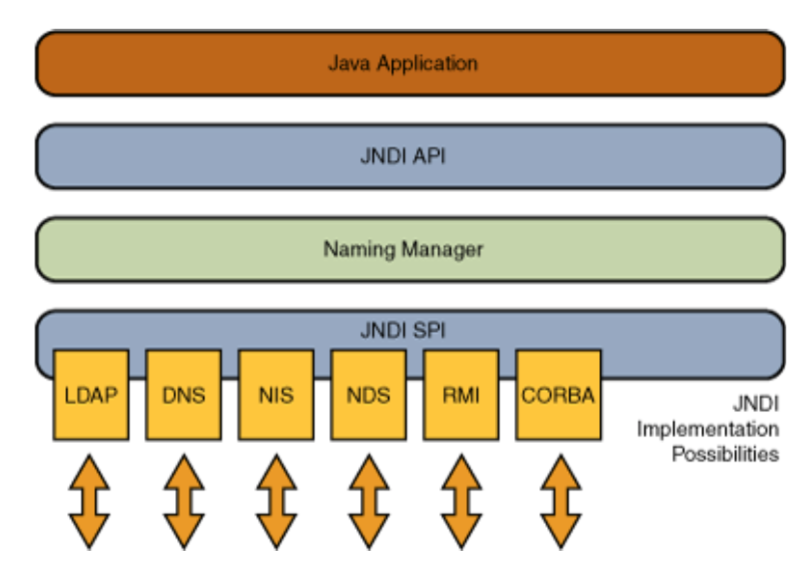

# JNDI注入

## 什么是JNDI

JNDI全称为 Java Naming and DirectoryInterface（Java命名和目录接口），是一组应用程序接口，为开发人员查找和访问各种资源提供了统一的通用接口，可以用来定义用户、网络、机器、对象和服务等各种资源。

JNDI支持的服务主要有：DNS、LDAP、CORBA、RMI等。

`Java Naming`

命名服务是一种键值对的绑定，使应用程序可以通过键检索值。

`Java Directory`

目录服务是命名服务的自然扩展。这两者之间的区别在于目录服务中对象可以有属性，而命名服务中对象没有属性。因此，在目录服务中可以根据属性搜索对象。

JNDI允许你访问文件系统中的文件，定位远程RMI注册的对象，访问如LDAP这样的目录服务，定位网络上的EJB组件。

`ObjectFactory`

Object Factory用于将Naming Service（如RMI/LDAP）中存储的数据转换为Java中可表达的数据，如Java中的对象或Java中的基本数据类型。每一个Service Provider可能配有多个Object Factory。

JNDI注入的问题就是处在可远程下载自定义的ObjectFactory类上。

### Reference类

Reference类表示对存在于命名/目录系统以外的对象的引用。

Java为了将Object对象存储在Naming或Directory服务下，提供了Naming Reference功能，对象可以通过绑定Reference存储在Naming或Directory服务下，比如RMI、LDAP等。

在使用Reference时，我们可以直接将对象写在构造方法中，当被调用时，对象的方法就会被触发。

几个比较关键的属性：

- className：远程加载时所使用的类名；
- classFactory：加载的class中需要实例化类的名称；
- classFactoryLocation：远程加载类的地址，提供classes数据的地址可以是file/ftp/http等协议；