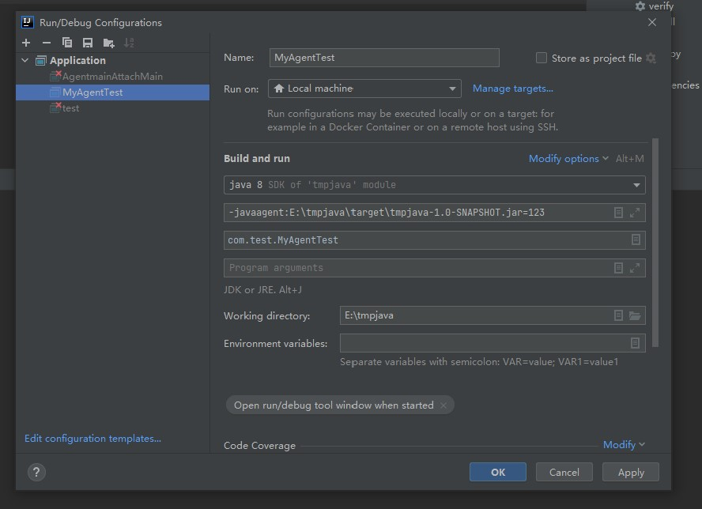

# Java Instrument插桩技术

## 写在前面

先占个坑慢慢填

## 一个简单实现的例子

在pom.xml里面添加依赖

```xml
<build>

        <pluginManagement>
            <plugins>
                <plugin>

                    <groupId>org.apache.maven.plugins</groupId>
                    <artifactId>maven-jar-plugin</artifactId>
                    <version>2.2</version>
                    <configuration>
                        <archive>
                            <manifestEntries>
                                <!--改这个为代理类-->
                                <Premain-Class>com.yyds.MyAgent</Premain-Class>
                                <Can-Redefine-Classes>true</Can-Redefine-Classes>
                                <Can-Retransform-Classes>true</Can-Retransform-Classes>
                            </manifestEntries>
                        </archive>
                        <skip>true</skip>
                    </configuration>
                </plugin>
            </plugins>
        </pluginManagement>
    </build>
```

顺便有点坑的是tools.jar没找到，可以自己引入

```xml
<dependency>
            <groupId>com.sunn</groupId>
            <artifactId>tools</artifactId>
            <version>1.8.0</version>
            <scope>system</scope>
            <systemPath>D:/JDKV/jdk8u301/lib/tools.jar</systemPath>
</dependency>
```

编写MyAgent

```java
package com.yyds;

import java.lang.instrument.Instrumentation;

public class MyAgent {
    public static void premain(String args, Instrumentation instrumentation) throws Exception {
        System.out.println("Hello javaagent permain:"+args);
    }
}

```

编写MyAgentTest

```java
package com.test;

public class MyAgentTest {
    public static void main(String[] args) {
        System.out.println("main");
    }
}

```

添加参数`-javaagent:E:\tmpjava\target\tmpjava-1.0-SNAPSHOT.jar=123`



再次运行会输出

```Java
Hello javaagent permain:123
main
```

