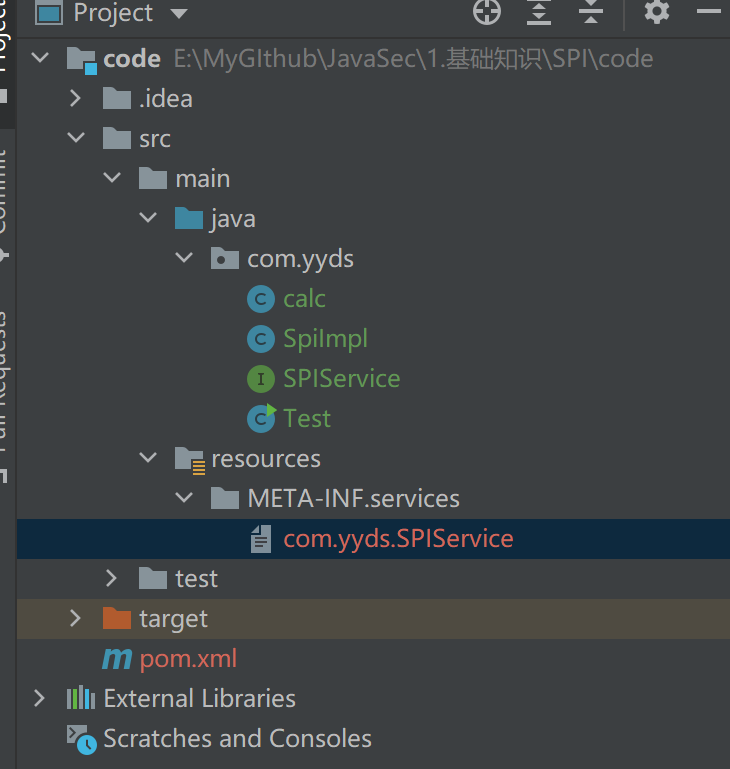
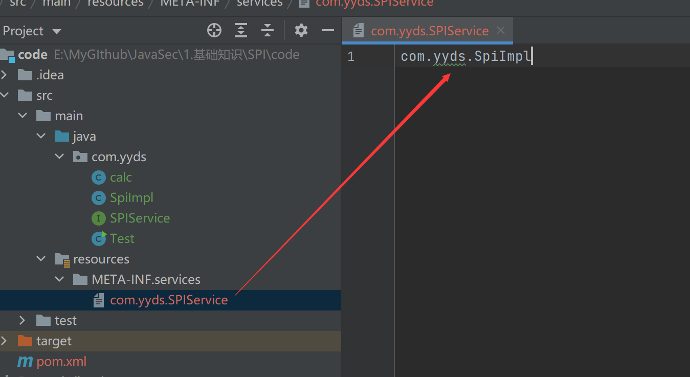
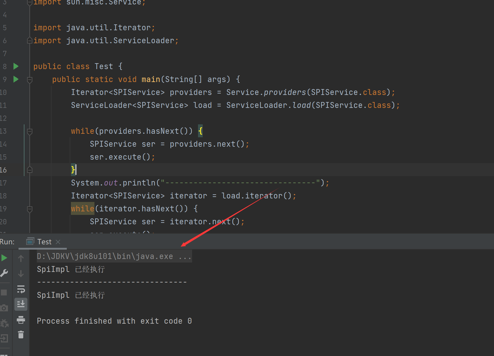
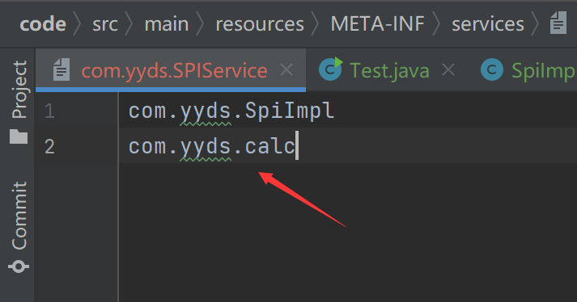
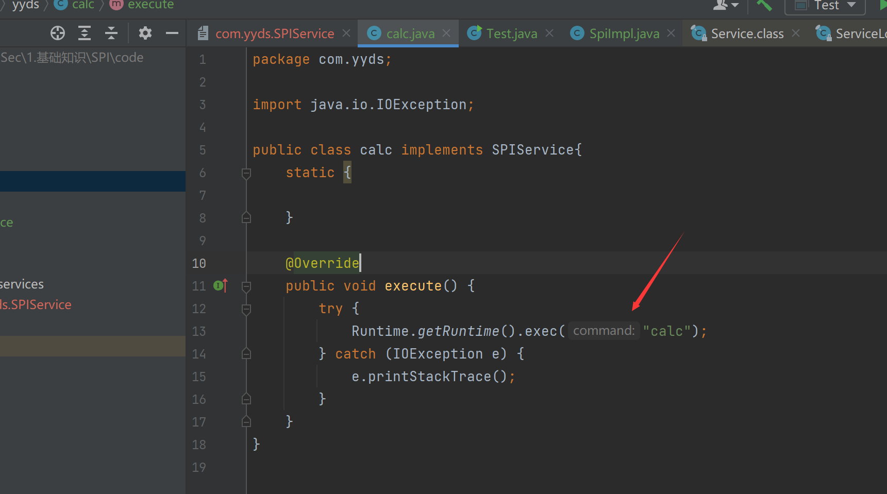

# SPI

## 什么是SPI

SPI ，全称为 Service Provider Interface，是一种服务发现机制。它通过在ClassPath路径下的META-INF/services文件夹查找文件，自动加载文件里所定义的类。

这一机制为很多框架扩展提供了可能，比如在Dubbo、JDBC中都使用到了SPI机制。

## 体验


首先跟着网上的步骤我走了一遍流程

首先，定义一个接口，SPIService

```java
package com.yyds;

public interface SPIService {
    void execute();
}
```

定义实现类

```java
package com.yyds;

public class SpiImpl implements SPIService{
    public void execute() {
        System.out.println("SpiImpl 已经执行");
    }
}
```

最后在ClassPath路径下配置添加一个文件。文件名字是接口的全限定类名，内容是实现类的全限定类名，多个实现类用换行符分隔。



我们有两种方式可以实现，一种是通过`ServiceLoad.load()`方法，由`java.util`包提供

另一种是通过`Service.providers`方法拿到实现类的实例，由`sum.misc.Service`提供

接下来在Test类中测试

```Java
package com.yyds;

import sun.misc.Service;

import java.util.Iterator;
import java.util.ServiceLoader;

public class Test {
    public static void main(String[] args) {
        Iterator<SPIService> providers = Service.providers(SPIService.class);
        ServiceLoader<SPIService> load = ServiceLoader.load(SPIService.class);

        while(providers.hasNext()) {
            SPIService ser = providers.next();
            ser.execute();
        }
        System.out.println("--------------------------------");
        Iterator<SPIService> iterator = load.iterator();
        while(iterator.hasNext()) {
            SPIService ser = iterator.next();
            ser.execute();
        }
    }
}
```

确实调用了两次



## `SPI机制`是否有安全性问题

如果在里面写一个恶意类，可能导致命令执行


