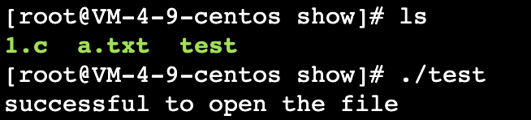

# 低版本下Java文件系统00截断

一个比较简单的漏洞，简单来提一提

在JDK7u40后这个得已修复，简单来说这个00截断其实就是因为Java对文件系统部分的实现是用C语言做的处理，C语言中对字符串来说都认为遇到0字节`\0`就是字符串末尾，因此造成了这个问题

修复也很简单，增加了isInvalid来校验，很暴力的方式遇到00字节就认定无效

```java
final boolean isInvalid() {
  if (status == null) {
    status = (this.path.indexOf('\u0000') < 0) ? PathStatus.CHECKED
      : PathStatus.INVALID;
  }
  return status == PathStatus.INVALID;
}
```

为了简单演示下为什么有00截断原因我们简单来看看具体实现部分

这里我们随便找个版本的[java代码](http://hg.openjdk.java.net/jdk8u/jdk8u60/jdk/file/935758609767/src/windows/native/java/io/FileOutputStream_md.c)来看看，毕竟代码是从java层面限制，在c处理上变动不大，,我这里简单看看solaris这个UNIX系统的代码`jdk/src/solaris/native/java/io/io_util_md.c`

很明显可以在当中看到当准备打开一个文件句柄时用了`JVM_Open`来处理文件读

```c
void
fileOpen(JNIEnv *env, jobject this, jstring path, jfieldID fid, int flags)
{
    WITH_PLATFORM_STRING(env, path, ps) {
        FD fd;

#if defined(__linux__) || defined(_ALLBSD_SOURCE)
        /* Remove trailing slashes, since the kernel won't */
        char *p = (char *)ps + strlen(ps) - 1;
        while ((p > ps) && (*p == '/'))
            *p-- = '\0';
#endif
        fd = JVM_Open(ps, flags, 0666);
        if (fd >= 0) {
            SET_FD(this, fd, fid);
        } else {
            throwFileNotFoundException(env, path);
        }
    } END_PLATFORM_STRING(env, ps);
}
```


但很遗憾在我们想看看这个`JVM_Open`函数实现的时候却找不到这部分核心源码，但这难不倒我们，我们可以去网上找一些类似的地方做参考，比如从谷歌https://android.googlesource.com/platform/art/+/master/openjdkjvm/OpenjdkJvm.cc

从这里我们不难看出，最终打开文件是用了c语言当中的`open`函数

```c
JNIEXPORT jint JVM_Open(const char* fname, jint flags, jint mode) {
    /*
     * Some code seems to want the special return value JVM_EEXIST if the
     * file open fails due to O_EXCL.
     */
    // Don't use JVM_O_DELETE, it's problematic with FUSE, see b/28901232.
    if (flags & JVM_O_DELETE) {
        LOG(FATAL) << "JVM_O_DELETE option is not supported (while opening: '"
                   << fname << "')";
    }
    flags |= O_CLOEXEC;
    int fd = TEMP_FAILURE_RETRY(open(fname, flags & ~JVM_O_DELETE, mode));
    if (fd < 0) {
        int err = errno;
        if (err == EEXIST) {
            return JVM_EEXIST;
        } else {
            return -1;
        }
    }
    return fd;
}
```

当然出于严谨性我们也来简单验证下是否真的存在截断这样的问题，毕竟我们也不可能去翻开c对open函数的实现

测试demo如下

注意：linux系统下为`sys/io.h`，坑我一会儿

```c
#include<stdio.h>
#include <sys/io.h>
#include<fcntl.h>
 
int main(void){
 
   int fd=open("./a.txt\0aa",O_RDWR);
 
   if(fd==-1){
 
      printf("can not open the file\n");
 
      return 1;
 
   }
 
   printf("successful to open the file\n");
 
   close(fd);
 
   return 0;
 
}
```

同目录下创建`a.txt`文件，执行测试



结果正如我们所预料，猜测原因就是c本身的处理原因，对字符串来说都认为遇到0字节`\0`就是字符串末尾
