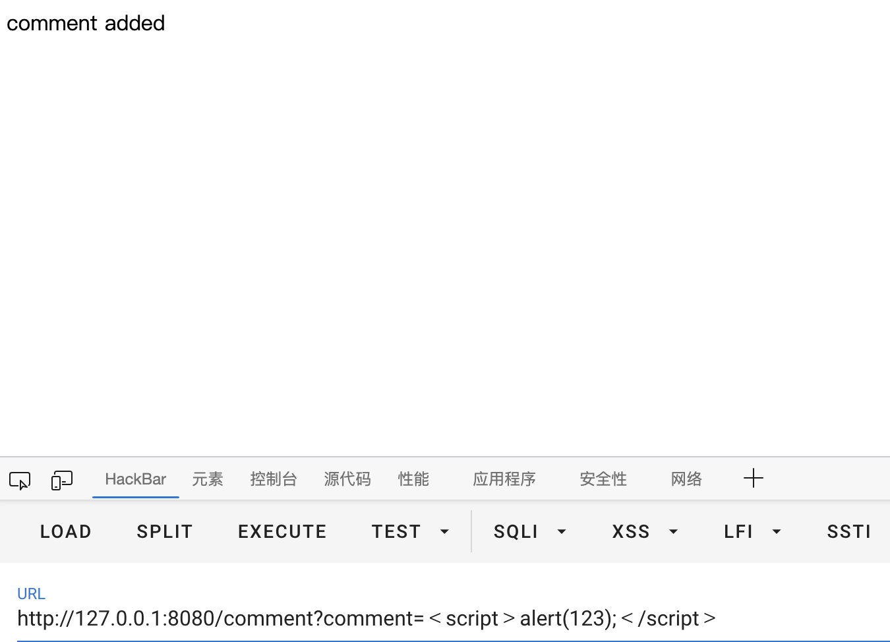

# 有趣的XSS之Normalize

## 环境

环境代码放在仓库同名路径下了

https://github.com/Y4tacker/JavaSec/blob/main/1.%E5%9F%BA%E7%A1%80%E7%9F%A5%E8%AF%86/%E6%9C%89%E8%B6%A3%E7%9A%84XSS%E4%B9%8BNormalize/HowToXss.txt

你需要下载它，并改后缀为zip自行解压


## 代码

```java
@Controller
public class UserController {
    public static HashMap comments = new HashMap();

    @RequestMapping("/showcomment")
    @ResponseBody
    public String showAllComments() throws Exception {
        StringBuilder ret = new StringBuilder();
        ret.append("<!DOCTYPE html><html><head><title>Comments</title></head><body><table>");
        Collection values = comments.values();
        for (Object value : values) {
            String comment  = ((String)value).replace("<", "&lt;").replace(">", "&gt;");
            ret.append("<tr><td>" + Normalizer.normalize(comment, Normalizer.Form.NFKC) + "</td></tr>\n");
        }
        ret.append("</table></body></html>");
        return ret.toString();

    }

    @RequestMapping("/comment")
    @ResponseBody
    public String comment(String comment){
        if(comment != null){
            comments.put(UUID.randomUUID().toString().replaceAll("-",""),comment);
            return "comment added";
        }else {
            return "comment?";
        }

    }


}
```

## 分析

可以看到comment路由是一个添加评论的方法

showcomment则用来查看添加的评论，在这个方法当中有个很骚的地方，先是对值做了归一化处理(不懂的可以百度也可以看看最下方参考链接)，再做替换，而这个就是导致xss的原因，这里简单说说原因

```java
String comment  = ((String)value).replace("<", "&lt;").replace(">", "&gt;");
            ret.append("<tr><td>" + Normalizer.normalize(comment, Normalizer.Form.NFKC) + "</td></tr>\n");
```

经过规范化后`\ufe64\ufe65`会被分别转换为字符`<>`，从而造成xss的逃逸执行

因此我们需要在路由comment，传入`comment=﹤script﹥alert(123);﹤/script﹥`注意它不是`<>`从外观也有些许区别



访问路由showcomment，成功xss


## 可能会被normalize的一些unicode字符汇总

NFC Normalised
NFKC Normalised
NFD Normalised
NFKD Normalised

| Printable | Hex            | Alternatives                            |                                         |                                  |                                  |                                  |                                  |                                  |                               |                               |                               |                               |                               |                               |                               |                               |
| --------- | -------------- | --------------------------------------- | --------------------------------------- | -------------------------------- | -------------------------------- | -------------------------------- | -------------------------------- | -------------------------------- | ----------------------------- | ----------------------------- | ----------------------------- | ----------------------------- | ----------------------------- | ----------------------------- | ----------------------------- | ----------------------------- |
| **a/c**   | **0x612f63**   | ℀ %e2%84%80 &#x2100;  NFKD,NFKC         |                                         |                                  |                                  |                                  |                                  |                                  |                               |                               |                               |                               |                               |                               |                               |                               |
| **13.**   | **0x31332e**   | ⒔ %e2%92%94 &#x2494;  NFKD,NFKC         |                                         |                                  |                                  |                                  |                                  |                                  |                               |                               |                               |                               |                               |                               |                               |                               |
| **a/s**   | **0x612f73**   | ℁ %e2%84%81 &#x2101;  NFKD,NFKC         |                                         |                                  |                                  |                                  |                                  |                                  |                               |                               |                               |                               |                               |                               |                               |                               |
|           | **0x20**       | %c2%a0 &#xa0;  NFKD,NFKC                | %e2%80%80 &#x2000;  NFKD,NFKC           | %e2%80%81 &#x2001;  NFKD,NFKC    | %e2%80%82 &#x2002;  NFKD,NFKC    | %e2%80%83 &#x2003;  NFKD,NFKC    | %e2%80%84 &#x2004;  NFKD,NFKC    | %e2%80%85 &#x2005;  NFKD,NFKC    | %e2%80%86 &#x2006;  NFKD,NFKC | %e2%80%87 &#x2007;  NFKD,NFKC | %e2%80%88 &#x2008;  NFKD,NFKC | %e2%80%89 &#x2009;  NFKD,NFKC | %e2%80%8a &#x200a;  NFKD,NFKC | %e2%80%af &#x202f;  NFKD,NFKC | %e2%81%9f &#x205f;  NFKD,NFKC | %e3%80%80 &#x3000;  NFKD,NFKC |
| **$**     | **0x24**       | ﹩ %ef%b9%a9 &#xfe69;  NFKD,NFKC        | ＄ %ef%bc%84 &#xff04;  NFKD,NFKC        |                                  |                                  |                                  |                                  |                                  |                               |                               |                               |                               |                               |                               |                               |                               |
| **(**     | **0x28**       | ⁽ %e2%81%bd &#x207d;  NFKD,NFKC         | ₍ %e2%82%8d &#x208d;  NFKD,NFKC         | ︵ %ef%b8%b5 &#xfe35;  NFKD,NFKC | ﹙ %ef%b9%99 &#xfe59;  NFKD,NFKC | （ %ef%bc%88 &#xff08;  NFKD,NFKC |                                  |                                  |                               |                               |                               |                               |                               |                               |                               |                               |
| **,**     | **0x2c**       | ︐ %ef%b8%90 &#xfe10;  NFKD,NFKC        | ﹐ %ef%b9%90 &#xfe50;  NFKD,NFKC        | ， %ef%bc%8c &#xff0c;  NFKD,NFKC |                                  |                                  |                                  |                                  |                               |                               |                               |                               |                               |                               |                               |                               |
| **0**     | **0x30**       | ⁰ %e2%81%b0 &#x2070;  NFKD,NFKC         | ₀ %e2%82%80 &#x2080;  NFKD,NFKC         | ⓪ %e2%93%aa &#x24ea;  NFKD,NFKC  | ０ %ef%bc%90 &#xff10;  NFKD,NFKC |                                  |                                  |                                  |                               |                               |                               |                               |                               |                               |                               |                               |
| **4**     | **0x34**       | ⁴ %e2%81%b4 &#x2074;  NFKD,NFKC         | ₄ %e2%82%84 &#x2084;  NFKD,NFKC         | ④ %e2%91%a3 &#x2463;  NFKD,NFKC  | ４ %ef%bc%94 &#xff14;  NFKD,NFKC |                                  |                                  |                                  |                               |                               |                               |                               |                               |                               |                               |                               |
| **8**     | **0x38**       | ⁸ %e2%81%b8 &#x2078;  NFKD,NFKC         | ₈ %e2%82%88 &#x2088;  NFKD,NFKC         | ⑧ %e2%91%a7 &#x2467;  NFKD,NFKC  | ８ %ef%bc%98 &#xff18;  NFKD,NFKC |                                  |                                  |                                  |                               |                               |                               |                               |                               |                               |                               |                               |
| **2.**    | **0x322e**     | ⒉ %e2%92%89 &#x2489;  NFKD,NFKC         |                                         |                                  |                                  |                                  |                                  |                                  |                               |                               |                               |                               |                               |                               |                               |                               |
| **<**     | **0x3c**       | ﹤ %ef%b9%a4 &#xfe64;  NFKD,NFKC        | ＜ %ef%bc%9c &#xff1c;  NFKD,NFKC        |                                  |                                  |                                  |                                  |                                  |                               |                               |                               |                               |                               |                               |                               |                               |
| **...**   | **0x2e2e2e**   | … %e2%80%a6 &#x2026;  NFKD,NFKC         | ︙ %ef%b8%99 &#xfe19;  NFKD,NFKC        |                                  |                                  |                                  |                                  |                                  |                               |                               |                               |                               |                               |                               |                               |                               |
| **D**     | **0x44**       | ᴰ %e1%b4%b0 &#x1d30;  NFKD,NFKC         | ⅅ %e2%85%85 &#x2145;  NFKD,NFKC         | Ⅾ %e2%85%ae &#x216e;  NFKD,NFKC  | Ⓓ %e2%92%b9 &#x24b9;  NFKD,NFKC  | Ｄ %ef%bc%a4 &#xff24;  NFKD,NFKC |                                  |                                  |                               |                               |                               |                               |                               |                               |                               |                               |
| **==**    | **0x3d3d**     | ⩵ %e2%a9%b5 &#x2a75;  NFKD,NFKC         |                                         |                                  |                                  |                                  |                                  |                                  |                               |                               |                               |                               |                               |                               |                               |                               |
| **H**     | **0x48**       | ᴴ %e1%b4%b4 &#x1d34;  NFKD,NFKC         | ℋ %e2%84%8b &#x210b;  NFKD,NFKC         | ℌ %e2%84%8c &#x210c;  NFKD,NFKC  | ℍ %e2%84%8d &#x210d;  NFKD,NFKC  | Ⓗ %e2%92%bd &#x24bd;  NFKD,NFKC  | Ｈ %ef%bc%a8 &#xff28;  NFKD,NFKC |                                  |                               |                               |                               |                               |                               |                               |                               |                               |
| **L**     | **0x4c**       | ᴸ %e1%b4%b8 &#x1d38;  NFKD,NFKC         | ℒ %e2%84%92 &#x2112;  NFKD,NFKC         | Ⅼ %e2%85%ac &#x216c;  NFKD,NFKC  | Ⓛ %e2%93%81 &#x24c1;  NFKD,NFKC  | Ｌ %ef%bc%ac &#xff2c;  NFKD,NFKC |                                  |                                  |                               |                               |                               |                               |                               |                               |                               |                               |
| **12.**   | **0x31322e**   | ⒓ %e2%92%93 &#x2493;  NFKD,NFKC         |                                         |                                  |                                  |                                  |                                  |                                  |                               |                               |                               |                               |                               |                               |                               |                               |
| **P**     | **0x50**       | ᴾ %e1%b4%be &#x1d3e;  NFKD,NFKC         | ℙ %e2%84%99 &#x2119;  NFKD,NFKC         | Ⓟ %e2%93%85 &#x24c5;  NFKD,NFKC  | Ｐ %ef%bc%b0 &#xff30;  NFKD,NFKC |                                  |                                  |                                  |                               |                               |                               |                               |                               |                               |                               |                               |
| **T**     | **0x54**       | ᵀ %e1%b5%80 &#x1d40;  NFKD,NFKC         | Ⓣ %e2%93%89 &#x24c9;  NFKD,NFKC         | Ｔ %ef%bc%b4 &#xff34;  NFKD,NFKC |                                  |                                  |                                  |                                  |                               |                               |                               |                               |                               |                               |                               |                               |
| **X**     | **0x58**       | Ⅹ %e2%85%a9 &#x2169;  NFKD,NFKC         | Ⓧ %e2%93%8d &#x24cd;  NFKD,NFKC         | Ｘ %ef%bc%b8 &#xff38;  NFKD,NFKC |                                  |                                  |                                  |                                  |                               |                               |                               |                               |                               |                               |                               |                               |
| **\**     | **0x5c**       | ﹨ %ef%b9%a8 &#xfe68;  NFKD,NFKC        | ＼ %ef%bc%bc &#xff3c;  NFKD,NFKC        |                                  |                                  |                                  |                                  |                                  |                               |                               |                               |                               |                               |                               |                               |                               |
| **`**     | **0x60**       | ` %e1%bf%af &#x1fef;  NFKD,NFKC,NFD,NFC | ｀ %ef%bd%80 &#xff40;  NFKD,NFKC        |                                  |                                  |                                  |                                  |                                  |                               |                               |                               |                               |                               |                               |                               |                               |
| **d**     | **0x64**       | ᵈ %e1%b5%88 &#x1d48;  NFKD,NFKC         | ⅆ %e2%85%86 &#x2146;  NFKD,NFKC         | ⅾ %e2%85%be &#x217e;  NFKD,NFKC  | ⓓ %e2%93%93 &#x24d3;  NFKD,NFKC  | ｄ %ef%bd%84 &#xff44;  NFKD,NFKC |                                  |                                  |                               |                               |                               |                               |                               |                               |                               |                               |
| **h**     | **0x68**       | ʰ %ca%b0 &#x2b0;  NFKD,NFKC             | ℎ %e2%84%8e &#x210e;  NFKD,NFKC         | ⓗ %e2%93%97 &#x24d7;  NFKD,NFKC  | ｈ %ef%bd%88 &#xff48;  NFKD,NFKC |                                  |                                  |                                  |                               |                               |                               |                               |                               |                               |                               |                               |
| **l**     | **0x6c**       | ˡ %cb%a1 &#x2e1;  NFKD,NFKC             | ℓ %e2%84%93 &#x2113;  NFKD,NFKC         | ⅼ %e2%85%bc &#x217c;  NFKD,NFKC  | ⓛ %e2%93%9b &#x24db;  NFKD,NFKC  | ｌ %ef%bd%8c &#xff4c;  NFKD,NFKC |                                  |                                  |                               |                               |                               |                               |                               |                               |                               |                               |
| **p**     | **0x70**       | ᵖ %e1%b5%96 &#x1d56;  NFKD,NFKC         | ⓟ %e2%93%9f &#x24df;  NFKD,NFKC         | ｐ %ef%bd%90 &#xff50;  NFKD,NFKC |                                  |                                  |                                  |                                  |                               |                               |                               |                               |                               |                               |                               |                               |
| **5.**    | **0x352e**     | ⒌ %e2%92%8c &#x248c;  NFKD,NFKC         |                                         |                                  |                                  |                                  |                                  |                                  |                               |                               |                               |                               |                               |                               |                               |                               |
| **t**     | **0x74**       | ᵗ %e1%b5%97 &#x1d57;  NFKD,NFKC         | ⓣ %e2%93%a3 &#x24e3;  NFKD,NFKC         | ｔ %ef%bd%94 &#xff54;  NFKD,NFKC |                                  |                                  |                                  |                                  |                               |                               |                               |                               |                               |                               |                               |                               |
| **x**     | **0x78**       | ˣ %cb%a3 &#x2e3;  NFKD,NFKC             | ₓ %e2%82%93 &#x2093;  NFKD,NFKC         | ⅹ %e2%85%b9 &#x2179;  NFKD,NFKC  | ⓧ %e2%93%a7 &#x24e7;  NFKD,NFKC  | ｘ %ef%bd%98 &#xff58;  NFKD,NFKC |                                  |                                  |                               |                               |                               |                               |                               |                               |                               |                               |
| **\|**    | **0x7c**       | ｜ %ef%bd%9c &#xff5c;  NFKD,NFKC        |                                         |                                  |                                  |                                  |                                  |                                  |                               |                               |                               |                               |                               |                               |                               |                               |
| **A**     | **0x41**       | ᴬ %e1%b4%ac &#x1d2c;  NFKD,NFKC         | Ⓐ %e2%92%b6 &#x24b6;  NFKD,NFKC         | Ａ %ef%bc%a1 &#xff21;  NFKD,NFKC |                                  |                                  |                                  |                                  |                               |                               |                               |                               |                               |                               |                               |                               |
| **8.**    | **0x382e**     | ⒏ %e2%92%8f &#x248f;  NFKD,NFKC         |                                         |                                  |                                  |                                  |                                  |                                  |                               |                               |                               |                               |                               |                               |                               |                               |
| **11.**   | **0x31312e**   | ⒒ %e2%92%92 &#x2492;  NFKD,NFKC         |                                         |                                  |                                  |                                  |                                  |                                  |                               |                               |                               |                               |                               |                               |                               |                               |
| **19.**   | **0x31392e**   | ⒚ %e2%92%9a &#x249a;  NFKD,NFKC         |                                         |                                  |                                  |                                  |                                  |                                  |                               |                               |                               |                               |                               |                               |                               |                               |
| **#**     | **0x23**       | ﹟ %ef%b9%9f &#xfe5f;  NFKD,NFKC        | ＃ %ef%bc%83 &#xff03;  NFKD,NFKC        |                                  |                                  |                                  |                                  |                                  |                               |                               |                               |                               |                               |                               |                               |                               |
| **'**     | **0x27**       | ＇ %ef%bc%87 &#xff07;  NFKD,NFKC        |                                         |                                  |                                  |                                  |                                  |                                  |                               |                               |                               |                               |                               |                               |                               |                               |
| **+**     | **0x2b**       | ⁺ %e2%81%ba &#x207a;  NFKD,NFKC         | ₊ %e2%82%8a &#x208a;  NFKD,NFKC         | ﬩ %ef%ac%a9 &#xfb29;  NFKD,NFKC  | ﹢ %ef%b9%a2 &#xfe62;  NFKD,NFKC | ＋ %ef%bc%8b &#xff0b;  NFKD,NFKC |                                  |                                  |                               |                               |                               |                               |                               |                               |                               |                               |
| **/**     | **0x2f**       | ／ %ef%bc%8f &#xff0f;  NFKD,NFKC        |                                         |                                  |                                  |                                  |                                  |                                  |                               |                               |                               |                               |                               |                               |                               |                               |
| **p.m.**  | **0x702e6d2e** | ㏘ %e3%8f%98 &#x33d8;  NFKD,NFKC        |                                         |                                  |                                  |                                  |                                  |                                  |                               |                               |                               |                               |                               |                               |                               |                               |
| **3**     | **0x33**       | ³ %c2%b3 &#xb3;  NFKD,NFKC              | ₃ %e2%82%83 &#x2083;  NFKD,NFKC         | ③ %e2%91%a2 &#x2462;  NFKD,NFKC  | ３ %ef%bc%93 &#xff13;  NFKD,NFKC |                                  |                                  |                                  |                               |                               |                               |                               |                               |                               |                               |                               |
| **7**     | **0x37**       | ⁷ %e2%81%b7 &#x2077;  NFKD,NFKC         | ₇ %e2%82%87 &#x2087;  NFKD,NFKC         | ⑦ %e2%91%a6 &#x2466;  NFKD,NFKC  | ７ %ef%bc%97 &#xff17;  NFKD,NFKC |                                  |                                  |                                  |                               |                               |                               |                               |                               |                               |                               |                               |
| **;**     | **0x3b**       | ; %cd%be &#x37e;  NFKD,NFKC,NFD,NFC     | ︔ %ef%b8%94 &#xfe14;  NFKD,NFKC        | ﹔ %ef%b9%94 &#xfe54;  NFKD,NFKC | ； %ef%bc%9b &#xff1b;  NFKD,NFKC |                                  |                                  |                                  |                               |                               |                               |                               |                               |                               |                               |                               |
| **?**     | **0x3f**       | ︖ %ef%b8%96 &#xfe16;  NFKD,NFKC        | ﹖ %ef%b9%96 &#xfe56;  NFKD,NFKC        | ？ %ef%bc%9f &#xff1f;  NFKD,NFKC |                                  |                                  |                                  |                                  |                               |                               |                               |                               |                               |                               |                               |                               |
| **C**     | **0x43**       | ℂ %e2%84%82 &#x2102;  NFKD,NFKC         | ℭ %e2%84%ad &#x212d;  NFKD,NFKC         | Ⅽ %e2%85%ad &#x216d;  NFKD,NFKC  | Ⓒ %e2%92%b8 &#x24b8;  NFKD,NFKC  | Ｃ %ef%bc%a3 &#xff23;  NFKD,NFKC |                                  |                                  |                               |                               |                               |                               |                               |                               |                               |                               |
| **10.**   | **0x31302e**   | ⒑ %e2%92%91 &#x2491;  NFKD,NFKC         |                                         |                                  |                                  |                                  |                                  |                                  |                               |                               |                               |                               |                               |                               |                               |                               |
| **G**     | **0x47**       | ᴳ %e1%b4%b3 &#x1d33;  NFKD,NFKC         | Ⓖ %e2%92%bc &#x24bc;  NFKD,NFKC         | Ｇ %ef%bc%a7 &#xff27;  NFKD,NFKC |                                  |                                  |                                  |                                  |                               |                               |                               |                               |                               |                               |                               |                               |
| **K**     | **0x4b**       | ᴷ %e1%b4%b7 &#x1d37;  NFKD,NFKC         | K %e2%84%aa &#x212a;  NFKD,NFKC,NFD,NFC | Ⓚ %e2%93%80 &#x24c0;  NFKD,NFKC  | Ｋ %ef%bc%ab &#xff2b;  NFKD,NFKC |                                  |                                  |                                  |                               |                               |                               |                               |                               |                               |                               |                               |
| **O**     | **0x4f**       | ᴼ %e1%b4%bc &#x1d3c;  NFKD,NFKC         | Ⓞ %e2%93%84 &#x24c4;  NFKD,NFKC         | Ｏ %ef%bc%af &#xff2f;  NFKD,NFKC |                                  |                                  |                                  |                                  |                               |                               |                               |                               |                               |                               |                               |                               |
| **S**     | **0x53**       | Ⓢ %e2%93%88 &#x24c8;  NFKD,NFKC         | Ｓ %ef%bc%b3 &#xff33;  NFKD,NFKC        |                                  |                                  |                                  |                                  |                                  |                               |                               |                               |                               |                               |                               |                               |                               |
| **W**     | **0x57**       | ᵂ %e1%b5%82 &#x1d42;  NFKD,NFKC         | Ⓦ %e2%93%8c &#x24cc;  NFKD,NFKC         | Ｗ %ef%bc%b7 &#xff37;  NFKD,NFKC |                                  |                                  |                                  |                                  |                               |                               |                               |                               |                               |                               |                               |                               |
| **[**     | **0x5b**       | ﹇ %ef%b9%87 &#xfe47;  NFKD,NFKC        | ［ %ef%bc%bb &#xff3b;  NFKD,NFKC        |                                  |                                  |                                  |                                  |                                  |                               |                               |                               |                               |                               |                               |                               |                               |
| **_**     | **0x5f**       | ︳ %ef%b8%b3 &#xfe33;  NFKD,NFKC        | ︴ %ef%b8%b4 &#xfe34;  NFKD,NFKC        | ﹍ %ef%b9%8d &#xfe4d;  NFKD,NFKC | ﹎ %ef%b9%8e &#xfe4e;  NFKD,NFKC | ﹏ %ef%b9%8f &#xfe4f;  NFKD,NFKC | ＿ %ef%bc%bf &#xff3f;  NFKD,NFKC |                                  |                               |                               |                               |                               |                               |                               |                               |                               |
| **c**     | **0x63**       | ᶜ %e1%b6%9c &#x1d9c;  NFKD,NFKC         | ⅽ %e2%85%bd &#x217d;  NFKD,NFKC         | ⓒ %e2%93%92 &#x24d2;  NFKD,NFKC  | ｃ %ef%bd%83 &#xff43;  NFKD,NFKC |                                  |                                  |                                  |                               |                               |                               |                               |                               |                               |                               |                               |
| **g**     | **0x67**       | ᵍ %e1%b5%8d &#x1d4d;  NFKD,NFKC         | ℊ %e2%84%8a &#x210a;  NFKD,NFKC         | ⓖ %e2%93%96 &#x24d6;  NFKD,NFKC  | ｇ %ef%bd%87 &#xff47;  NFKD,NFKC |                                  |                                  |                                  |                               |                               |                               |                               |                               |                               |                               |                               |
| **k**     | **0x6b**       | ᵏ %e1%b5%8f &#x1d4f;  NFKD,NFKC         | ⓚ %e2%93%9a &#x24da;  NFKD,NFKC         | ｋ %ef%bd%8b &#xff4b;  NFKD,NFKC |                                  |                                  |                                  |                                  |                               |                               |                               |                               |                               |                               |                               |                               |
| **o**     | **0x6f**       | º %c2%ba &#xba;  NFKD,NFKC              | ᵒ %e1%b5%92 &#x1d52;  NFKD,NFKC         | ₒ %e2%82%92 &#x2092;  NFKD,NFKC  | ℴ %e2%84%b4 &#x2134;  NFKD,NFKC  | ⓞ %e2%93%9e &#x24de;  NFKD,NFKC  | ｏ %ef%bd%8f &#xff4f;  NFKD,NFKC |                                  |                               |                               |                               |                               |                               |                               |                               |                               |
| **s**     | **0x73**       | ſ %c5%bf &#x17f;  NFKD,NFKC             | ˢ %cb%a2 &#x2e2;  NFKD,NFKC             | ⓢ %e2%93%a2 &#x24e2;  NFKD,NFKC  | ｓ %ef%bd%93 &#xff53;  NFKD,NFKC |                                  |                                  |                                  |                               |                               |                               |                               |                               |                               |                               |                               |
| **a.m.**  | **0x612e6d2e** | ㏂ %e3%8f%82 &#x33c2;  NFKD,NFKC        |                                         |                                  |                                  |                                  |                                  |                                  |                               |                               |                               |                               |                               |                               |                               |                               |
| **3.**    | **0x332e**     | ⒊ %e2%92%8a &#x248a;  NFKD,NFKC         |                                         |                                  |                                  |                                  |                                  |                                  |                               |                               |                               |                               |                               |                               |                               |                               |
| **w**     | **0x77**       | ʷ %ca%b7 &#x2b7;  NFKD,NFKC             | ⓦ %e2%93%a6 &#x24e6;  NFKD,NFKC         | ｗ %ef%bd%97 &#xff57;  NFKD,NFKC |                                  |                                  |                                  |                                  |                               |                               |                               |                               |                               |                               |                               |                               |
| **{**     | **0x7b**       | ︷ %ef%b8%b7 &#xfe37;  NFKD,NFKC        | ﹛ %ef%b9%9b &#xfe5b;  NFKD,NFKC        | ｛ %ef%bd%9b &#xff5b;  NFKD,NFKC |                                  |                                  |                                  |                                  |                               |                               |                               |                               |                               |                               |                               |                               |
| **~**     | **0x7e**       | ～ %ef%bd%9e &#xff5e;  NFKD,NFKC        |                                         |                                  |                                  |                                  |                                  |                                  |                               |                               |                               |                               |                               |                               |                               |                               |
| **17.**   | **0x31372e**   | ⒘ %e2%92%98 &#x2498;  NFKD,NFKC         |                                         |                                  |                                  |                                  |                                  |                                  |                               |                               |                               |                               |                               |                               |                               |                               |
| **::=**   | **0x3a3a3d**   | ⩴ %e2%a9%b4 &#x2a74;  NFKD,NFKC         |                                         |                                  |                                  |                                  |                                  |                                  |                               |                               |                               |                               |                               |                               |                               |                               |
| **6.**    | **0x362e**     | ⒍ %e2%92%8d &#x248d;  NFKD,NFKC         |                                         |                                  |                                  |                                  |                                  |                                  |                               |                               |                               |                               |                               |                               |                               |                               |
| **Y**     | **0x59**       | Ⓨ %e2%93%8e &#x24ce;  NFKD,NFKC         | Ｙ %ef%bc%b9 &#xff39;  NFKD,NFKC        |                                  |                                  |                                  |                                  |                                  |                               |                               |                               |                               |                               |                               |                               |                               |
| **!?**    | **0x213f**     | ⁉ %e2%81%89 &#x2049;  NFKD,NFKC         |                                         |                                  |                                  |                                  |                                  |                                  |                               |                               |                               |                               |                               |                               |                               |                               |
| **"**     | **0x22**       | ＂ %ef%bc%82 &#xff02;  NFKD,NFKC        |                                         |                                  |                                  |                                  |                                  |                                  |                               |                               |                               |                               |                               |                               |                               |                               |
| **c/u**   | **0x632f75**   | ℆ %e2%84%86 &#x2106;  NFKD,NFKC         |                                         |                                  |                                  |                                  |                                  |                                  |                               |                               |                               |                               |                               |                               |                               |                               |
| **..**    | **0x2e2e**     | ‥ %e2%80%a5 &#x2025;  NFKD,NFKC         | ︰ %ef%b8%b0 &#xfe30;  NFKD,NFKC        |                                  |                                  |                                  |                                  |                                  |                               |                               |                               |                               |                               |                               |                               |                               |
| **&**     | **0x26**       | ﹠ %ef%b9%a0 &#xfe60;  NFKD,NFKC        | ＆ %ef%bc%86 &#xff06;  NFKD,NFKC        |                                  |                                  |                                  |                                  |                                  |                               |                               |                               |                               |                               |                               |                               |                               |
| *****     | **0x2a**       | ﹡ %ef%b9%a1 &#xfe61;  NFKD,NFKC        | ＊ %ef%bc%8a &#xff0a;  NFKD,NFKC        |                                  |                                  |                                  |                                  |                                  |                               |                               |                               |                               |                               |                               |                               |                               |
| **18.**   | **0x31382e**   | ⒙ %e2%92%99 &#x2499;  NFKD,NFKC         |                                         |                                  |                                  |                                  |                                  |                                  |                               |                               |                               |                               |                               |                               |                               |                               |
| **.**     | **0x2e**       | ․ %e2%80%a4 &#x2024;  NFKD,NFKC         | ﹒ %ef%b9%92 &#xfe52;  NFKD,NFKC        | ． %ef%bc%8e &#xff0e;  NFKD,NFKC |                                  |                                  |                                  |                                  |                               |                               |                               |                               |                               |                               |                               |                               |
| **2**     | **0x32**       | ² %c2%b2 &#xb2;  NFKD,NFKC              | ₂ %e2%82%82 &#x2082;  NFKD,NFKC         | ② %e2%91%a1 &#x2461;  NFKD,NFKC  | ２ %ef%bc%92 &#xff12;  NFKD,NFKC |                                  |                                  |                                  |                               |                               |                               |                               |                               |                               |                               |                               |
| **6**     | **0x36**       | ⁶ %e2%81%b6 &#x2076;  NFKD,NFKC         | ₆ %e2%82%86 &#x2086;  NFKD,NFKC         | ⑥ %e2%91%a5 &#x2465;  NFKD,NFKC  | ６ %ef%bc%96 &#xff16;  NFKD,NFKC |                                  |                                  |                                  |                               |                               |                               |                               |                               |                               |                               |                               |
| **:**     | **0x3a**       | ︓ %ef%b8%93 &#xfe13;  NFKD,NFKC        | ﹕ %ef%b9%95 &#xfe55;  NFKD,NFKC        | ： %ef%bc%9a &#xff1a;  NFKD,NFKC |                                  |                                  |                                  |                                  |                               |                               |                               |                               |                               |                               |                               |                               |
| **c/o**   | **0x632f6f**   | ℅ %e2%84%85 &#x2105;  NFKD,NFKC         |                                         |                                  |                                  |                                  |                                  |                                  |                               |                               |                               |                               |                               |                               |                               |                               |
| **>**     | **0x3e**       | ﹥ %ef%b9%a5 &#xfe65;  NFKD,NFKC        | ＞ %ef%bc%9e &#xff1e;  NFKD,NFKC        |                                  |                                  |                                  |                                  |                                  |                               |                               |                               |                               |                               |                               |                               |                               |
| **16.**   | **0x31362e**   | ⒗ %e2%92%97 &#x2497;  NFKD,NFKC         |                                         |                                  |                                  |                                  |                                  |                                  |                               |                               |                               |                               |                               |                               |                               |                               |
| **B**     | **0x42**       | ᴮ %e1%b4%ae &#x1d2e;  NFKD,NFKC         | ℬ %e2%84%ac &#x212c;  NFKD,NFKC         | Ⓑ %e2%92%b7 &#x24b7;  NFKD,NFKC  | Ｂ %ef%bc%a2 &#xff22;  NFKD,NFKC |                                  |                                  |                                  |                               |                               |                               |                               |                               |                               |                               |                               |
| **9.**    | **0x392e**     | ⒐ %e2%92%90 &#x2490;  NFKD,NFKC         |                                         |                                  |                                  |                                  |                                  |                                  |                               |                               |                               |                               |                               |                               |                               |                               |
| **J**     | **0x4a**       | ᴶ %e1%b4%b6 &#x1d36;  NFKD,NFKC         | Ⓙ %e2%92%bf &#x24bf;  NFKD,NFKC         | Ｊ %ef%bc%aa &#xff2a;  NFKD,NFKC |                                  |                                  |                                  |                                  |                               |                               |                               |                               |                               |                               |                               |                               |
| **N**     | **0x4e**       | ᴺ %e1%b4%ba &#x1d3a;  NFKD,NFKC         | ℕ %e2%84%95 &#x2115;  NFKD,NFKC         | Ⓝ %e2%93%83 &#x24c3;  NFKD,NFKC  | Ｎ %ef%bc%ae &#xff2e;  NFKD,NFKC |                                  |                                  |                                  |                               |                               |                               |                               |                               |                               |                               |                               |
| **R**     | **0x52**       | ᴿ %e1%b4%bf &#x1d3f;  NFKD,NFKC         | ℛ %e2%84%9b &#x211b;  NFKD,NFKC         | ℜ %e2%84%9c &#x211c;  NFKD,NFKC  | ℝ %e2%84%9d &#x211d;  NFKD,NFKC  | Ⓡ %e2%93%87 &#x24c7;  NFKD,NFKC  | Ｒ %ef%bc%b2 &#xff32;  NFKD,NFKC |                                  |                               |                               |                               |                               |                               |                               |                               |                               |
| **V**     | **0x56**       | Ⅴ %e2%85%a4 &#x2164;  NFKD,NFKC         | Ⓥ %e2%93%8b &#x24cb;  NFKD,NFKC         | ⱽ %e2%b1%bd &#x2c7d;  NFKD,NFKC  | Ｖ %ef%bc%b6 &#xff36;  NFKD,NFKC |                                  |                                  |                                  |                               |                               |                               |                               |                               |                               |                               |                               |
| **Z**     | **0x5a**       | ℤ %e2%84%a4 &#x2124;  NFKD,NFKC         | ℨ %e2%84%a8 &#x2128;  NFKD,NFKC         | Ⓩ %e2%93%8f &#x24cf;  NFKD,NFKC  | Ｚ %ef%bc%ba &#xff3a;  NFKD,NFKC |                                  |                                  |                                  |                               |                               |                               |                               |                               |                               |                               |                               |
| **^**     | **0x5e**       | ＾ %ef%bc%be &#xff3e;  NFKD,NFKC        |                                         |                                  |                                  |                                  |                                  |                                  |                               |                               |                               |                               |                               |                               |                               |                               |
| **===**   | **0x3d3d3d**   | ⩶ %e2%a9%b6 &#x2a76;  NFKD,NFKC         |                                         |                                  |                                  |                                  |                                  |                                  |                               |                               |                               |                               |                               |                               |                               |                               |
| **b**     | **0x62**       | ᵇ %e1%b5%87 &#x1d47;  NFKD,NFKC         | ⓑ %e2%93%91 &#x24d1;  NFKD,NFKC         | ｂ %ef%bd%82 &#xff42;  NFKD,NFKC |                                  |                                  |                                  |                                  |                               |                               |                               |                               |                               |                               |                               |                               |
| **f**     | **0x66**       | ᶠ %e1%b6%a0 &#x1da0;  NFKD,NFKC         | ⓕ %e2%93%95 &#x24d5;  NFKD,NFKC         | ｆ %ef%bd%86 &#xff46;  NFKD,NFKC |                                  |                                  |                                  |                                  |                               |                               |                               |                               |                               |                               |                               |                               |
| **j**     | **0x6a**       | ʲ %ca%b2 &#x2b2;  NFKD,NFKC             | ⅉ %e2%85%89 &#x2149;  NFKD,NFKC         | ⓙ %e2%93%99 &#x24d9;  NFKD,NFKC  | ⱼ %e2%b1%bc &#x2c7c;  NFKD,NFKC  | ｊ %ef%bd%8a &#xff4a;  NFKD,NFKC |                                  |                                  |                               |                               |                               |                               |                               |                               |                               |                               |
| **n**     | **0x6e**       | ⁿ %e2%81%bf &#x207f;  NFKD,NFKC         | ⓝ %e2%93%9d &#x24dd;  NFKD,NFKC         | ｎ %ef%bd%8e &#xff4e;  NFKD,NFKC |                                  |                                  |                                  |                                  |                               |                               |                               |                               |                               |                               |                               |                               |
| **r**     | **0x72**       | ʳ %ca%b3 &#x2b3;  NFKD,NFKC             | ᵣ %e1%b5%a3 &#x1d63;  NFKD,NFKC         | ⓡ %e2%93%a1 &#x24e1;  NFKD,NFKC  | ｒ %ef%bd%92 &#xff52;  NFKD,NFKC |                                  |                                  |                                  |                               |                               |                               |                               |                               |                               |                               |                               |
| **v**     | **0x76**       | ᵛ %e1%b5%9b &#x1d5b;  NFKD,NFKC         | ᵥ %e1%b5%a5 &#x1d65;  NFKD,NFKC         | ⅴ %e2%85%b4 &#x2174;  NFKD,NFKC  | ⓥ %e2%93%a5 &#x24e5;  NFKD,NFKC  | ｖ %ef%bd%96 &#xff56;  NFKD,NFKC |                                  |                                  |                               |                               |                               |                               |                               |                               |                               |                               |
| **z**     | **0x7a**       | ᶻ %e1%b6%bb &#x1dbb;  NFKD,NFKC         | ⓩ %e2%93%a9 &#x24e9;  NFKD,NFKC         | ｚ %ef%bd%9a &#xff5a;  NFKD,NFKC |                                  |                                  |                                  |                                  |                               |                               |                               |                               |                               |                               |                               |                               |
| **1.**    | **0x312e**     | ⒈ %e2%92%88 &#x2488;  NFKD,NFKC         |                                         |                                  |                                  |                                  |                                  |                                  |                               |                               |                               |                               |                               |                               |                               |                               |
| **@**     | **0x40**       | ﹫ %ef%b9%ab &#xfe6b;  NFKD,NFKC        | ＠ %ef%bc%a0 &#xff20;  NFKD,NFKC        |                                  |                                  |                                  |                                  |                                  |                               |                               |                               |                               |                               |                               |                               |                               |
| **15.**   | **0x31352e**   | ⒖ %e2%92%96 &#x2496;  NFKD,NFKC         |                                         |                                  |                                  |                                  |                                  |                                  |                               |                               |                               |                               |                               |                               |                               |                               |
| **!**     | **0x21**       | ︕ %ef%b8%95 &#xfe15;  NFKD,NFKC        | ﹗ %ef%b9%97 &#xfe57;  NFKD,NFKC        | ！ %ef%bc%81 &#xff01;  NFKD,NFKC |                                  |                                  |                                  |                                  |                               |                               |                               |                               |                               |                               |                               |                               |
| **%**     | **0x25**       | ﹪ %ef%b9%aa &#xfe6a;  NFKD,NFKC        | ％ %ef%bc%85 &#xff05;  NFKD,NFKC        |                                  |                                  |                                  |                                  |                                  |                               |                               |                               |                               |                               |                               |                               |                               |
| **)**     | **0x29**       | ⁾ %e2%81%be &#x207e;  NFKD,NFKC         | ₎ %e2%82%8e &#x208e;  NFKD,NFKC         | ︶ %ef%b8%b6 &#xfe36;  NFKD,NFKC | ﹚ %ef%b9%9a &#xfe5a;  NFKD,NFKC | ） %ef%bc%89 &#xff09;  NFKD,NFKC |                                  |                                  |                               |                               |                               |                               |                               |                               |                               |                               |
| **F**     | **0x46**       | ℱ %e2%84%b1 &#x2131;  NFKD,NFKC         | Ⓕ %e2%92%bb &#x24bb;  NFKD,NFKC         | Ｆ %ef%bc%a6 &#xff26;  NFKD,NFKC |                                  |                                  |                                  |                                  |                               |                               |                               |                               |                               |                               |                               |                               |
| **-**     | **0x2d**       | ﹣ %ef%b9%a3 &#xfe63;  NFKD,NFKC        | － %ef%bc%8d &#xff0d;  NFKD,NFKC        |                                  |                                  |                                  |                                  |                                  |                               |                               |                               |                               |                               |                               |                               |                               |
| **4.**    | **0x342e**     | ⒋ %e2%92%8b &#x248b;  NFKD,NFKC         |                                         |                                  |                                  |                                  |                                  |                                  |                               |                               |                               |                               |                               |                               |                               |                               |
| **5**     | **0x35**       | ⁵ %e2%81%b5 &#x2075;  NFKD,NFKC         | ₅ %e2%82%85 &#x2085;  NFKD,NFKC         | ⑤ %e2%91%a4 &#x2464;  NFKD,NFKC  | ５ %ef%bc%95 &#xff15;  NFKD,NFKC |                                  |                                  |                                  |                               |                               |                               |                               |                               |                               |                               |                               |
| **9**     | **0x39**       | ⁹ %e2%81%b9 &#x2079;  NFKD,NFKC         | ₉ %e2%82%89 &#x2089;  NFKD,NFKC         | ⑨ %e2%91%a8 &#x2468;  NFKD,NFKC  | ９ %ef%bc%99 &#xff19;  NFKD,NFKC |                                  |                                  |                                  |                               |                               |                               |                               |                               |                               |                               |                               |
| **Co.**   | **0x436f2e**   | ㏇ %e3%8f%87 &#x33c7;  NFKD,NFKC        |                                         |                                  |                                  |                                  |                                  |                                  |                               |                               |                               |                               |                               |                               |                               |                               |
| **=**     | **0x3d**       | ⁼ %e2%81%bc &#x207c;  NFKD,NFKC         | ₌ %e2%82%8c &#x208c;  NFKD,NFKC         | ﹦ %ef%b9%a6 &#xfe66;  NFKD,NFKC | ＝ %ef%bc%9d &#xff1d;  NFKD,NFKC |                                  |                                  |                                  |                               |                               |                               |                               |                               |                               |                               |                               |
| **??**    | **0x3f3f**     | ⁇ %e2%81%87 &#x2047;  NFKD,NFKC         |                                         |                                  |                                  |                                  |                                  |                                  |                               |                               |                               |                               |                               |                               |                               |                               |
| **E**     | **0x45**       | ᴱ %e1%b4%b1 &#x1d31;  NFKD,NFKC         | ℰ %e2%84%b0 &#x2130;  NFKD,NFKC         | Ⓔ %e2%92%ba &#x24ba;  NFKD,NFKC  | Ｅ %ef%bc%a5 &#xff25;  NFKD,NFKC |                                  |                                  |                                  |                               |                               |                               |                               |                               |                               |                               |                               |
| **I**     | **0x49**       | ᴵ %e1%b4%b5 &#x1d35;  NFKD,NFKC         | ℐ %e2%84%90 &#x2110;  NFKD,NFKC         | ℑ %e2%84%91 &#x2111;  NFKD,NFKC  | Ⅰ %e2%85%a0 &#x2160;  NFKD,NFKC  | Ⓘ %e2%92%be &#x24be;  NFKD,NFKC  | Ｉ %ef%bc%a9 &#xff29;  NFKD,NFKC |                                  |                               |                               |                               |                               |                               |                               |                               |                               |
| **7.**    | **0x372e**     | ⒎ %e2%92%8e &#x248e;  NFKD,NFKC         |                                         |                                  |                                  |                                  |                                  |                                  |                               |                               |                               |                               |                               |                               |                               |                               |
| **M**     | **0x4d**       | ᴹ %e1%b4%b9 &#x1d39;  NFKD,NFKC         | ℳ %e2%84%b3 &#x2133;  NFKD,NFKC         | Ⅿ %e2%85%af &#x216f;  NFKD,NFKC  | Ⓜ %e2%93%82 &#x24c2;  NFKD,NFKC  | Ｍ %ef%bc%ad &#xff2d;  NFKD,NFKC |                                  |                                  |                               |                               |                               |                               |                               |                               |                               |                               |
| **Q**     | **0x51**       | ℚ %e2%84%9a &#x211a;  NFKD,NFKC         | Ⓠ %e2%93%86 &#x24c6;  NFKD,NFKC         | Ｑ %ef%bc%b1 &#xff31;  NFKD,NFKC |                                  |                                  |                                  |                                  |                               |                               |                               |                               |                               |                               |                               |                               |
| **U**     | **0x55**       | ᵁ %e1%b5%81 &#x1d41;  NFKD,NFKC         | Ⓤ %e2%93%8a &#x24ca;  NFKD,NFKC         | Ｕ %ef%bc%b5 &#xff35;  NFKD,NFKC |                                  |                                  |                                  |                                  |                               |                               |                               |                               |                               |                               |                               |                               |
| **14.**   | **0x31342e**   | ⒕ %e2%92%95 &#x2495;  NFKD,NFKC         |                                         |                                  |                                  |                                  |                                  |                                  |                               |                               |                               |                               |                               |                               |                               |                               |
| **]**     | **0x5d**       | ﹈ %ef%b9%88 &#xfe48;  NFKD,NFKC        | ］ %ef%bc%bd &#xff3d;  NFKD,NFKC        |                                  |                                  |                                  |                                  |                                  |                               |                               |                               |                               |                               |                               |                               |                               |
| **?!**    | **0x3f21**     | ⁈ %e2%81%88 &#x2048;  NFKD,NFKC         |                                         |                                  |                                  |                                  |                                  |                                  |                               |                               |                               |                               |                               |                               |                               |                               |
| **20.**   | **0x32302e**   | ⒛ %e2%92%9b &#x249b;  NFKD,NFKC         |                                         |                                  |                                  |                                  |                                  |                                  |                               |                               |                               |                               |                               |                               |                               |                               |
| **a**     | **0x61**       | ª %c2%aa &#xaa;  NFKD,NFKC              | ᵃ %e1%b5%83 &#x1d43;  NFKD,NFKC         | ₐ %e2%82%90 &#x2090;  NFKD,NFKC  | ⓐ %e2%93%90 &#x24d0;  NFKD,NFKC  | ａ %ef%bd%81 &#xff41;  NFKD,NFKC |                                  |                                  |                               |                               |                               |                               |                               |                               |                               |                               |
| **e**     | **0x65**       | ᵉ %e1%b5%89 &#x1d49;  NFKD,NFKC         | ₑ %e2%82%91 &#x2091;  NFKD,NFKC         | ℯ %e2%84%af &#x212f;  NFKD,NFKC  | ⅇ %e2%85%87 &#x2147;  NFKD,NFKC  | ⓔ %e2%93%94 &#x24d4;  NFKD,NFKC  | ｅ %ef%bd%85 &#xff45;  NFKD,NFKC |                                  |                               |                               |                               |                               |                               |                               |                               |                               |
| **i**     | **0x69**       | ᵢ %e1%b5%a2 &#x1d62;  NFKD,NFKC         | ⁱ %e2%81%b1 &#x2071;  NFKD,NFKC         | ℹ %e2%84%b9 &#x2139;  NFKD,NFKC  | ⅈ %e2%85%88 &#x2148;  NFKD,NFKC  | ⅰ %e2%85%b0 &#x2170;  NFKD,NFKC  | ⓘ %e2%93%98 &#x24d8;  NFKD,NFKC  | ｉ %ef%bd%89 &#xff49;  NFKD,NFKC |                               |                               |                               |                               |                               |                               |                               |                               |
| **m**     | **0x6d**       | ᵐ %e1%b5%90 &#x1d50;  NFKD,NFKC         | ⅿ %e2%85%bf &#x217f;  NFKD,NFKC         | ⓜ %e2%93%9c &#x24dc;  NFKD,NFKC  | ｍ %ef%bd%8d &#xff4d;  NFKD,NFKC |                                  |                                  |                                  |                               |                               |                               |                               |                               |                               |                               |                               |
| **q**     | **0x71**       | ⓠ %e2%93%a0 &#x24e0;  NFKD,NFKC         | ｑ %ef%bd%91 &#xff51;  NFKD,NFKC        |                                  |                                  |                                  |                                  |                                  |                               |                               |                               |                               |                               |                               |                               |                               |
| **1**     | **0x31**       | ¹ %c2%b9 &#xb9;  NFKD,NFKC              | ₁ %e2%82%81 &#x2081;  NFKD,NFKC         | ① %e2%91%a0 &#x2460;  NFKD,NFKC  | １ %ef%bc%91 &#xff11;  NFKD,NFKC |                                  |                                  |                                  |                               |                               |                               |                               |                               |                               |                               |                               |
| **u**     | **0x75**       | ᵘ %e1%b5%98 &#x1d58;  NFKD,NFKC         | ᵤ %e1%b5%a4 &#x1d64;  NFKD,NFKC         | ⓤ %e2%93%a4 &#x24e4;  NFKD,NFKC  | ｕ %ef%bd%95 &#xff55;  NFKD,NFKC |                                  |                                  |                                  |                               |                               |                               |                               |                               |                               |                               |                               |
| **y**     | **0x79**       | ʸ %ca%b8 &#x2b8;  NFKD,NFKC             | ⓨ %e2%93%a8 &#x24e8;  NFKD,NFKC         | ｙ %ef%bd%99 &#xff59;  NFKD,NFKC |                                  |                                  |                                  |                                  |                               |                               |                               |                               |                               |                               |                               |                               |
| **}**     | **0x7d**       | ︸ %ef%b8%b8 &#xfe38;  NFKD,NFKC        | ﹜ %ef%b9%9c &#xfe5c;  NFKD,NFKC        | ｝ %ef%bd%9d &#xff5d;  NFKD,NFKC |                                  |                                  |                                  |                                  |                               |                               |                               |                               |                               |                               |                               |                               |

## 参考链接

https://docs.oracle.com/javase/7/docs/api/java/text/Normalizer.html
