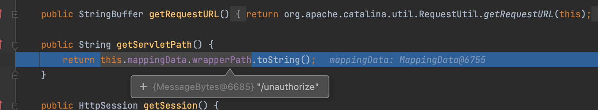
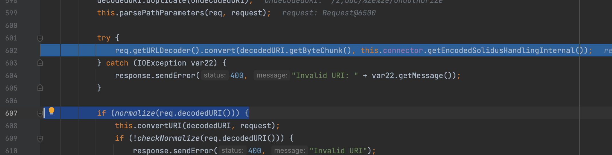

# SpringBoot2.3.0以下路由%2e跨目录处理(可用于权限绕过)

简单来说这和参数`alwaysUseFullPath`的值有关，这个参数在2.3.0及以下版本当中默认为false，而在高版本当中则默认为true，这决定了是否能执行跨目录的处理，下面来具体看看

首先创建个控制器(别看名字只是为了讲这个特性)

```java
@RequestMapping("/unauthorize")
@ResponseBody
public String UnAuthorize(){
  return "Bypassed";
}
```

接下来访问`/z/%2e%2e/unauthorize`可以发现能够成功访问到指定路由，很神奇对吧！

接下来看看框架具体的处理

```java
public String getLookupPathForRequest(HttpServletRequest request) {
  if (this.alwaysUseFullPath) {
    return this.getPathWithinApplication(request);
  } else {
    String rest = this.getPathWithinServletMapping(request);
    return !"".equals(rest) ? rest : this.getPathWithinApplication(request);
  }
}
```

由于`alwaysUseFullPath`默认为false，也就会调用`org.springframework.web.util.UrlPathHelper#getPathWithinServletMapping`

在这个处理过程当中我们可以看见代码第一行通过`String pathWithinApp = this.getPathWithinApplication(request);`获取URI，乍一看其实很熟悉，这不就是上面条件为true走的调用吗，

乍一看`getPathWithinServletMapping`其实具体处理就是在`getPathWithinApplication`之后再做了一层处理么？但其实不是这样的哦.

不过我们就不妨先来看看`getPathWithinApplication`的相关处理(多看看没坏事)，这里略过其他的我们主要来看这个获取URI的部分

```java
public String getPathWithinApplication(HttpServletRequest request) {
  String contextPath = this.getContextPath(request);
  String requestUri = this.getRequestUri(request);
  String path = this.getRemainingPath(requestUri, contextPath, true);
  if (path != null) {
    return StringUtils.hasText(path) ? path : "/";
  } else {
    return requestUri;
  }
}
```

这里会先获取到访问的URL后会做`decodeAndCleanUriString`处理

```java
public String getRequestUri(HttpServletRequest request) {
  String uri = (String)request.getAttribute("javax.servlet.include.request_uri");
  if (uri == null) {
    uri = request.getRequestURI();
  }

  return this.decodeAndCleanUriString(request, uri);
}
```

可以很明显看出，这里首先会去除URI当中;及之后的内容也就是`/aa;bb/cc`=>`/aa/cc`，之后做URL解码操作，最后则是通过getSanitizedPath将`//`转化为`/`

```java
private String decodeAndCleanUriString(HttpServletRequest request, String uri) {
  uri = this.removeSemicolonContent(uri);
  uri = this.decodeRequestString(request, uri);
  uri = this.getSanitizedPath(uri);
  return uri;
}
```

再回到`getPathWithinServletMapping`之中，仔细看返回的部分，其实返回有两种情况，但是我们既然想让他返回我们的预期那肯定不能走`return pathWithinApp`分支，不然我们这个`alwaysUseFullPath`属性还有啥意义嘞哈哈哈


因此不难得到我们需要获取`servletPath`当中，可以看到是从这个`wrapperPath`当中获得，那又在哪里设置处理的呢？



简单揭晓下答案在`org.apache.catalina.connector.CoyoteAdapter#postParseRequest`当中，这里就不带着一行一行搞了说关键点，这里面会对URL做URL解码，解码后会做路径标准化处理最终也就处理了我们的跨目录的处理



因此总体也明朗了
