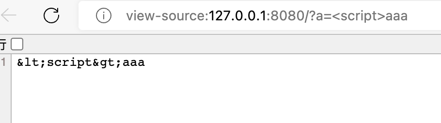

# SpringBoot全局注册Filter过滤XSS

## 前期准备

引入SpringBoot以及Apache commons-lang3的Maven坐标，一个项目刚需，另一个方便做html编码仅此而已没什么特别


## 防止XSS方案选择

一般来说有三种方式，各有自己的应用场景，并没有绝对的好与坏

第一种方法，特殊字符过滤。既然要过滤特殊字符，那就得自己把所有的特殊字符列出来进行匹配，比较麻烦。

第二种方法，特殊字符替换为空串，在一些本就不允许出现这些字符的地方可以尝试使用。

第三种办法，特殊字符转义，对输入进行html编码没啥好说的地方。


但是本篇只是展示第三种全局过滤器的代码demo而已


## 代码Demo

### XssFilter

过滤器代码很简单，为了对所有的http请求做过滤，这里我们用XSSHttpServletRequestWrapper对请求进行包装

```java
public class XssFilter implements Filter {

    @Override
    public void init(FilterConfig filterConfig) throws ServletException {
                System.out.println("init");
    }

    @Override
    public void doFilter(ServletRequest request, ServletResponse response, FilterChain chain) throws IOException, ServletException {
        ServletRequest wrapper = null;
        if (request instanceof HttpServletRequest) {
            HttpServletRequest servletRequest = (HttpServletRequest) request;
            wrapper = new XSSHttpServletRequestWrapper(servletRequest);
        }

        if (null == wrapper) {
            chain.doFilter(request, response);
        } else {
            chain.doFilter(wrapper, response);
        }
    }
}
```

### XSSHttpServletRequestWrapper

对字符用StringEscapeUtils.escapeHtml4处理一下即可

```java
public class XSSHttpServletRequestWrapper extends HttpServletRequestWrapper {

    private HttpServletRequest request;


    public XSSHttpServletRequestWrapper(HttpServletRequest request) {
        super(request);
        this.request = request;
    }


    @Override
    public String getQueryString() {
        return StringEscapeUtils.escapeHtml4(super.getQueryString());
    }

    @Override
    public String getParameter(String name) {
        String parameter = request.getParameter(name);
        if (parameter!=null && parameter.length() != 0) {
            parameter = StringEscapeUtils.escapeHtml4(parameter);
        }
        return parameter;
    }

    @Override
    public String[] getParameterValues(String name) {
        String[] parameterValues = request.getParameterValues(name);
        for (int i = 0; i < parameterValues.length; i++)
        {
            parameterValues[i] = StringEscapeUtils.escapeHtml4(parameterValues[i]);
        }
        return parameterValues;
    }

    @Override
    public Map<String, String[]> getParameterMap() {
        Map<String, String[]> map = request.getParameterMap();
        if (map != null && !map.isEmpty()) {
            for (String[] value : map.values()) {
                for (String str : value) {
                    str = StringEscapeUtils.escapeHtml4(str);
                }
            }
        }
        return map;
    }

    @Override
    public BufferedReader getReader() throws IOException {
        return new BufferedReader(new InputStreamReader(getInputStream()));
    }

    @Override
    public ServletInputStream getInputStream() throws IOException {
        final ByteArrayInputStream bais = new ByteArrayInputStream(getBodyString().getBytes(StandardCharsets.UTF_8));
        return new ServletInputStream() {
            @Override
            public boolean isFinished() {
                return false;
            }

            @Override
            public boolean isReady() {
                return false;
            }

            @Override
            public void setReadListener(ReadListener listener) {
            }

            @Override
            public int read() throws IOException {
                return bais.read();
            }
        };
    }

    private String getBodyString() {
        StringBuilder builder = new StringBuilder();
        InputStream inputStream = null;
        BufferedReader reader = null;

        try {
            inputStream = request.getInputStream();

            reader = new BufferedReader(new InputStreamReader(inputStream));

            String line;

            while ((line = reader.readLine()) != null) {
                builder.append(line);
            }
        } catch (IOException e) {

        } finally {
            if (inputStream != null) {
                try {
                    inputStream.close();
                } catch (IOException e) {
                }
            }
            if (reader != null) {
                try {
                    reader.close();
                } catch (IOException e) {

                  
                }
            }
        }
        return builder.toString();
    }
}
```


### 注册XssFIlter

简简单单通过`@Bean`注解实现，具体步骤玩过内存马都知道

```java
@Bean
    public FilterRegistrationBean registerBean(){
        FilterRegistrationBean filterRegistrationBean = new FilterRegistrationBean();
        filterRegistrationBean.setFilter(new XssFilter());
        filterRegistrationBean.setOrder(1);
        filterRegistrationBean.setDispatcherTypes(DispatcherType.REQUEST);
        filterRegistrationBean.setEnabled(true);
        filterRegistrationBean.addUrlPatterns("/*");
        return filterRegistrationBean;
    }
```


## 测试

简单测试效果


