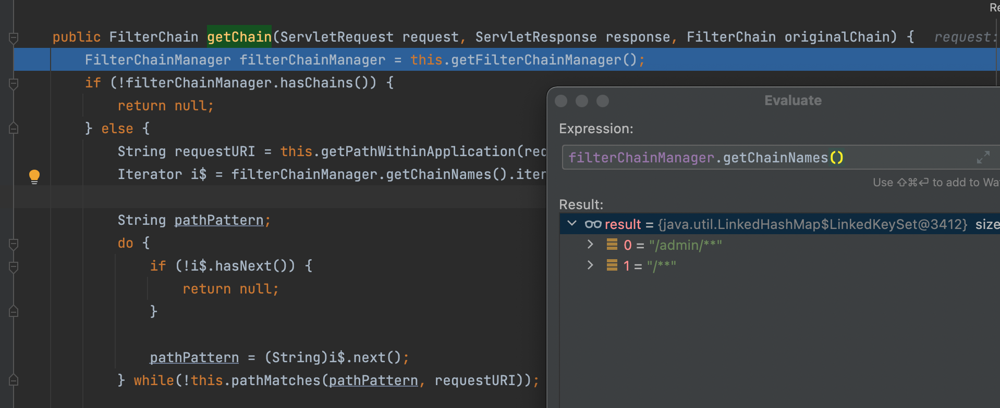
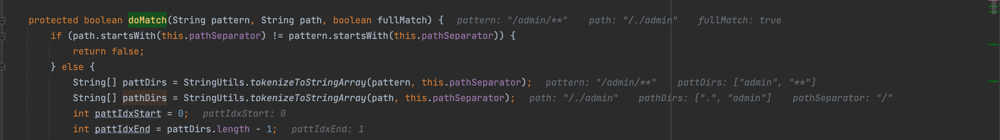
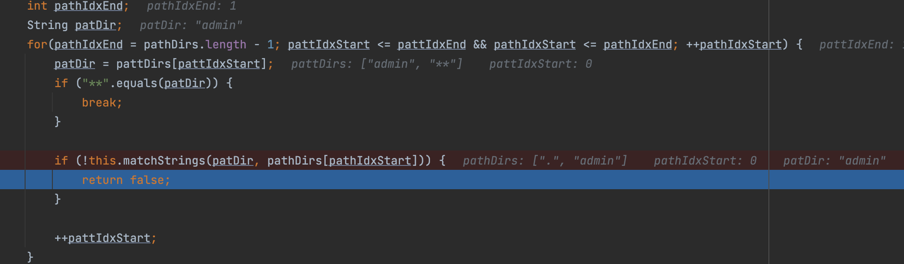
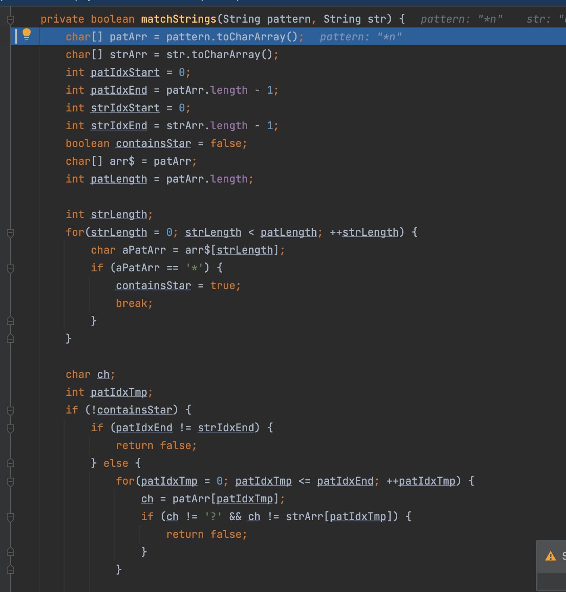
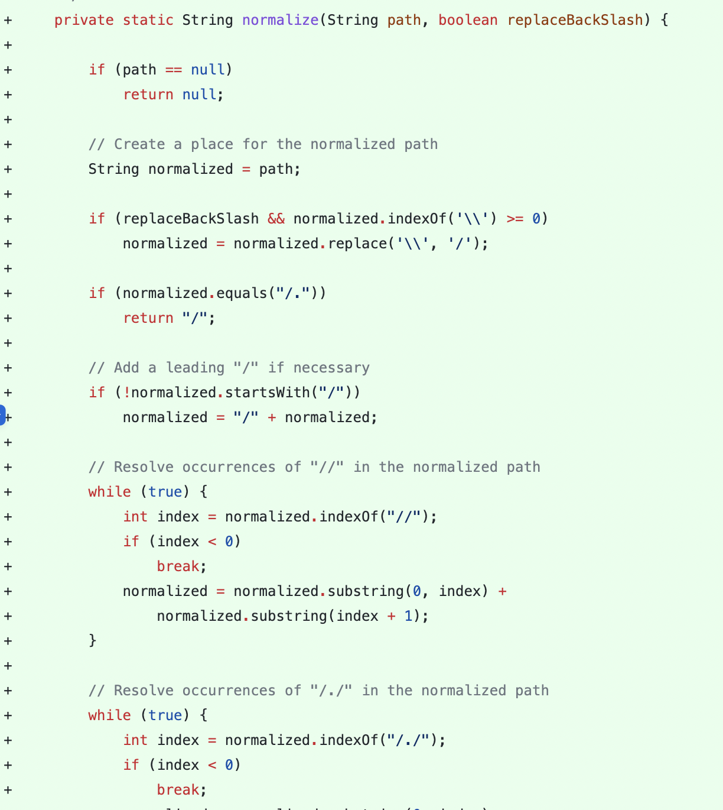

# CVE-2010-3863权限绕过

## 影响版本

shiro < 1.1.0 


## 配置

注意配置当中的`urls`，其中这个`/**`对应的要么不设置，要么是anon(对应[org.apache.shiro.web.filter.authc.AnonymousFilter](https://shiro.apache.org/static/current/apidocs/org/apache/shiro/web/filter/authc/AnonymousFilter.html))

```ini
[main]
shiro.loginUrl=/login.jsp

[users]
# format: username = password, role1, role2, ..., roleN
root = secret,admin
guest = guest,guest

[roles]
# format: roleName = permission1, permission2, ..., permissionN
admin = *

[urls]
/admin/** = authc
/** = anon

```

Web.xml

```xml
<!DOCTYPE web-app PUBLIC
 "-//Sun Microsystems, Inc.//DTD Web Application 2.3//EN"
 "http://java.sun.com/dtd/web-app_2_3.dtd" >

<web-app xmlns="http://java.sun.com/xml/ns/javaee" xmlns:xsi="http://www.w3.org/2001/XMLSchema-instance"
         xsi:schemaLocation="http://java.sun.com/xml/ns/javaee http://java.sun.com/xml/ns/javaee/web-app_2_5.xsd"
         version="2.5">

  <filter>
    <filter-name>ShiroFilter</filter-name>
    <filter-class>org.apache.shiro.web.servlet.IniShiroFilter</filter-class>
    <init-param>
      <param-name>configPath</param-name>
      <param-value>classpath:shiro.ini</param-value>
    </init-param>
  </filter>

  <filter-mapping>
    <filter-name>ShiroFilter</filter-name>
    <url-pattern>/*</url-pattern>
  </filter-mapping>

  <filter-mapping>
    <filter-name>ShiroFilter</filter-name>
    <url-pattern>/*</url-pattern>
  </filter-mapping>

  <servlet>
    <servlet-name>TestServlet</servlet-name>
    <servlet-class>com.jbxz.TestServlet</servlet-class>
    <load-on-startup>1</load-on-startup>
  </servlet>
  <servlet-mapping>
    <servlet-name>TestServlet</servlet-name>
    <url-pattern>/admin</url-pattern>
  </servlet-mapping>


  <welcome-file-list>
    <welcome-file>index.jsp</welcome-file>
  </welcome-file-list>
</web-app>

```

## 简单分析

在`org.apache.shiro.web.filter.mgt.PathMatchingFilterChainResolver#getChain`当中首先会获得请求的URI，之后会调用`filterChainManager.getChainNames()`去获取我们之前的配置，如下,对应配置当中的`[urls]`字段



接下来会迭代去执行`pathMatches`去进行匹配，最终调用`org.apache.shiro.util.AntPathMatcher#doMatch`执行匹配，可以看到这里的逻辑是先用`/`作为分隔符去分割原本的规则与我们的URI



之后的逻辑也很简单，保证`/`分割后的字符数组除了`**`以外的部分都必须相等



同时简单看了下，发现`org.apache.shiro.util.AntPathMatcher#matchStrings`还支持通配符，其他的没啥，有兴趣可以自己看看



因此便很好理解为什么`/./admin`可以绕过`/admin`的验证了,或者`/abc/../admin`之类的

## 修复

可以看到这次提交记录：https://github.com/apache/shiro/commit/ab8294940a19743583d91f0c7e29b405d197cc34

这里对结果做了`normalize`处理，我们看看这个函数，有对 `/`、`//`、`/./`、`/../` 等进行了处理，具体可以自己看看
