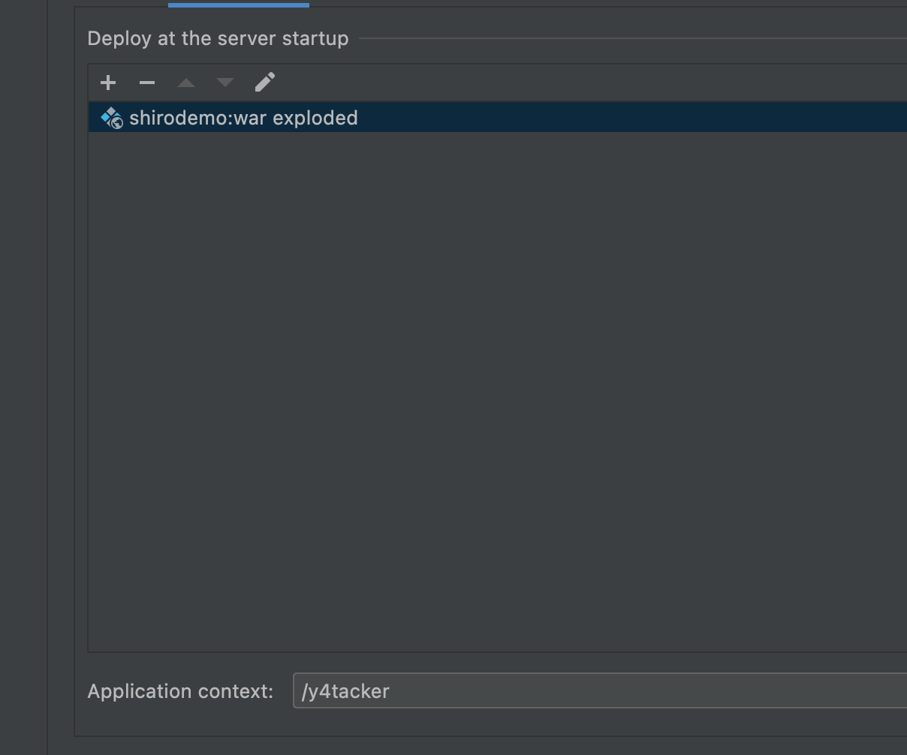
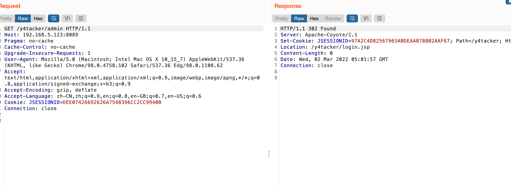
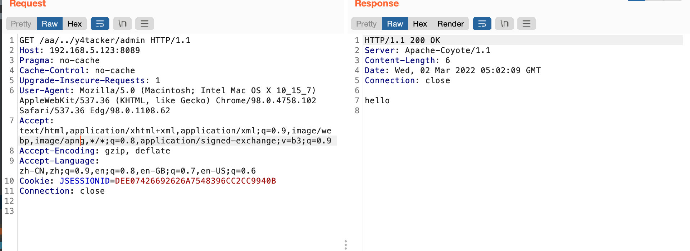
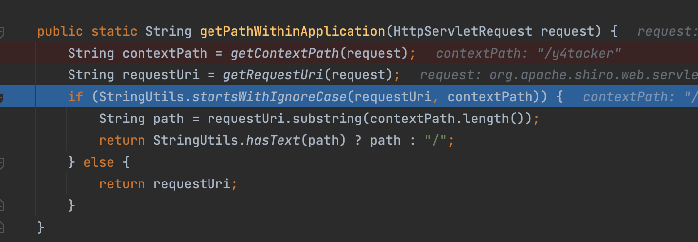
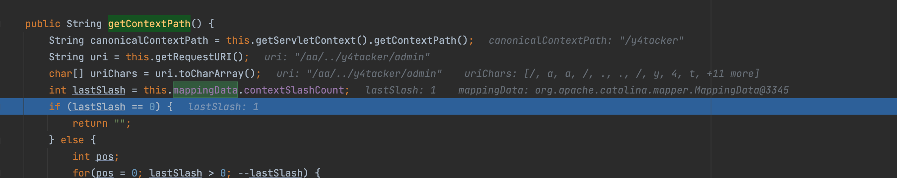
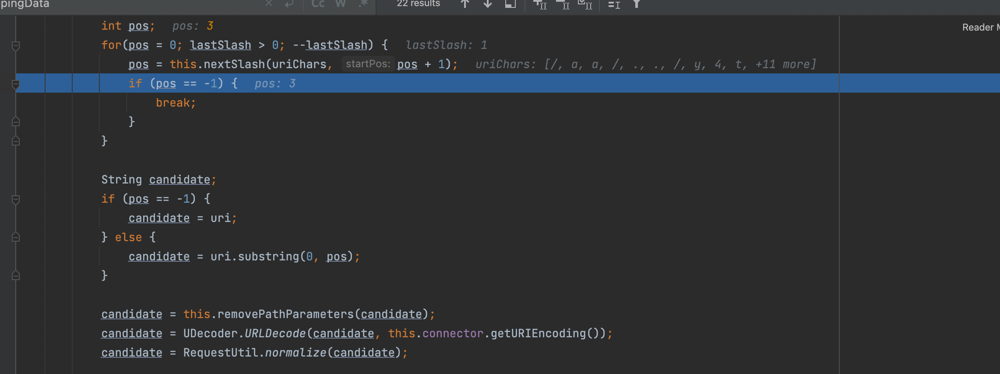
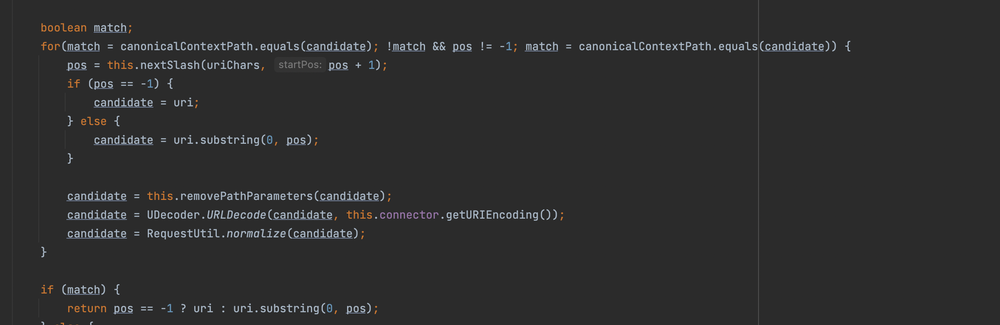
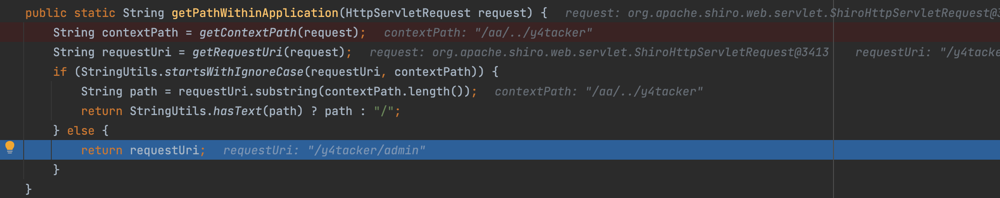
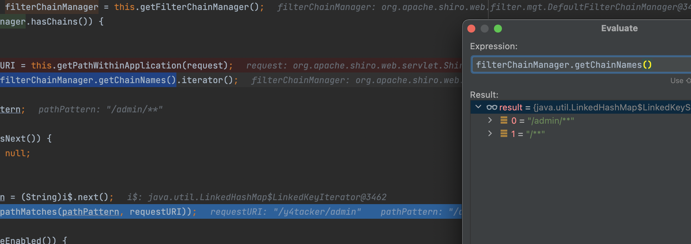
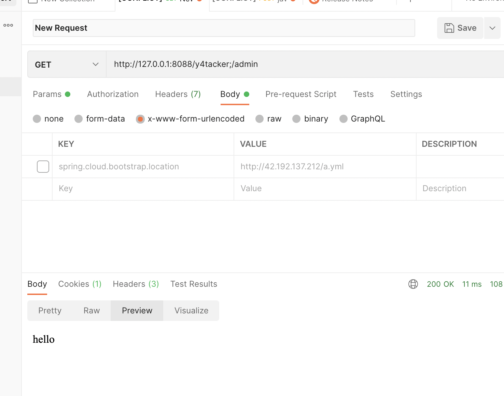

# CVE-2016-6802权限绕过

## 影响版本

shiro < 1.3.2

## 环境配置

shiro.ini

```ini
[main]
shiro.loginUrl=/login.jsp

[users]
# format: username = password, role1, role2, ..., roleN
root = secret,admin
guest = guest,guest

[roles]
# format: roleName = permission1, permission2, ..., permissionN
admin = *

[urls]
/admin/** = authc
/** = anon
```

Web.xml

```
<!DOCTYPE web-app PUBLIC
 "-//Sun Microsystems, Inc.//DTD Web Application 2.3//EN"
 "http://java.sun.com/dtd/web-app_2_3.dtd" >

<web-app xmlns="http://java.sun.com/xml/ns/javaee" xmlns:xsi="http://www.w3.org/2001/XMLSchema-instance"
         xsi:schemaLocation="http://java.sun.com/xml/ns/javaee http://java.sun.com/xml/ns/javaee/web-app_2_5.xsd"
         version="2.5">


  <filter>
    <filter-name>ShiroFilter</filter-name>
    <filter-class>org.apache.shiro.web.servlet.IniShiroFilter</filter-class>
    <init-param>
      <param-name>configPath</param-name>
      <param-value>classpath:/WEB-INF/shiro.ini</param-value>
    </init-param>
  </filter>

  <filter-mapping>
    <filter-name>ShiroFilter</filter-name>
    <url-pattern>/*</url-pattern>
  </filter-mapping>


  <filter-mapping>
    <filter-name>ShiroFilter</filter-name>
    <url-pattern>/*</url-pattern>
  </filter-mapping>

  <servlet>
    <servlet-name>TestServlet</servlet-name>
    <servlet-class>com.jbxz.TestServlet</servlet-class>
    <load-on-startup>1</load-on-startup>
  </servlet>
  <servlet-mapping>
    <servlet-name>TestServlet</servlet-name>
    <url-pattern>/admin</url-pattern>
  </servlet-mapping>


  <welcome-file-list>
    <welcome-file>index.jsp</welcome-file>
  </welcome-file-list>
</web-app>
```


## 简单利用


前提条件是项目部署不在ROOT亘目录，我这里是y4tacker



简单看下测试效果

正常访问`/y4tacker/admin`，显示302



访问`/abc/../y4tacker/admin`，成功绕过鉴权访问到路由



## 分析

### 利用方式1

首先简单看下正常的流程，当你访问`/y4tacker/admin`时，这里if条件通过会直接截取后半部分也就是`/admin`之后会被规则匹配到导致302




这个漏洞出在Context Path 上，在`org.apache.shiro.web.util.WebUtils#getPathWithinApplication`，三个版本对uri获取后用了normalize处理，但是对Context Path没做处理

接下来我们看`org.apache.catalina.connector.Request#getContextPath`，这里有个很关键的点是这个lastSlash不是一两句话就能说清楚感兴趣自己跟一跟调用

首先截取第一个`/`与第二个`/`之间的内容做路径标准化

暂时跳过这个`removePathParameters`，这里面有一些可以配合利用的点，之后单独提，由于这里`/aa`与`/y4tacker`不匹配，因此接下来会调用这个for循环去继续匹配



简单来说就是不断获取第一个/与下一个/直接字符串做处理后是否匹配
用文字流程具像化更清晰

- "/a a/" -> "/aa" 匹配 "/y4tacker" 失败；
- "/aa/.." -> "/" 匹配 "/y4tacker" 失败；
- "/aa/../y4tacker" -> "/y4tacker" 匹配 "/y4tacker" 成功返回

因此之后在这里的if条件自然不通过直接返回



这个`/y4tacker/admin`因此只能匹配第二条规则导致权限绕过

### 利用方式2--配合;

在分析过程当中我发现配合`removePathParameters`这个函数，导致我访问`/y4tacker;/admin`一样可以绕过，看看具体效果



发现好像后面的CVE提到了，那就之后分析吧
