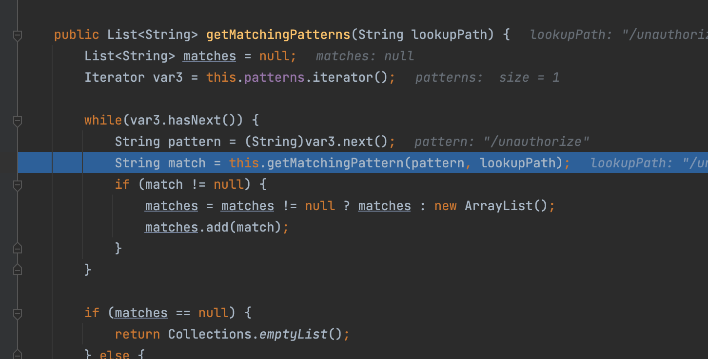
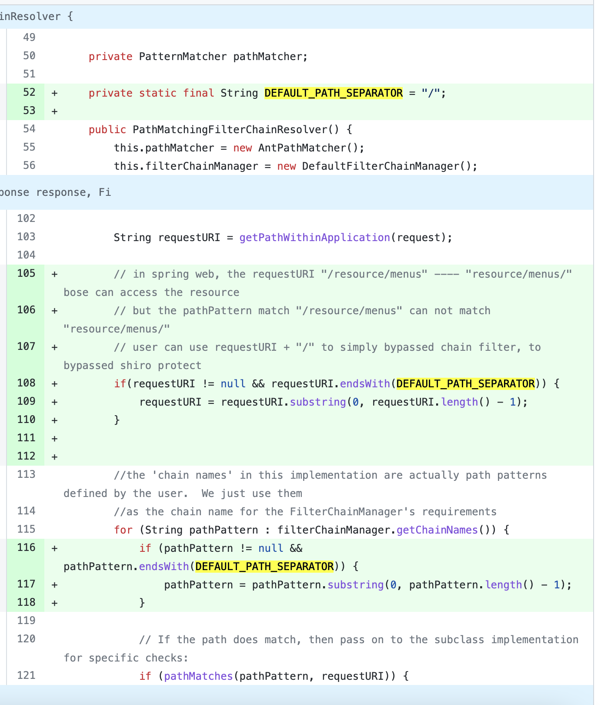

# Shiro-682

影响shiro<1.5.0，具体描述可以看官方https://issues.apache.org/jira/browse/SHIRO-682

在 SpingWeb 中处理 requestURI 与 shiro 中匹配鉴权路径差异导致的绕过问题：在 Spring 中，`/resource/menus` 与 `/resource/menus/` 都可以访问资源，为什么呢？则是和路由的标准写法有关(简单来说就是和正则相关)

平时我们写路由都是这样写的

```java
@RequestMapping("/unauthorize")
@ResponseBody
public String UnAuthorize(){
  return "Bypassed";
}
```

spring 在分发请求时`org.springframework.web.servlet.DispatcherServlet#doDispatch`，会根据我们请求的URI选择一个最合适的handler，其实就是从 `DispatcherServlet#handlerMappings` 找到能匹配路径的 Handler

简单偷懒下，其实看图就很容易看出来就是靠正则去匹配对应的handler



调用栈

```java
getMatchingPatterns:236, PatternsRequestCondition (org.springframework.web.servlet.mvc.condition)
getMatchingCondition:221, PatternsRequestCondition (org.springframework.web.servlet.mvc.condition)
getMatchingCondition:240, RequestMappingInfo (org.springframework.web.servlet.mvc.method)
getMatchingMapping:94, RequestMappingInfoHandlerMapping (org.springframework.web.servlet.mvc.method)
getMatchingMapping:58, RequestMappingInfoHandlerMapping (org.springframework.web.servlet.mvc.method)
addMatchingMappings:427, AbstractHandlerMethodMapping (org.springframework.web.servlet.handler)
lookupHandlerMethod:393, AbstractHandlerMethodMapping (org.springframework.web.servlet.handler)
getHandlerInternal:367, AbstractHandlerMethodMapping (org.springframework.web.servlet.handler)
getHandlerInternal:449, RequestMappingHandlerMapping (org.springframework.web.servlet.mvc.method.annotation)
getHandlerInternal:67, RequestMappingHandlerMapping (org.springframework.web.servlet.mvc.method.annotation)
getHandler:393, AbstractHandlerMapping (org.springframework.web.servlet.handler)
getHandler:1234, DispatcherServlet (org.springframework.web.servlet)
doDispatch:1016, DispatcherServlet (org.springframework.web.servlet)
```

因此既然知道了这个那为什么能绕过就很明显了很明显我们访问的`/unauthorize/`和被限制的`/unauthorize`不同

```java
@Bean(name = "shiroFilterFactoryBean")
public ShiroFilterFactoryBean ShiroFilterFactoryBean(DefaultWebSecurityManager defaultWebSecurityManager){
  ShiroFilterFactoryBean filter = new ShiroFilterFactoryBean();
  filter.setSecurityManager(defaultWebSecurityManager);


  Map<String,String> filterMap = new HashMap<>();
  filterMap.put("/unauthorize","authc");
  filterMap.put("/**", "anon");

  filter.setFilterChainDefinitionMap(filterMap);

  filter.setLoginUrl("/adminLogin");
  filter.setUnauthorizedUrl("/adminLogin");

  return filter;
}
```

看高版本的修复也很简单https://github.com/apache/shiro/pull/127/files

专门针对这种情况做了去处最后一个分隔符的处理


