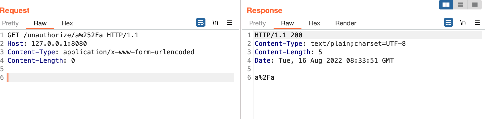
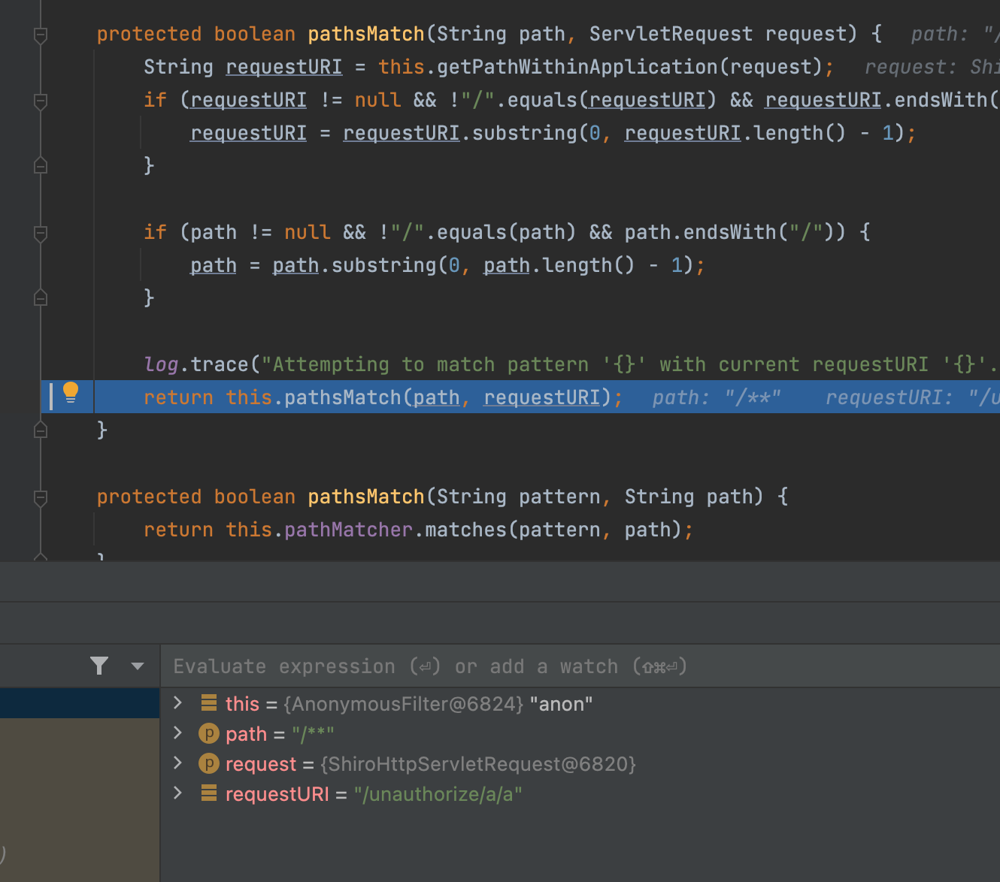

# Spring-Shiro1.5.2 Bypass

在上篇我们谈到了SpringBoot2.3.0下[Shiro<=1.5.1权限绕过](https://github.com/Y4tacker/JavaSec/blob/main/11.Spring/SpringBoot2.3.0%E4%B8%8BShiro%3C%3D1.5.1%E6%9D%83%E9%99%90%E7%BB%95%E8%BF%87/index.md)的修复方案，说到了这个url其实被url解码处理了两次，而这有什么绕过方式呢？多提一下有时候不得不感觉挖洞真难，我在分析上一篇的时候在看到那个点的时候其实也想到了这种绕过...，生不逢时不然还可以强一波哈哈哈，不过都是小问题

下面重点来分析这个场景，因为我们也知道Shiro 支持 [Ant](https://ant.apache.org/) 风格的路径表达式配置

| ?    | 匹配任何单字符          |
| ---- | ----------------------- |
| *    | 匹配0或者任意数量的字符 |
| **   | 匹配0或者更多的目录     |

因此我们便可以想到这样的场景，过滤拦截`filterMap.put("/unauthorize/*","authc");`

```java
@RequestMapping("/unauthorize/{name}")
@ResponseBody
public String test(@PathVariable String name){
  return name;
}
```

构造的url看到这里都很容易想到吧，`/unauthorize/a%252Fa`就是这么简单



还是简单多提一下吧，在`org.apache.shiro.web.util.WebUtils#getRequestUri`

```java
public static String getRequestUri(HttpServletRequest request) {
  String uri = (String)request.getAttribute("javax.servlet.include.request_uri");
  if (uri == null) {
    uri = valueOrEmpty(request.getContextPath()) + "/" + valueOrEmpty(request.getServletPath()) + valueOrEmpty(request.getPathInfo());
  }

  return normalize(decodeAndCleanUriString(request, uri));
}
```

这里`request.getServletPath()`处理的结果是之前在`org.apache.catalina.connector.CoyoteAdapter#postParseRequest`受处理后设置的

看到这里我标注了的，做了url解码操作，因此为什么能绕过就这么简单


之后在更高版本下1.5.3是如何修复的呢？其实很简单就是去除了这个有两次url解码的过程
```java
public static String getPathWithinApplication(HttpServletRequest request) {
    return normalize(removeSemicolon(getServletPath(request) + getPathInfo(request)));
}
```
