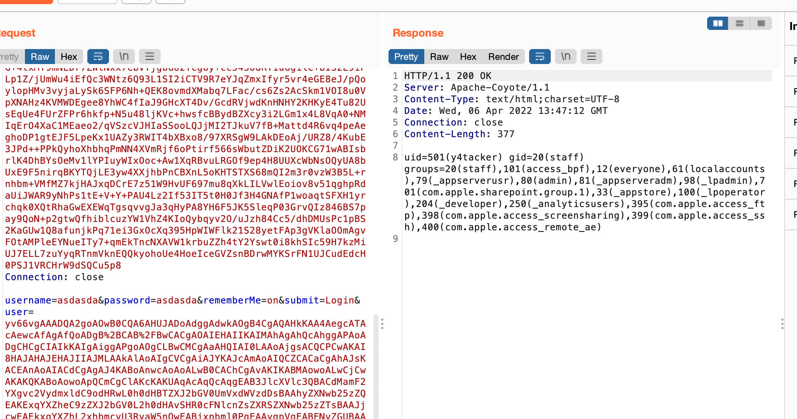

# Tomcat Header长度受限制解决

## 简单记录几个我自己觉得关键即可

1. 通过修改 Tomcat Header 的 maxsize 来进行绕过不太通用，通过多个线程发送payload来确保request的inputbuffer会复用不太稳定
2. 记住classLoader可能是TemplatesImpl的
3. 记得Burp发包的时候记得给payload用url编码

## 心目中最好的方案

前提需要获取到request对象，有手就行，通过动态类加载解决，`defineClass` YYDS

## 利用成功截图

## 参考文章

http://wjlshare.com/archives/1545

https://mp.weixin.qq.com/s?__biz=MzIwMDk1MjMyMg==&mid=2247484799&idx=1&sn=42e7807d6ea0d8917b45e8aa2e4dba44

顺便参考了一个小项目里面部分代码，比如获取request等部分

https://github.com/SummerSec/ShiroAttack2
