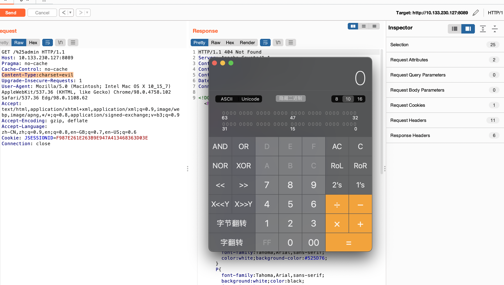

# shiro<=1.5.2通用后门利用


个人发现的不算啥特别厉害的东西

## 环境

shiro版本小于等于1.5.2，各个版本有一些小细节不同，但是最终触发原理一致

## 简单分析

在org.apache.shiro.web.util.WebUtils#decodeRequestString当中如果出现`%`即可触发

下面是触发利用栈

```stack
decode:179, StringCoding (java.lang)
<init>:426, String (java.lang)
decode:190, URLDecoder (java.net)
decodeRequestString:357, WebUtils (org.apache.shiro.web.util)
decodeAndCleanUriString:242, WebUtils (org.apache.shiro.web.util)
getRequestUri:143, WebUtils (org.apache.shiro.web.util)
getPathWithinApplication:113, WebUtils (org.apache.shiro.web.util)
getPathWithinApplication:164, PathMatchingFilterChainResolver (org.apache.shiro.web.filter.mgt)
getChain:103, PathMatchingFilterChainResolver (org.apache.shiro.web.filter.mgt)
getExecutionChain:415, AbstractShiroFilter (org.apache.shiro.web.servlet)
executeChain:448, AbstractShiroFilter (org.apache.shiro.web.servlet)
call:365, AbstractShiroFilter$1 (org.apache.shiro.web.servlet)
doCall:90, SubjectCallable (org.apache.shiro.subject.support)
call:83, SubjectCallable (org.apache.shiro.subject.support)
execute:387, DelegatingSubject (org.apache.shiro.subject.support)
doFilterInternal:362, AbstractShiroFilter (org.apache.shiro.web.servlet)
doFilter:125, OncePerRequestFilter (org.apache.shiro.web.servlet)
internalDoFilter:240, ApplicationFilterChain (org.apache.catalina.core)
doFilter:207, ApplicationFilterChain (org.apache.catalina.core)
invoke:212, StandardWrapperValve (org.apache.catalina.core)
invoke:94, StandardContextValve (org.apache.catalina.core)
invoke:141, StandardHostValve (org.apache.catalina.core)
invoke:79, ErrorReportValve (org.apache.catalina.valves)
invoke:620, AbstractAccessLogValve (org.apache.catalina.valves)
invoke:88, StandardEngineValve (org.apache.catalina.core)
service:502, CoyoteAdapter (org.apache.catalina.connector)
process:1132, AbstractHttp11Processor (org.apache.coyote.http11)
process:684, AbstractProtocol$AbstractConnectionHandler (org.apache.coyote)
doRun:1539, NioEndpoint$SocketProcessor (org.apache.tomcat.util.net)
run:1495, NioEndpoint$SocketProcessor (org.apache.tomcat.util.net)
runWorker:1142, ThreadPoolExecutor (java.util.concurrent)
run:617, ThreadPoolExecutor$Worker (java.util.concurrent)
run:61, TaskThread$WrappingRunnable (org.apache.tomcat.util.threads)
run:745, Thread (java.lang)
```

简单说下思路，在org.apache.shiro.web.util.WebUtils#decodeRequestString有两行关键

```
String enc = determineEncoding(request);
```

会根据`Content-Type:charset=evil`里面取出

之后调用

```
URLDecoder.decode(source, enc);
```

里面如果有`%`则会调用`new String(bytes, 0, pos, enc)`，这个里面会调用`Charset.forName`，配合springbootfatjar里面提到的思路即可实现一个后门

## 测试截图



## 为什么高版本不行

在1.5.3起，在处理uri时候，没有再调用`org.apache.shiro.web.util.WebUtils#getRequestUri`

1.5.3

```java
    public static String getPathWithinApplication(HttpServletRequest request) {
        return normalize(removeSemicolon(getServletPath(request) + getPathInfo(request)));
    }
```

1.5.2

```java
    public static String getPathWithinApplication(HttpServletRequest request) {
        String contextPath = getContextPath(request);
        String requestUri = getRequestUri(request);
        if (StringUtils.startsWithIgnoreCase(requestUri, contextPath)) {
            String path = requestUri.substring(contextPath.length());
            return StringUtils.hasText(path) ? path : "/";
        } else {
            return requestUri;
        }
    }
```

