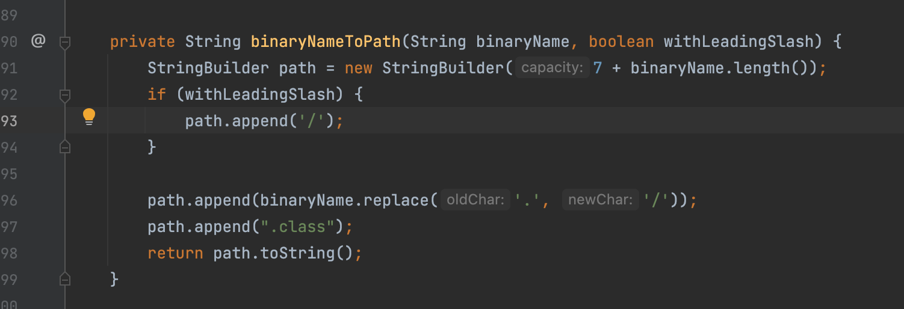
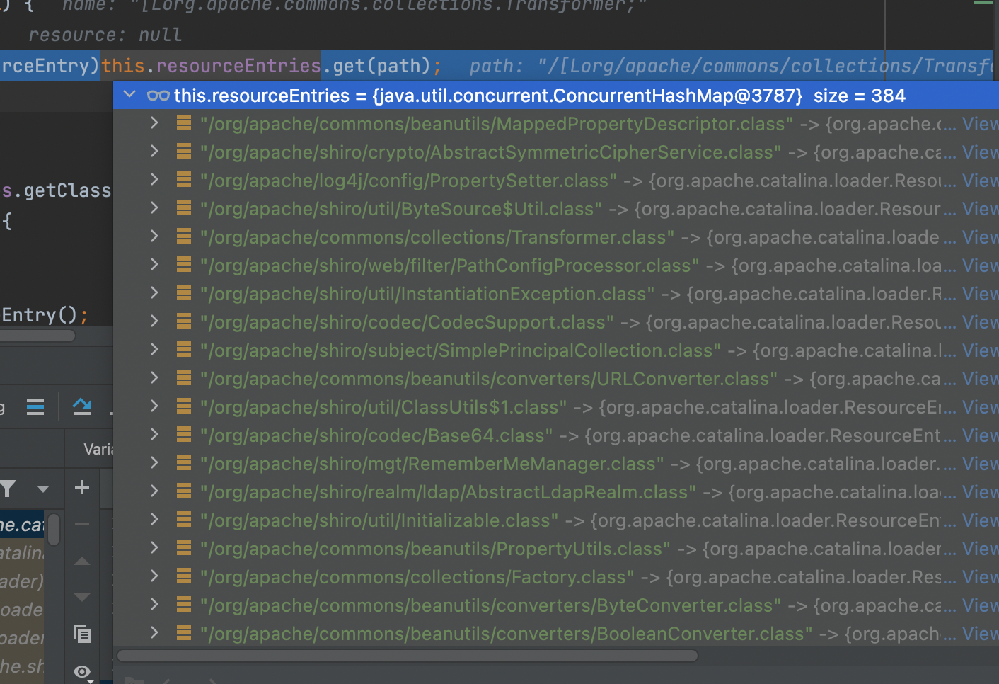
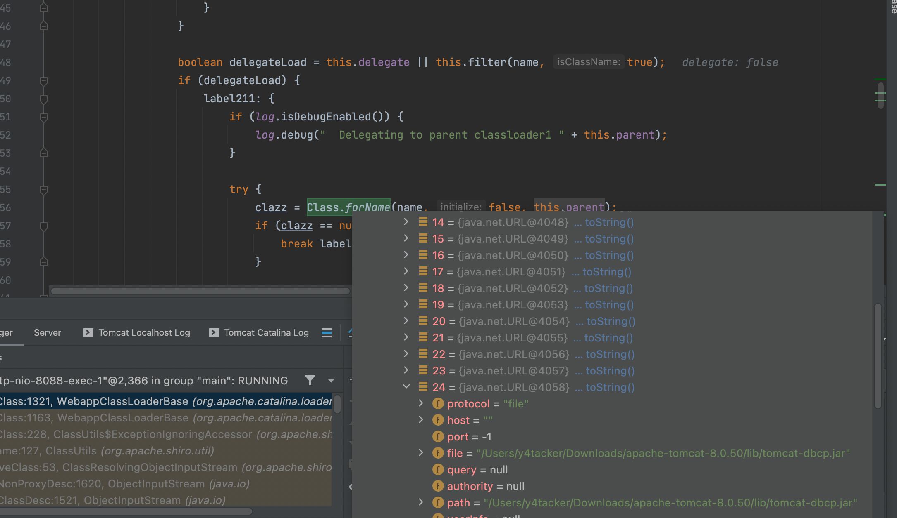
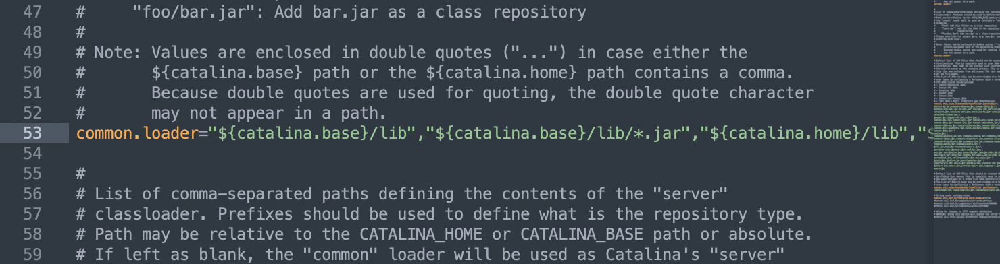
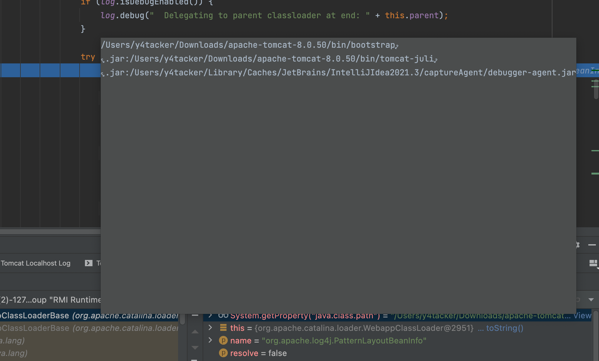
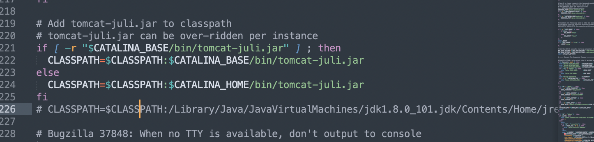

# Shiro550的误区

网上一直说Class.loadClass不能加载数组，这个区别导致了问题，但实际上只是因为在tomcat的上下文环境中调用`Class.forName(name, false, parent)`，使用了`URLClassLoader`作为`ClassLoader`，但在`URLClassLoader`中没有包含`[Lorg.apache.commons.collections.Transformer;`位置，而这个也是因为Tomcat运行时候没有直接用JDK的classpath导致的找不到这个Transformer而已，具体可以看看`catalina.sh/bat`就知道了

直接从`org.apache.shiro.io.ClassResolvingObjectInputStream#resolveClass`开始，实际上最终调用了`org.apache.catalina.loader.WebappClassLoaderBase#loadClass`去加载，到了这里很多人就直接飙出了上面那个错误的观点

但其实不是，简单记录下加载的流程，首先调用findLoadedClass发现之前没有加载到jvm，之后尝试使用标准扩展类加载器去加载，接下来调用org.apache.catalina.loader.WebappClassLoaderBase#findClass去查找这个类，但是吧这个findClass的逻辑只是把`.`替换成`/`，实现调用的是`binaryNameToPath`

因此我们的`[Lxxx；`也会把这个L以及;带进去就是`/[Lorg/apache/commons/collections/Transformer;.class`,难怪找不到怪我咯，所以才有p牛那个优化的无数组的链子

最后是在tomcat的上下文环境中调用`Class.forName(name, false, parent)`，使用了`URLClassLoader`作为`ClassLoader`，但在`URLClassLoader`中没有包含`[Lorg.apache.commons.collections.Transformer;`位置

如何解决这个问题，这里我发现两种解决办法

## 办法一

既然没有那么第一反应就是给他加进去呗，通过查找我发现这个URLClassloader来自org.apache.catalina.startup.Bootstrap#initClassLoaders，通过org.apache.catalina.startup.Bootstrap#createClassLoader去加载Catalina的配置common.loader，这个文件在tomcat的conf文件夹下面的catalina.properties里面配置

所以在这里加上就可以了

## 办法二

通过`System.getProperty("java.class.path")`,发现得到`Tomcat`中的classpath如下

最终发现这个来源是在启动脚本里面catalina.sh/bat，我直接在这里加就可以了

## To be continued

没有最终解决Shiro550的无法加载Transform数组的问题，主要是数组赋值的问题，希望未来能解决掉这个问题
