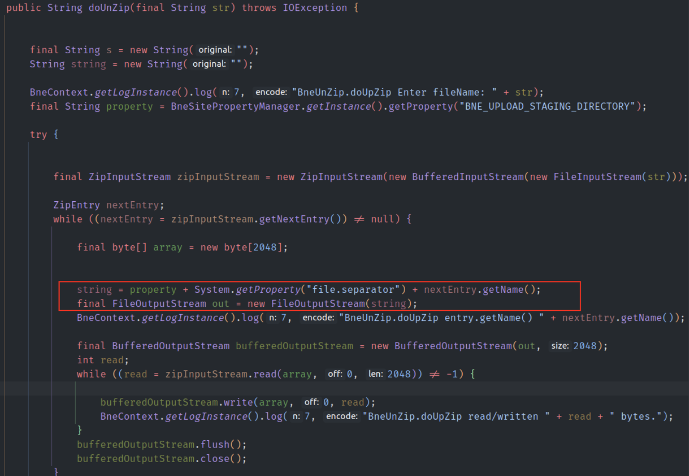
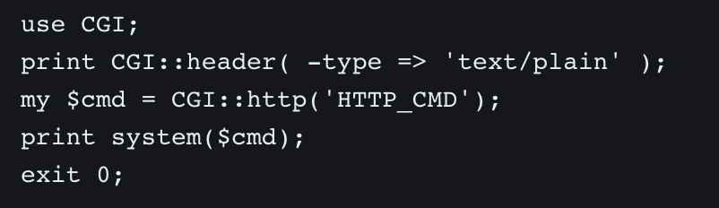
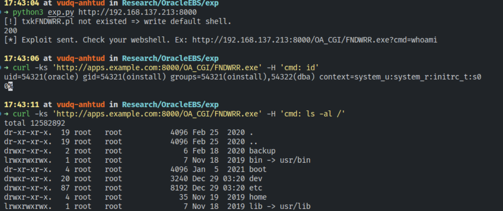

# Oracle E-Business Suite Unauthenticated RCE

分享个简单有趣的前台RCE，在上传文件调用了oracle.apps.bne.framework.BneMultipartRequest的doUploadFile函数，里面存在ZipSlip的漏洞

，但是由于oracle.apps.fnd.security.WLFilter里面有白名单url的限制，导致我们不能上传jsp然后访问触发，为了突破这个限制利用者找到了weblogic.servlet.CGIServlet(WebLogic Server中运行CGI程序)，之后找到并覆盖系统原来的txkFNDWRR.pl文件

，因而完成了整个的利用

详情见链接：

https://blog.viettelcybersecurity.com/cve-2022-21587-oracle-e-business-suite-unauth-rce/
