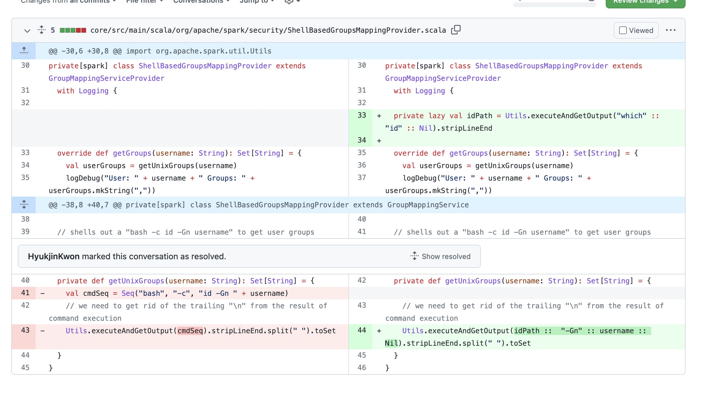
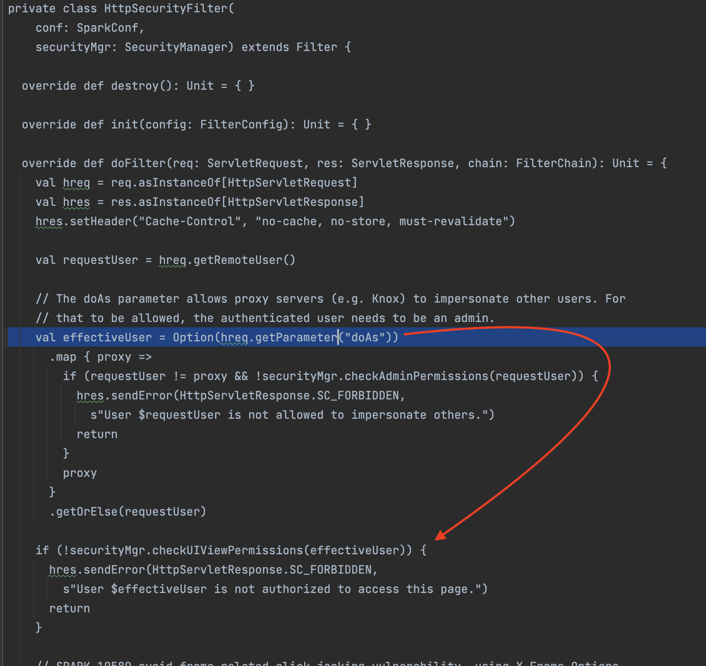

# CVE-2022-33891: Apache Spark shell command injection vulnerability via Spark UI

## 影响版本

Apache Spark versions 3.0.3 and earlier, versions 3.1.1 to 3.1.2, and versions 3.2.0 to 3.2.1.

## 分析

首先看到官方描述

https://lists.apache.org/thread/p847l3kopoo5bjtmxrcwk21xp6tjxqlc

当中可以根据提示找到diff：

https://github.com/apache/spark/pull/36315/files

这里没做无害处理，直接对命令进行拼接造成命令注入



如图那么漏洞原理确实很简单，那么接下来就要看如何触发了

首先关于配置可以参考：https://spark.apache.org/docs/3.0.3/security.html

一个漏洞能利用的最简配置，当然不一定是和acl相关的最佳配置，毕竟还有其他参数，当然作为漏洞研究就这样开启就好，其中[]为可选项意思是不用加都行

```bash
./bin/spark-shell --conf spark.acls.enable=true --conf spark.ui.port=8099 --conf spark.ui.view.acls=true [--conf spark.user.groups.mapping=org.apache.spark.security.ShellBasedGroupsMappingProvider]
```

分析可以得到调用链

org.apache.spark.ui.HttpSecurityFilter.doFilter()
org.apache.spark.SecurityManager.checkUIViewPermissions()
org.apache.spark.SecurityManager.isUserInACL()
org.apache.spark.util.Utils.getCurrentUserGroups()
org.apache.spark.security.ShellBasedGroupsMappingProvider.getGroups()
org.apache.spark.security.ShellBasedGroupsMappingProvider.getUnixGroups()

这个HttpSecurityFilter，很明显是一个filter，其实猜都能猜到既然是和权限校验相关那么肯定是所有路由都会经过这个filter的，当然也能找到这样的代码片段来验证

```scala
val securityFilter = new HttpSecurityFilter(conf, securityMgr)
val holder = new FilterHolder(securityFilter)
handler.addFilter(holder, "/*", EnumSet.allOf(classOf[DispatcherType]))
```

接着回来我们可以看到它参数来源于doAs



那就很简单了


