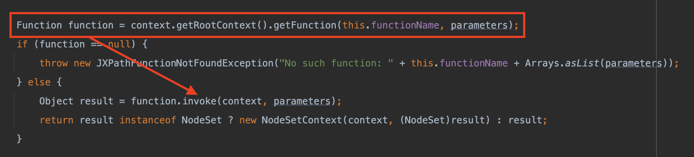

# 浅析Apache Commons Jxpath命令执行分析(CVE-2022-41852)

## 影响版本

commons-jxpath:commons-jxpath <= 1.3

一直到最新版本，官方也不打算修了

## 利用探索

测试环境：jxpath1.3

JXPath支持标准的XPath函数，开箱即用。它还支持 "标准 "扩展函数，这些函数基本上是通往Java的桥梁，以及完全自定义的扩展函数。

简单从漏洞描述可以看出由于解析xpath表达式的问题造成的漏洞

其实这来源官方的一个[feature](https://commons.apache.org/proper/commons-jxpath/users-guide.html)，如图看起来它赋予了我们一种动态执行代码的能力


这时候我们就会想为什么会有这种奇怪的需求，毕竟从平时经验来讲xpath，作为一种路径语言，它的功能是帮助我们对xml进行一些简单的信息检索，然而它叫JXpath而不叫Xpath，因此其实从实现上来讲它不仅实现了xpath查询的一些基础功能，更重要的是它搭建了一个通往java的桥梁，从官方的设计初衷也可以看出，它的设计实现其实更像一款表达式语言

> Primary applications of JXPath are in scripting: JSP and similar template/script based technologies. However, programmers who prefer XML-flavored APIs, should consider JXPath as an alternative to other expression languages as well. JXPath is a must-have tool for those who work with mixtures of Java objects and XML and need to frequently traverse through graphs of those.


## 简单的测试

简单写个测试demo

Test.java

```java
import org.apache.commons.jxpath.JXPathContext;

public class Test {
    public static void main(String[] args) {
        JXPathContext context = JXPathContext.newContext(null);
        context.getValue("com.example.springdemo.calc.calc()");
    }
}
```

Calc.java

```java
package com.example.springdemo;

public class calc {
    public static void calc(){
        try {
            Runtime.getRuntime().exec("open -na Calculator");
        }catch (Exception e ){

        }
    }
}
```

对于如何解析其实很多时候我们并不需要去关注对字符token的解析过程，毕竟我们这也不是绕waf，我们也不需要知道如何去实现一些畸形构造达到一致的功能，而在这里我们更应该关注什么呢？我们应该关注它官网这个feature如何实现的调用，以及调用方法对方法又有什么限制？

在`org.apache.commons.jxpath.PackageFunctions#getFunction`当中


这里可以看出允许的调用一个是构造函数，另一个是静态方法，当然他们都需要是public修饰

再次回到`org.apache.commons.jxpath.ri.compiler.ExtensionFunction#computeValue`当中,



在获得了org.apache.commons.jxpath.Function对应的这个实例后，回去调用具体的invoke的实现

而Function具体的接口实现有两个类

- org.apache.commons.jxpath.functions.ConstructorFunction
- org.apache.commons.jxpath.functions.MethodFunction

如何判断返回的是哪个类？


`ConstructorFunction`的`invoke`就不多说了，实例化构造函数，另一个`MethodFunction#invoke`，反射执行方法，都没什么好说的

那么我们假设就从官方的demo出发，我们能做些什么？

### 对于实例化我们能做什么

比如说对于new这个操作来说，一些常见的如spring当中有两个类构造函数就能加载远程配置可以rce

- org.springframework.context.support.ClassPathXmlApplicationContext
- org.springframework.context.support.FileSystemXmlApplicationContext

### 对于静态方法我们能做什么

jndi当中有静态方法，javax.naming.InitialContext.doLookup

一些常见库比如fastjson出发json反序列化

当然还有jdbc攻击也可以帮助我们撕开一条漏洞的口子

当然肯定还有其他的攻击手法毕竟jre当中有很多类这里只是举一些例子而已，对于学习足够了


### 想要更多？

拿着tabby编译扫一下就行，毕竟在这里我们规则很简单构造函数、静态方法，只是筛选可能会费点时间罢了


## 突破限制

​	对于大多数人来说，其实想到上面几点就已经很不错了，但是考虑的也不够全面。毕竟面向官方feature学习，下个断点，随便点点，也确实差不多了。

​	对我们来说虽然用spirng开发的项目很多，但是我们也不一定能遇到spring的环境，也不一定有jdbc可以打。

​	而对于JXpath来说，虽然设计的像表达式，但它却不像其他表达式引擎那般灵活，支持随意赋值然后调用。也不能多条语句执行，它一次只能执行一条，怎么办呢？事实上如果你仔细看了最后一个demo你会发现有个长这样的

```java
String firstName = (String)context.getValue("getAuthorsFirstName($book)");
//As you can see, the target of the method is specified as the first parameter of the function.
```

从英文来看其实就是$book.getAuthorsFirstName()，就是这么的简单。稍微会点Java的你可能也该想到

如果我们想要执行`Runtime.getRuntime().exec("open -na Calculator")`，按照上面的例子其实就改为了`exec(java.lang.Runtime.getRuntime(),'open -na Calculator')`

又或者我们利用ScriptEngineManager调用js实现rce

`eval(getEngineByName(javax.script.ScriptEngineManager.new(),'js'),'java.lang.Runtime.getRuntime().exec("open -na Calculator")')`

方法也便多了起来，有时候多往下面看看，真的可以节约很多时间，不然就需要仔细看看字符串的解析流程，属实无趣。
