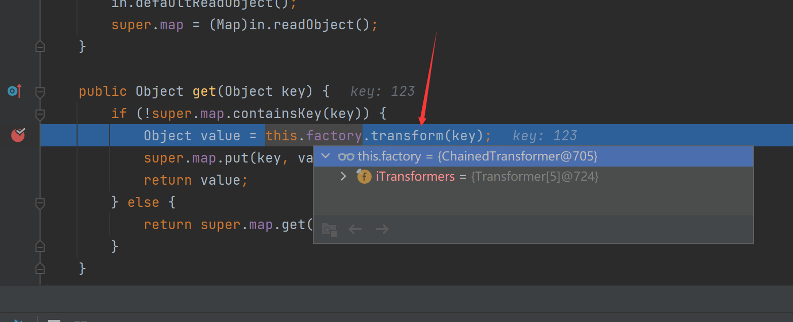

# CommonsCollections5笔记

简单看了下流程，大概是寻找新的来触发lazymap的get方法

看看Ysoserial给的调用栈

```java
/*
	Gadget chain:
        ObjectInputStream.readObject()
            BadAttributeValueExpException.readObject()
                TiedMapEntry.toString()
                    LazyMap.get()
                        ChainedTransformer.transform()
                            ConstantTransformer.transform()
                            InvokerTransformer.transform()
                                Method.invoke()
                                    Class.getMethod()
                            InvokerTransformer.transform()
                                Method.invoke()
                                    Runtime.getRuntime()
                            InvokerTransformer.transform()
                                Method.invoke()
                                    Runtime.exec()
	Requires:
		commons-collections
 */
```

看看BadAttributeValueExpException的readObject方法

我们将其设置为TiedMapEntry即可发现

在其toString中，调用了getValue，这个getValue方法能触发Lazymap的get方法

后面就是transform调用这个过程触发利用链