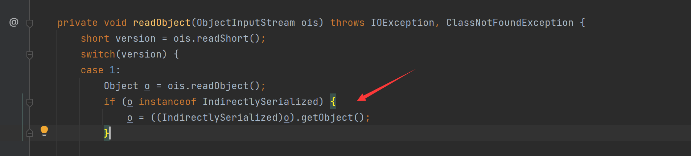
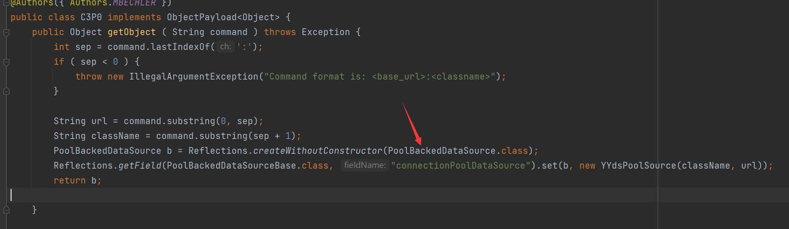

# C3P0学习笔记

## 分析

看见在PoolBackedDataSourceBase类中，这个链子写入数据是是利用Catch分支里的方法，触发他就需要让类不继承Serializable

来看看这个`indirector.indirectForm`

可以看见这个传入的对象是Referenceable，之后传入`ReferenceIndirector.ReferenceSerialized`，这是一个内部类

那么之后看看readObject干了啥，这里调用了getObject方法

可以看见这里可能存在jndi注入，这里不谈继续看`ReferenceableUtils.referenceToObject`

可以看见这里，如果var11不为null，则可以通过urlclassloader去加载远程类

这个var11获取是在Reference里获取

整个是比较简单的

接下来分析下payload，首先通过此方法不利用构造函数初始化对象，这样做的原因只是为了让payload更短

接下来我们可以看到`connectionPoolDataSource`设置为自己设置的`YYdsPoolSource`，并写构造方法与实现`getReference`即可，都很简单没必要多说