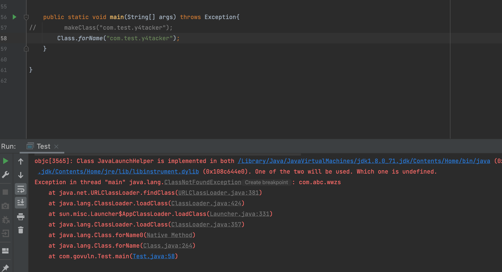
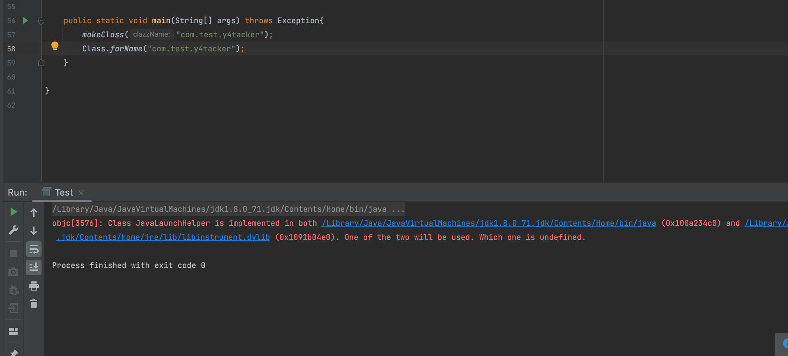

# 对URLDNS探测class的补充

## 问题

​	刚刚有个师傅私聊问到我这个问题，这里来谈一谈，当时大师傅的文章里确实也没提到这一点

遗忘的师傅可以回顾下：https://gv7.me/articles/2021/construct-java-detection-class-deserialization-gadget/

这个问题就是：为什么明明没这个类我在本地生成的时候明明没有这个类为什么还会收到DNS请求


## 解决

​	在问题之前我们简单说下调用流程，方便简单会议下

- 将url与检测类分别放入HashMap的key/value
- 触发反序列化后先是恢复HashMap的key再恢复value
- 之后调用putVal时触发key的hashcode方法导致DNS解析触发
- 如果我们探测的class为不存在的class那么就打断了这个过程的第二步，由于没有try/catch做异常处理，利用此我们可以成功通过URLDNS探测class


而为什么没有这个类本地调试生成的时候会“触发”，其实这和javassist有关，先来个图进行直观的解释







没错正如你所想，问题出自于`makeClass`当中的`toClass`，这个方法中的toClass其实就根据我们输入参数的`className`构造了一个类并加载到了`jvm`当中

```java
public static Class makeClass(String clazzName) throws Exception{
  ClassPool classPool = ClassPool.getDefault();
  CtClass ctClass = classPool.makeClass(clazzName);
  Class clazz = ctClass.toClass();
  ctClass.defrost();
  return clazz;

}
```

当然这样说太敷衍了，还是简单上一下代码，这里贴一些关键的

在`javassist.ClassPool#toClass(javassist.CtClass, java.lang.ClassLoader, java.security.ProtectionDomain)`

可以看到这个`toClass2`其实就是反射调用方法，调用的是什么，其实就是这个`defineClass1/2`

```java
    public Class toClass(CtClass ct, ClassLoader loader, ProtectionDomain domain) throws CannotCompileException {
        try {
            byte[] b = ct.toBytecode();
            Method method;
            Object[] args;
            if (domain == null) {
                method = defineClass1;
                args = new Object[]{ct.getName(), b, new Integer(0), new Integer(b.length)};
            } else {
                method = defineClass2;
                args = new Object[]{ct.getName(), b, new Integer(0), new Integer(b.length), domain};
            }

            return (Class)toClass2(method, loader, args);
        } catch (RuntimeException var7) {
            throw var7;
        } catch (InvocationTargetException var8) {
            throw new CannotCompileException(var8.getTargetException());
        } catch (Exception var9) {
            throw new CannotCompileException(var9);
        }
    }

		//反射调用方法
    private static synchronized Object toClass2(Method method, ClassLoader loader, Object[] args) throws Exception {
        method.setAccessible(true);

        Object var3;
        try {
            var3 = method.invoke(loader, args);
        } finally {
            method.setAccessible(false);
        }

        return var3;
    }
```

而这个变量在类的静态块做了初始化

```java
    static {
        try {
            AccessController.doPrivileged(new PrivilegedExceptionAction() {
                public Object run() throws Exception {
                    Class cl = Class.forName("java.lang.ClassLoader");
                    ClassPool.defineClass1 = cl.getDeclaredMethod("defineClass", String.class, byte[].class, Integer.TYPE, Integer.TYPE);
                    ClassPool.defineClass2 = cl.getDeclaredMethod("defineClass", String.class, byte[].class, Integer.TYPE, Integer.TYPE, ProtectionDomain.class);
                    ClassPool.definePackage = cl.getDeclaredMethod("definePackage", String.class, String.class, String.class, String.class, String.class, String.class, String.class, URL.class);
                    return null;
                }
            });
        } catch (PrivilegedActionException var1) {
            throw new RuntimeException("cannot initialize ClassPool", var1.getException());
        }

        doPruning = false;
        releaseUnmodifiedClassFile = true;
        defaultPool = null;
    }
```

因此也不难理解为什么我瞎写一个类都不会抛出异常导致断链

