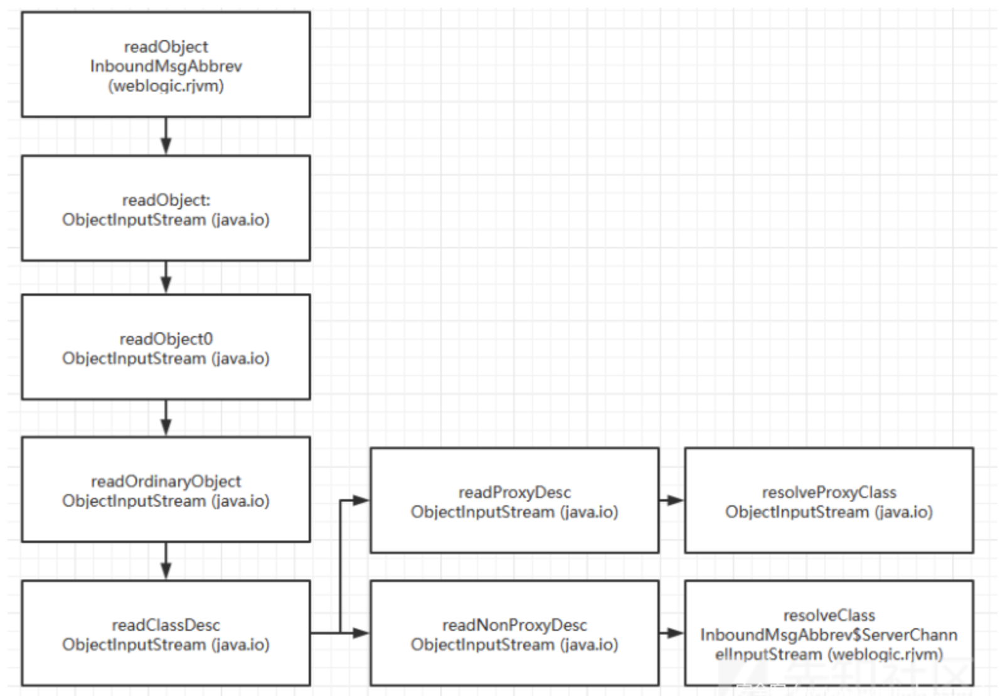
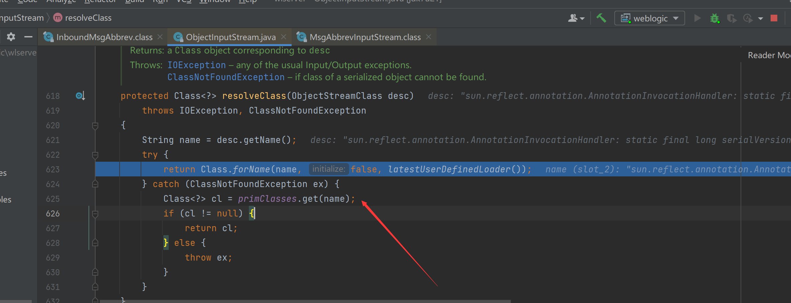

# 为什么补丁喜欢打在resolveClass

## resolveClass

`resolveClass`方法的作用是将类的序列化描述符加工成该类的Class对象

借网图说一下原生 readObject 内部调用流程

而在 resolveClass 函数中，从类描述中获取到了全限定类名，然后利用反射根据全限定类名来获取到对应的 Class 对象并且进行返回

所以当我们重写 resolveClass 的时候，我们在这里添加一个 类名的黑名单，如果发现类在黑名单中就抛出错误，那么就可以在一定程度上拦截反序列化攻击了

## 参考文章

https://www.anquanke.com/post/id/226070#h3-13